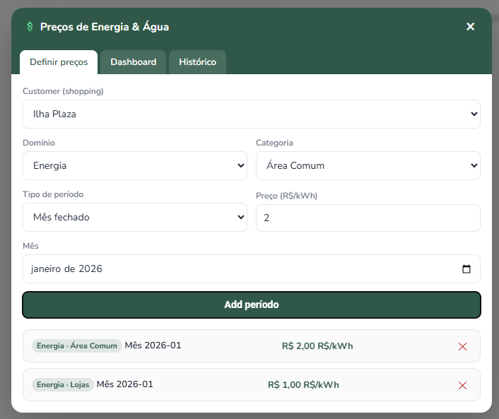
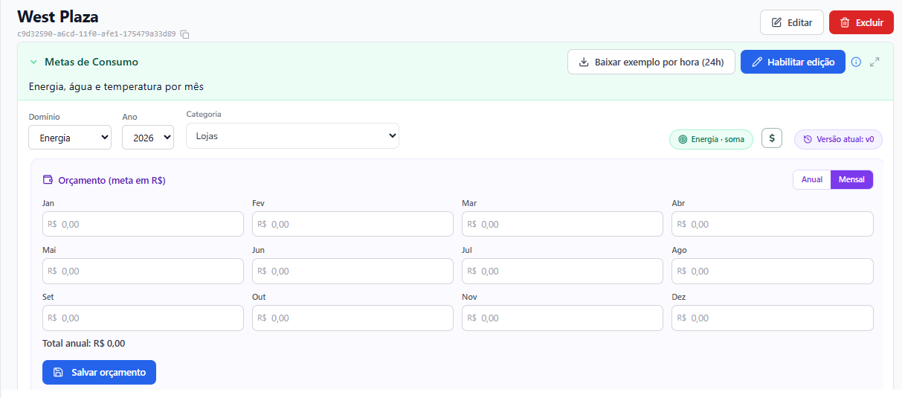

# Resumo — Reunião MYIO × Soul Malls

> Reunião de apresentação e alinhamento · **14 de julho de 2026, 10:30 — Leblon (RJ)**
> Documento de **resumo** (não é ata). Organizado por **tema** e **próximos passos**.
> 🟣 = apresentado pela MYIO · 🔵 = ponto levantado pela Soul Malls · 🟢 = oportunidade / piloto.

---

## Participantes

| Nome | Empresa | Área | Contato |
|------|---------|------|---------|
| Rodrigo Lago | MYIO | Tecnologia | rodrigo@myio.com.br |
| João Paulo Couto | MYIO | Comercial | jp@myio.com.br |
| Isabella Yamakawa | Soul Malls | Operações | isabella.yamakawa@soulmalls.com.br |
| Ezio Diniz | Soul Malls | Operações | ezio.diniz@soulmalls.com.br |

---

## 📊 Plataforma & Head Office

### T1 — Cockpit Head Office de todos os shoppings 🟣

- Apresentado o Head Office como **cockpit único**, consolidando todos os shoppings
- Visão **consolidada e por unidade** a partir de uma só tela
- Cada unidade (Ilha Plaza, Plaza Macaé, West Plaza, Praia da Costa, Contagem) acessível no mesmo painel
- Ponto de entrada para os demais módulos demonstrados — **metas** e **alarmes**
- Base para comparar shoppings entre si e o conjunto (ver T3)

### T2 — Painel de Metas: de kWh para R$ 🔵

- Painel de metas apresentado hoje **em kWh**
- Soul Malls avaliou que para eles faz sentido o **orçamento em R$**
- Meta em R$ **por unidade**, por **ano** ou **mês fechado**
- Segmentação por domínio e categoria: **Energia** e **Água**, cada um por **Lojas** e **Área Comum** (equipamentos)
- Base no modelo GCDR **RFC-0054** (tarifa × meta) — ver Protótipos

### T3 — Dashboard de tendências, KPIs e indicadores 🔵

- Soul Malls reforçou a importância de dashboard / gráficos / KPIs / indicadores
- **Tendências de consumo** do mês e do ano
- Visão **por shopping** e **consolidada** (todos juntos)
- Comparação entre unidades num mesmo período
- Indicadores de **desvio** (realizado × meta) como apoio à decisão

---

## 🏷 Padrões & Dados

### T4 — Padrão de nomenclatura dos equipamentos 🟣

- Discutido o **padrão de nomenclatura** dos equipamentos como base para os dados
- Nomenclatura **consistente entre unidades** (mesmos nomes para mesmos tipos)
- Base para **classificar por categoria** (Área Comum × Lojas)
- Impacta a **relação de equipamentos** enviada (ver Anexo)
- Identificadores como **CAG**, **Chiller** e **Subestação** usados na leitura/classificação

---

## 🔗 Integrações

### T5 — Integração com o TM (financeiro / cobrança) 🔵

- Sistema **financeiro de cobrança** da Soul Malls
- Hoje a carga de dados é feita por **planilha exportada** no painel de cada shopping
- Objetivo: **integração direta**, substituindo a exportação manual
- Soul Malls enviará a **documentação da integração do TM**
- Depende do **processo de validação/autenticação a quatro mãos** (ver Próximos passos)

### T6 — Integração com a Intranet Mall (lojista) 🔵

- Dar ao **lojista** acesso aos dados via Intranet Mall
- Já existe um **desenho prévio** do link Intranet Mall → tela do lojista (fim de 2025)
- Falta apenas **amarrar validação/autenticação**
- Envolve a **Intranet Mall** (parceira) e seu TI, **Rafael Nascimento**
- Mesmo **processo de autenticação a quatro mãos** do TM — ver **Antecedentes**

---

## 🗓️ Antecedentes — reunião prévia (fim de 2025)

- Foi citado na reunião que já houve uma **reunião prévia com Emerson Ataíde** — à época no **Praia da Costa** e hoje no **Shopping Plaza Macaé**
- No **fim de 2025**, conversaram **Rodrigo Lago** (MYIO), **Emerson Ataíde** (Soul Malls) e **Rafael Nascimento** (responsável de TI da **Intranet Mall** — empresa parceira)
- Já havia sido feito o **desenho do link da Intranet Mall para uma tela do lojista**
- Faltava apenas deixar bem **"amarrado"** validação / autenticação — o que conecta ao próximo passo da Soul Malls (processo a quatro mãos)

| Pessoa | Empresa | Papel | Contato |
|--------|---------|-------|---------|
| Emerson Ataíde | Soul Malls | Antes: Praia da Costa · Hoje: Shopping Plaza Macaé | emerson.ataide@soulmalls.com.br |
| Rafael Nascimento | Intranet Mall (parceira) | Responsável de TI | rafael@intranetmall.com.br |

_Registro: conversas do fim de 2025._

---

## ⚙️ Automação & Piloto

### T7 — Módulo de Alarmes e automação 🟣

- Também foi apresentado o **módulo de Alarmes** no painel de **cada unidade**
- Um dos **principais ganhos** demonstrados na reunião
- Foi o **gancho para falar de automação**
- Ex.: reagir a alarmes / **desativar Chiller em picos de demanda**
- Alvo típico de automação: **climatização** (CAG / Chillers)

### T8 — Piloto de Metas no Macaé 🟢

- Apenas o shopping **Macaé** tem dispositivos de leitura de energia na **entrada**
- As demais unidades **não têm** leitura de entrada hoje
- Com isso, é possível rodar um **piloto de metas** já nessa unidade
- MYIO enviará a **ideia do piloto de orçamento em R$** para o Macaé
- MYIO enviará **orçamentos** para implantar leitura de entrada nas demais unidades

---

## ✅ Próximos passos

Como encaminhamento da reunião, a **MYIO** ficou responsável por enviar a **relação de equipamentos** atuais, apresentar a **ideia do piloto de orçamento em R$** para o **Macaé** e enviar os **orçamentos** para implantação de dispositivos de leitura de entrada nas demais unidades. A **Soul Malls**, por sua vez, enviará a **documentação da integração do TM**, validará a documentação do projeto das **metas de orçamento em R$** assim que recebê-la e definirá, em conjunto com a MYIO, um **processo a quatro mãos** de validação e autenticação para uso no **TM** e no **Intranet Mall**.

### MYIO

- Enviar relação de equipamentos atuais
- Enviar a ideia do **piloto de orçamento em R$** para o Macaé
- Enviar orçamentos para implantação de dispositivos de leitura de entrada nas demais unidades

### Soul Malls

- Enviar a documentação da integração do **TM**
- Validar a documentação do projeto das **metas de orçamento em R$** assim que recebê-la
- Definir um **processo a quatro mãos** com a MYIO de validação e autenticação para uso no TM e no IntranetMalls

---

## Notas de leitura

- Documento de resumo, não substitui a ata formal
- Itens marcados por origem: 🟣 apresentado pela MYIO · 🔵 levantado pela Soul Malls · 🟢 oportunidade/piloto
- O piloto de metas depende da leitura na entrada — hoje disponível apenas no Macaé

---

## 📎 Anexo — Relação de Equipamentos (Área Comum)

> Relação atual de dispositivos de **área comum** por unidade, extraída da plataforma MYIO.
> Período **01/07/2026 – 27/07/2026** · Unidade: **kWh** · Gerado em 27/07/2026.
> Atende ao encaminhamento da MYIO de *enviar a relação de equipamentos atuais*.

**Resumo:** 4 unidades · 20 dispositivos de área comum no total.

> ⚠️ **Observação:** o **Shopping Contagem** não possui equipamentos em **área comum** atualmente — apenas **Energia × Lojas**. Por isso não consta nas tabelas de área comum abaixo.

### 🏬 Ilha Plaza — Rio de Janeiro/RJ · 5 dispositivos · total 78.043,667 kWh

| # | Nome | Identificador | Consumo (kWh) | % |
|---|------|---------------|--------------:|--:|
| 1 | Chillers | Sem identificador | 43.720,619 | 56,02% |
| 2 | Bomba CAG | CAG | 29.591,275 | 37,92% |
| 3 | Chiller 02 | Sem identificador | 3.241,858 | 4,15% |
| 4 | Cinema Bombas | CAG | 1.067,415 | 1,37% |
| 5 | Chiller 01 | Sem identificador | 422,500 | 0,54% |
| | **Total** | | **78.043,667** | **100%** |

### 🏬 Shopping Plaza Macaé — Macaé/RJ · 1 dispositivo · total 137.752,223 kWh

| # | Nome | Identificador | Consumo (kWh) | % |
|---|------|---------------|--------------:|--:|
| 1 | MEDIÇÃO GERAL CAG | CAG | 137.752,223 | 100,00% |
| | **Total** | | **137.752,223** | **100%** |

_Única unidade com medição de entrada — candidata ao piloto de metas (Tema T8)._

### 🏬 Praia da Costa — Vila Velha/ES · 4 dispositivos · total 554.443,732 kWh

| # | Nome | Identificador | Consumo (kWh) | % |
|---|------|---------------|--------------:|--:|
| 1 | Subestação Condomínio | Área Comum | 459.541,582 | 82,88% |
| 2 | Subestação CAG | Área Comum | 94.896,707 | 17,12% |
| 3 | Pista de Gelo | Área Comum | 5,443 | 0,00% |
| 4 | G1 Elevador | Área Comum | 0,000 | 0,00% |
| | **Total** | | **554.443,732** | **100%** |

### 🏬 West Plaza — São Paulo/SP · 10 dispositivos · total 96.384,368 kWh

| # | Nome | Identificador | Consumo (kWh) | % |
|---|------|---------------|--------------:|--:|
| 1 | CHILLER 01 BLOCO B | SMWPCHILLER_B.3 | 23.459,116 | 24,34% |
| 2 | CAG BLOCO C | SMWPCAGBOMBAS_C | 19.858,308 | 20,60% |
| 3 | CHILLER 2 BLOCO C | SMWPCHILLER_C.2 | 13.796,990 | 14,31% |
| 4 | CAG BLOCO B | SMWPCAGBOMBAS_B | 12.166,352 | 12,62% |
| 5 | CHILLER 2 BLOCO B | SMWPCHILLER_B.2 | 11.877,651 | 12,32% |
| 6 | CHILLER 1 BLOCO A | SMWPCHILLER_A.1 | 9.133,516 | 9,48% |
| 7 | CAG BLOCO A | SMWPCAGBOMBAS_A | 6.092,435 | 6,32% |
| 8 | CHILLER 01 BLOCO C - 3.1 | SMWPCHILLER3.1 | 0,000 | 0,00% |
| 9 | CHILLER 1 BLOCO B | SMWPCHILLER_B.1 | 0,000 | 0,00% |
| 10 | CHILLER 2 BLOCO A | SMWPCHILLER_A.2 | 0,000 | 0,00% |
| | **Total** | | **96.384,368** | **100%** |

### Arquivos anexos (PDF)

Relatórios-fonte gerados na plataforma MYIO em 27/07/2026 — um por unidade, em `docs/shared/soul-malls/`:

- 📄 [Ilha Plaza — Área Comum (5 disp.)](ilha-plaza-area-comum-20260727-1437.pdf)
- 📄 [Shopping Plaza Macaé — Área Comum (1 disp.)](shopping-plaza-macae-area-comum-20260727-1437.pdf)
- 📄 [Praia da Costa — Área Comum (4 disp.)](praia-da-costa-area-comum-20260727-1436.pdf)
- 📄 [West Plaza — Área Comum (10 disp.)](west-plaza-area-comum-20260727-1437.pdf)

_Valores conforme leitura do período; dispositivos em 0,000 kWh indicam ausência de leitura/consumo no intervalo._

---

## 🧪 Protótipos & Validação de Fluxo — Metas Financeiras em R$

> Base do backend: GCDR **RFC-0054 — Metas Monetárias e Tarifas Horárias**.
> Objetivo: ter o **orçamento em R$ da meta para cada unidade**, por **ano** ou **mês fechado**, segmentado por **Energia × Lojas**, **Energia × Área Comum** (equipamentos) e demais categorias.

### Fluxo — do preço à meta em R$

1. **Classificar o device** — cada medidor recebe uma **categoria explícita**: *Área Comum* (`COMMON_AREA`) ou *Lojas/Específico* (`SPECIFIC`). É a chave que liga **consumo × preço** (nunca inferida por nome).
2. **Definir o preço (tarifa)** em `R$/kWh` por **unidade × domínio × categoria × período** (mês fechado) — *Protótipo 1*.
3. **Definir o orçamento (meta em R$)** por **unidade × domínio × ano × categoria**, alternável **Mensal/Anual** e versionado — *Protótipo 2*.

### Resumo do RFC-0054 (pt-BR)

Telemetria mede **quantidade** (kWh/m³); o negócio gerencia **custo** (R$). O RFC-0054 adiciona a dimensão de dinheiro como **3 aplicações independentes e opcionais**, todas na mesma grade horária das metas:

1. **Tarifas horárias por unidade** — `(unidade, domínio, categoria, hora) → preço` (R$/kWh ou R$/m³). Edita-se num nível conveniente (dia, faixas intraday, mês, ano) e o sistema distribui para as horas (o nível mais fino vence). Cada hora tem **duas** tarifas: **Área Comum** e **Lojas/Específico**. Categoria é atributo **do device**, explícito.
2. **Metas de quantidade** (kWh/m³, RFC-0046) — inalteradas. Com tarifa carregada, uma meta por device passa a ser lida em R$: `quantidade × tarifa da categoria`, somado.
3. **Metas financeiras (orçamento)** — alvo direto em R$ (ex.: "Energia 2026 ≤ R$ 7,5 mi"), por unidade e categoria.

- **Backend-autoritativo** — todo R$ é calculado no servidor; o cliente recebe **valor já calculado**. v1: BRL, tarifa `FLAT`, fuso America/Sao_Paulo; device-granularity exigida (rollout amplo é gate de Fase 2).

**Dimensões:** Domínio (Energia · Água) · Categoria (Lojas · Área Comum) · Período (Mês fechado · Ano) · Meta em R$ versionada.

### Protótipos (telas)

**Protótipo 1 — Definição de Preço (tarifa R$/kWh)**

Campos: **Customer** (ex.: Ilha Plaza) · **Domínio** (Energia) · **Categoria** (Área Comum / Lojas) · **Tipo de período** (Mês fechado) · **Preço (R$/kWh)** · **Mês**. `Add período` grava a faixa. Exemplo já cadastrado (Ilha Plaza): Energia · Área Comum · 2026-01 → **R$ 2,00**; Energia · Lojas · 2026-01 → **R$ 1,00**.

**Protótipo 2 — Orçamento (meta em R$) por unidade**

Campos: **Unidade** (ex.: West Plaza) · **Domínio** (Energia) · **Ano** (2026) · **Categoria** (Lojas / Área Comum) · toggle **Anual/Mensal** · valores por mês (Jan–Dez) com **Total anual** · **Versão** (ex.: v0) · agregação **Energia · soma**. `Salvar orçamento` grava a versão.

_A validar: categorização dos devices por unidade; preço por categoria/competência; orçamento por unidade e categoria (ano/mês); versionamento; e a leitura Realizado × Orçado._

---

## 📖 Glossário

### Plataforma & processo MYIO

| Termo | Significado |
|-------|-------------|
| **RFC / RFC-0054** | **Número/código interno da MYIO para uma demanda** (do inglês *Request for Comments* — especificação técnica). **RFC-0054** é a demanda de *Metas Monetárias e Tarifas Horárias*, base do modelo de metas em R$. |
| **GCDR** | Plataforma de dados da MYIO (backend) onde ficam cadastro, tarifas e metas. "GCDR RFC-0054" = a demanda 0054 dentro do GCDR. |
| **Head Office** | Painel/cockpit único que consolida todos os shoppings numa só visão. |
| **Módulo de Alarmes** | Recurso no painel de cada unidade que sinaliza eventos/anomalias (ex.: picos de demanda) — base para acionar automação. |
| **Device (dispositivo)** | Ponto de medição — o medidor de energia ou água de um equipamento/loja. |
| **Piloto** | Implantação inicial restrita (ex.: Macaé) para validar antes do rollout amplo. |

### Metas, tarifas e categorias

| Termo | Significado |
|-------|-------------|
| **Categoria — Área Comum × Lojas** | Classificação do device. **Área Comum** (`COMMON_AREA`): infraestrutura/equipamentos. **Lojas / Específico** (`SPECIFIC`): consumidores como lojas, restaurantes, estacionamento. |
| **Domínio** | Tipo de grandeza medida: **Energia**, **Água** (e Temperatura, sem preço). |
| **Tarifa (horária)** | Preço `R$/kWh` (ou `R$/m³`) por hora, por categoria. Editável por dia, faixa, mês ou ano — o sistema distribui para as horas. |
| **Meta / Orçado (R$)** | Objetivo de custo definido para o período (mês fechado ou ano), por unidade e categoria. |
| **Realizado** | Custo efetivo projetado a partir do consumo medido × tarifa. |
| **Versão (v0)** | Cada gravação de meta/tarifa gera uma versão — para histórico e controle de concorrência. |
| **kWh** | Quilowatt-hora — unidade de energia elétrica. (m³ = metros cúbicos, para água.) |

### Equipamentos & integrações

| Termo | Significado |
|-------|-------------|
| **CAG** | Central de Água Gelada — sistema de climatização (bombas e chillers) que resfria o shopping. |
| **Chiller** | Resfriador de água da climatização; parte da CAG. |
| **Subestação** | Ponto de entrada e transformação da energia elétrica da unidade. |
| **TM** | Sistema financeiro de cobrança da Soul Malls (hoje recebe dados por planilha exportada). |
| **Intranet Mall** | Empresa parceira responsável pelo portal do lojista. |
