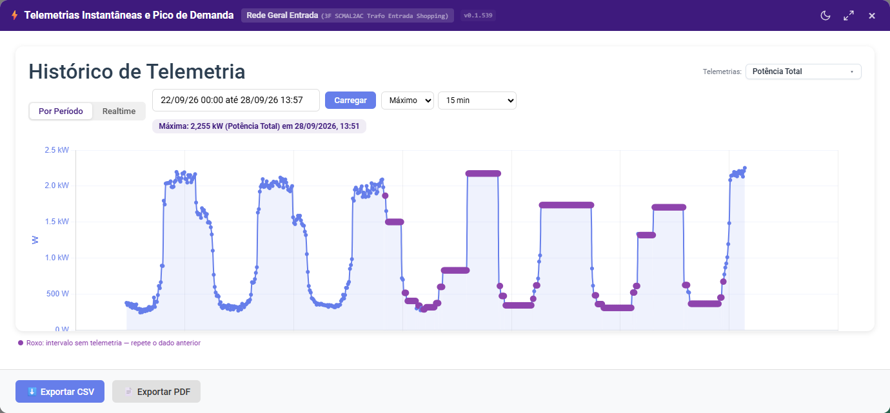
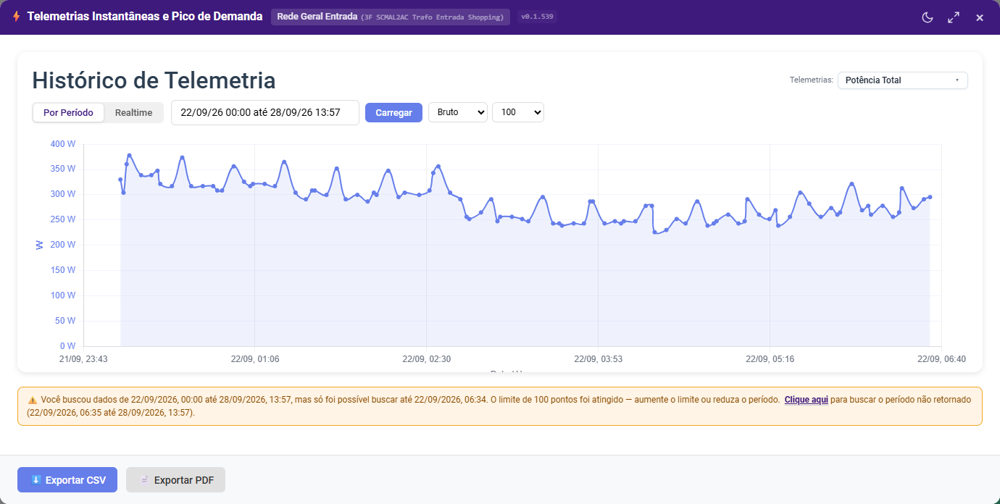
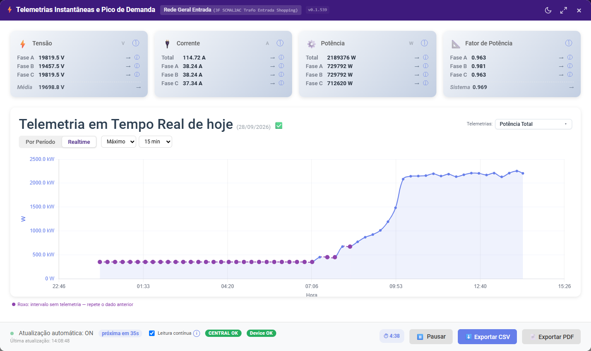
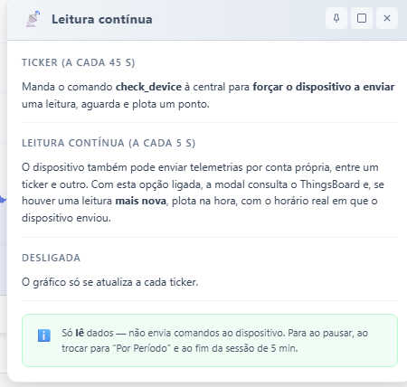

# Telemetria Instantânea e Pico de Demanda

> Guia do usuário — como consultar tensão, corrente, potência e fator de potência de um dispositivo (histórico e tempo real) e identificar o pico de demanda no dashboard MyIO.

## Visão geral

A modal **⚡ Telemetrias Instantâneas e Pico de Demanda** mostra, para um dispositivo de energia (entrada, medidor, etc.), duas visões complementares. **Cada aba tem o seu próprio gráfico e os seus próprios dados** — o que você consulta em uma não aparece na outra.

- **Por Período** — histórico de uma ou duas telemetrias (ex.: Potência Total) em um intervalo de datas, com o **pico de demanda** destacado.
- **Realtime** — leitura do **dia de hoje** (desde 00:00) de Tensão, Corrente, Potência e Fator de Potência por fase, atualizada automaticamente.

### Como acessar

1. Em um card de dispositivo de energia, clique no ícone **Dashboard** (⚡) para abrir a modal **Gráfico de Energia**.
2. Dentro dela, clique no botão **⚡ Telemetrias Instantâneas e Pico de Demanda**.

---

## Aba "Por Período" (padrão)

Ao abrir a modal, a aba **Por Período** já vem selecionada e carregada — nenhuma conexão em tempo real é iniciada até que você clique em **Realtime**.

Nessa aba você encontra:

- **Seletor de Telemetrias** — escolha até 2 grandezas diferentes para comparar no mesmo gráfico.
- **Período de datas** — intervalo consultado; clique em **Carregar** após alterar.
- **Agregação dos pontos** — Bruto, Média, Máximo, Mínimo ou Soma. Ela decide quais outros campos aparecem:

| Agregação | Campo exibido | Opções |
| --- | --- | --- |
| **Bruto** | **Limite de pontos** | 100, 500, 1000, 5000, 10000, 25000 ou 50000 |
| **Média / Máximo / Mínimo / Soma** | **Intervalo de agrupamento** | 15 min, 30 min, 1 hora, 2 horas, 4 horas, 12 horas ou 1 dia (24 horas) |

  Bruto mostra os valores reais recebidos do dispositivo, sem agrupar — por isso não tem intervalo. As demais agregações agrupam os dados no intervalo escolhido e não têm limite de pontos (o gráfico traz um ponto por intervalo).
- **Pico de demanda** — logo acima do gráfico (com **Máximo**), uma linha destaca o maior valor do período e quando ocorreu, por exemplo: *"Máxima: 2,198 kW (Potência Total) em 22/09/2026"*.
  - Com agrupamento de **1 dia (24 horas)**, o pico mostra só a data (sem horário), já que o valor representa o dia inteiro.
  - Nos demais agrupamentos, mostra data e horário.
  - O pico considera apenas leituras reais — nunca os pontos roxos descritos abaixo.
- **Exportar CSV / Exportar PDF** — no rodapé, para levar os dados para fora do dashboard.

Os cards de Tensão/Corrente/Potência/Fator de Potência **não aparecem** nesta aba: eles fazem sentido apenas para a leitura ao vivo.

### Pontos roxos: intervalos sem telemetria

O dispositivo só envia a potência quando o valor muda (ou quando a central força uma leitura). Se uma máquina fica estável em 10.000 W por 40 minutos, não chegam telemetrias nesse tempo. Para que o gráfico tenha **um ponto em cada intervalo**, quando uma agregação (Média, Máximo, Mínimo ou Soma) não encontra dados em um intervalo, o gráfico **repete o valor do intervalo anterior** e marca o ponto em **roxo**, com a linha tracejada até ele.

- Ao passar o mouse, o tooltip mostra a linha *"↺ Mesmo dado anterior (sem telemetria neste intervalo)"*.
- Uma legenda ("Roxo: intervalo sem telemetria — repete o dado anterior") aparece abaixo do gráfico sempre que houver pontos assim.
- **Bruto nunca preenche nada** — mostra sempre exatamente o que o dispositivo enviou.
- No início do período, o primeiro valor repetido vem da última leitura anterior à data inicial.

### Aviso de dados incompletos (Bruto)

Com **Bruto**, se os dados retornados terminam antes do fim do período pedido, um aviso fica **fixo abaixo do gráfico** até você fazer uma nova consulta:

> *Você buscou dados de 22/09/2026, 00:00 até 28/09/2026, 13:57, mas só foi possível buscar até 22/09/2026, 06:34. O limite de 100 pontos foi atingido — aumente o limite ou reduza o período.*

- Quando o motivo é o **limite de pontos**, o aviso traz o link **Clique aqui**. Ao clicar, o campo de período é preenchido com o trecho que faltou — começando **1 minuto depois** do último registro recebido e indo até o fim originalmente pedido. Basta clicar em **Carregar** para buscar o restante.
- Quando o dispositivo simplesmente não tem dados depois daquela data, o aviso informa isso e não oferece o link.
- Diferenças pequenas (até 15 minutos) entre o fim do período e o último dado não geram aviso, pois são normais.

---

## Aba "Realtime"

Clique em **Realtime** para ver o **dia de hoje**. O título mostra a data e o estado dos dados, por exemplo: **Telemetria em Tempo Real de hoje (28/09/2026) ✅**.

O ícone ao lado do título indica:

| Ícone | Significado |
| --- | --- |
| ✅ | Há telemetrias de hoje e central/dispositivo estão respondendo |
| ⚠️ | Atenção: central ou dispositivo falhou em uma verificação (ainda não é offline) |
| 🔴 | Central ou dispositivo offline |
| ❌ | O dispositivo não enviou nenhuma telemetria hoje |

### O que a aba mostra

- **Quatro cards por fase** — Tensão (V), Corrente (A), Potência (W) e Fator de Potência, com valores de Fase A/B/C e média/total do sistema. O ícone ⓘ de cada card abre mais detalhes.
- **Gráfico do dia** — sempre de 00:00 até agora. Ao entrar na aba, o gráfico já vem com o histórico de hoje e continua recebendo pontos. Se você voltar para **Por Período** e depois para **Realtime**, o gráfico de hoje continua de onde estava (o histórico do período nunca entra nele).
- **Agregação e intervalo** — ao lado das abas, escolha **Bruto** (valores reais, padrão), **Mínimo**, **Máximo**, **Média** ou **Soma**. Fora do Bruto, escolha o intervalo: **15 min, 30 min, 1 hora, 2 horas ou 4 horas**. O gráfico passa a ter um ponto a cada intervalo desde a meia-noite; intervalos sem telemetria repetem o dado anterior em **roxo**, como na aba Por Período.
- **Contador de sessão** (ex.: `⏱ 4:50`) — tempo restante da sessão; ao zerar, a atualização automática para sozinha, evitando conexões abertas indefinidamente.
- **Pausar / Retomar** e **Exportar CSV / PDF** — no rodapé.

### Rodapé: atualização automática

No rodapé você vê **Atualização automática: ON**, o tempo até a próxima atualização e, numa linha abaixo em texto mais discreto, o horário da **última atualização**.

A cada ciclo (por padrão **45 segundos**: 30 s de intervalo mais 15 s de espera) a modal manda um comando à central para **forçar o dispositivo a enviar** uma leitura e plota um ponto. Esse é o *ticker*.

### Leitura contínua (ⓘ)

O dispositivo pode enviar telemetrias por conta própria entre um ticker e outro. Com **Leitura contínua** ligada (padrão), a modal consulta o ThingsBoard a cada **5 segundos** e, quando há uma leitura **mais nova**, plota na hora com o horário real em que o dispositivo enviou. Desligada, o gráfico só se atualiza a cada ticker.

A leitura contínua só **lê** dados — não envia comandos ao dispositivo — e para junto com a atualização automática (ao pausar, ao trocar para Por Período e ao fim da sessão).

### Indicadores de saúde: CENTRAL e Device

Os badges do rodapé têm três estados. Uma falha **não** leva direto a offline:

| Badge | Quando aparece |
| --- | --- |
| **OK** (verde) | A última verificação foi bem-sucedida |
| **ATENÇÃO** (âmbar) | A verificação falhou, mas ainda não atingiu o limite de tentativas. O badge mostra a tentativa (ex.: 2/3) ao passar o mouse |
| **OFFLINE** (vermelho) | **3 falhas seguidas** (valor fixo por enquanto) |

- **CENTRAL** — falha quando a chamada de verificação (`check_device`) à central não responde.
- **Device** — falha quando a telemetria mais recente do próprio dispositivo tem **mais de 30 minutos**. Exemplo: são 13h e a última leitura do dispositivo foi às 12h20 → Device em **ATENÇÃO**; se continuar assim em 3 verificações seguidas → **OFFLINE**.
- Qualquer verificação bem-sucedida zera a contagem e o badge volta para OK. Uma leitura nova do dispositivo (inclusive pela leitura contínua) também volta o Device para OK.

Clique em um badge para ver o histórico de chamadas da central ou os detalhes do dispositivo.

---

## Números com casas decimais (padrão brasileiro)

Todos os valores numéricos da modal usam separador de milhar `.` e separador decimal `,` (ex.: `2.198,00`), seguindo o padrão brasileiro. Potências grandes são automaticamente escaladas de W para kW quando faz sentido.

---

## Dúvidas frequentes

**Por que a aba Realtime não teve nenhuma leitura ao abrir a modal?**
Por padrão, a modal abre em Por Período e não inicia a conexão em tempo real automaticamente — isso evita gastar rede quando você só quer ver o histórico. Clique em **Realtime** para começar.

**O pico de demanda não mostra hora, só a data — é um bug?**
Não. Isso acontece com o agrupamento de **1 dia (24 horas)**: o pico representa o valor máximo do dia inteiro, então não existe um horário específico.

**O que são os pontos roxos?**
São intervalos em que o dispositivo não enviou telemetria (por exemplo, porque a potência ficou estável). O gráfico repete o valor do intervalo anterior para manter um ponto por intervalo. Só aparecem fora do Bruto.

**Por que sumiram o intervalo de agrupamento (ou o limite de pontos)?**
Bruto mostra só o **Limite de pontos**; as outras agregações mostram só o **Intervalo de agrupamento**.

**Apareceu um aviso dizendo que só foi possível buscar até uma data anterior.**
Com Bruto, o limite de pontos foi atingido (ou o dispositivo não tem dados até o fim do período). Clique em **Clique aqui** no aviso para preencher o período restante e depois em **Carregar**, ou aumente o limite de pontos.

**O badge ficou âmbar (ATENÇÃO) — a central caiu?**
Ainda não. ATENÇÃO indica uma falha isolada; só após 3 verificações seguidas sem sucesso o estado vira OFFLINE.

**A leitura em tempo real parou sozinha depois de alguns minutos.**
É esperado — a sessão tem um tempo limite (contador no rodapé) para evitar conexões abertas indefinidamente. Clique novamente em **Realtime**, ou em **Retomar**, para iniciar uma nova sessão.
