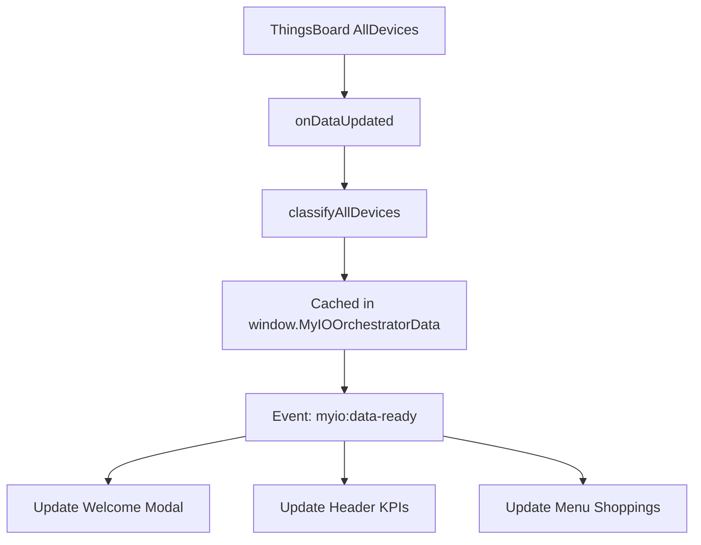

# MAIN_UNIQUE_DATASOURCE Widget

**RFC-0111: Unified Main Single Datasource Architecture**

## 📋 Resumo

Este widget implementa a nova arquitetura unificada onde **apenas 2 widgets ThingsBoard** permanecem:

- **MAIN_UNIQUE_DATASOURCE** (este widget - orquestra tudo)
- **TELEMETRY** (renderização dinâmica de dispositivos)

Todos os outros componentes (Header, Menu, Footer, Panels) foram migrados para a **MyIOLibrary**.

## 🏗️ Arquitetura

```
MAIN_UNIQUE_DATASOURCE (Widget Principal)
├── Datasource: "AllDevices" (todos os dispositivos)
├── Orquestrador: Classifica dispositivos por domain/context
├── Renderiza componentes MyIOLibrary:
│   ├── Welcome Modal (RFC-0112)
│   ├── Header Component (RFC-0113)
│   ├── Menu Component (RFC-0114)
│   └── Footer Component (RFC-0115)
└── Gerencia navegação e eventos
```

## 📁 Arquivos Criados

| Arquivo               | Descrição                                   |
| --------------------- | ------------------------------------------- |
| `template.html`       | Layout HTML com containers para componentes |
| `controller.js`       | Lógica de orquestração e classificação      |
| `styles.css`          | Estilos do layout e modais                  |
| `settingsSchema.json` | Configuração do widget (temas, cores)       |

## 🎯 Funcionalidades Principais

### 1. Welcome Modal (RFC-0112)

- Abre automaticamente em estado de loading ("Aguarde...")
- Recebe shopping cards após classificação de dispositivos
- Theme toggle (dark/light)
- CTA button habilitado quando dados estão prontos

### 2. Header Component (RFC-0113)

- Exibe KPIs dos dispositivos (total, energia, água, temperatura)
- Configurável via settings (cores dos cards)
- Botão "voltar" reabre Welcome Modal
- Filter modal para selecionar shoppings

### 3. Menu Component (RFC-0114)

- Navegação por tabs (Energia, Água, Temperatura)
- Contextos configuráveis por tab
- Date range picker integrado
- Eventos de navegação dispatched para TELEMETRY

### 4. Footer Component (RFC-0115)

- Seleção de até 6 dispositivos
- Botão de comparação
- Sincronizado com estado do dashboard

### 5. Device Classification

Classifica todos os dispositivos do datasource `AllDevices` por:

**Domains**:

- `energy` - Dispositivos de energia
- `water` - Hidrômetros
- `temperature` - Sensores de temperatura

**Contexts**:

- Energy: `equipments`, `stores`
- Water: `hidrometro_area_comum`, `hidrometro`
- Temperature: `termostato`, `termostato_external`

## 🔄 Fluxo de Dados



## 📡 Eventos Dispatched

| Evento                         | Quando                      | Payload                                                  |
| ------------------------------ | --------------------------- | -------------------------------------------------------- |
| `myio:data-ready`              | Dados classificados         | `{ classified, shoppingCards, deviceCounts, shoppings }` |
| `myio:telemetry-config-change` | Mudança de contexto no menu | `{ domain, context, timestamp }`                         |
| `myio:filter-applied`          | Filtro aplicado             | `{ selection, ts }`                                      |
| `myio:update-date`             | Range de data alterado      | `{ startISO, endISO }`                                   |
| `myio:theme-change`            | Tema alterado               | `{ themeMode }`                                          |
| `myio:dashboard-state`         | Mudança de estado           | `{ domain, stateId }`                                    |

## 📡 Eventos Listened

| Evento                     | Handler                                      |
| -------------------------- | -------------------------------------------- |
| `myio:data-ready`          | Atualiza componentes com dados classificados |
| `myio:panel-modal-request` | Abre modal de painel (Energy/Water/Temp)     |

## ⚙️ Configuração no ThingsBoard

### Datasource

Nome: `AllDevices`

**DataKeys Requeridos**:

```
- deviceType
- deviceProfile
- identifier
- ingestionId
- connectionStatus
- lastActivityTime
- lastConnectTime
- lastDisconnectTime
- centralName
- ownerName
- assetName
- customerId
- consumption (energy)
- pulses (water)
- temperature (temperature)
- water_level (tank)
```

### Widget Settings

**Theme**:

- `defaultThemeMode`: "dark" | "light"
- `darkMode`: { backgroundUrl, logoUrl, primaryColor, textColor }
- `lightMode`: { backgroundUrl, logoUrl, primaryColor, textColor }

**Welcome Modal**:

- `defaultHeroTitle`: Título principal
- `defaultHeroDescription`: Descrição
- `defaultPrimaryLabel`: Label do botão CTA

**Header Cards**:

- `cardEquipamentosBackgroundColor`
- `cardEquipamentosFontColor`
- `cardEnergiaBackgroundColor`
- `cardEnergiaFontColor`
- `cardTemperaturaBackgroundColor`
- `cardTemperaturaFontColor`
- `cardAguaBackgroundColor`
- `cardAguaFontColor`

**Menu Tabs**:

- `tabSelecionadoBackgroundColor`
- `tabSelecionadoFontColor`
- `tabNaoSelecionadoBackgroundColor`
- `tabNaoSelecionadoFontColor`

## 🔌 Integração com TELEMETRY

O widget TELEMETRY deve:

1. **Escutar o evento** `myio:telemetry-config-change`:

```javascript
window.addEventListener('myio:telemetry-config-change', (ev) => {
  const { domain, context } = ev.detail;
  WIDGET_DOMAIN = domain;
  WIDGET_CONTEXT = context;

  // Buscar devices do orchestrator
  const devices = window.MyIOOrchestrator?.getDevices(domain, context) || [];

  // Re-renderizar
  initializeCards(devices);
});
```

2. **Usar o MyIOOrchestrator** para buscar dispositivos:

```javascript
const devices = window.MyIOOrchestrator.getDevices('energy', 'equipments');
```

## 🎨 Panel Modals

Quando o usuário clica em "Geral" (energia), "Resumo" (água) ou "Resumo Geral" (temperatura), um modal 95vh x 95vw é aberto com:

- **Energy Panel** (RFC-0117) - createEnergyPanel()
- **Water Panel** (RFC-0118) - createWaterPanel()
- **Temperature Panel** (RFC-0119) - createTemperaturePanel()

**Nota**: Estes componentes de painel ainda precisam ser implementados na MyIOLibrary.

## ✅ Status da Implementação

- [x] template.html criado
- [x] controller.js criado (645 linhas)
- [x] styles.css criado
- [x] settingsSchema.json criado
- [x] ESLint configurado
- [ ] Panel components (RFC-0117, 0118, 0119) - não implementados ainda
- [ ] TELEMETRY modificado com event listener

## 🚀 Próximos Passos

1. **Criar Panel Components** na MyIOLibrary:

   - `src/components/energy-panel/`
   - `src/components/water-panel/`
   - `src/components/temperature-panel/`

2. **Modificar TELEMETRY**:

   - Adicionar listener para `myio:telemetry-config-change`
   - Atualizar CONTEXT_CONFIG com novos contextos

3. **Configurar Dashboard ThingsBoard**:
   - Criar datasource `AllDevices`
   - Adicionar widget MAIN_UNIQUE_DATASOURCE
   - Configurar state `telemetry` para TELEMETRY widget

## 📝 Notas Importantes

- **NÃO modificar** `src/MYIO-SIM/v5.2.0/MAIN/` (legacy)
- **NÃO modificar** `src/MYIO-SIM/v5.2.0/MENU/` (legacy)
- Este widget substitui 8+ widgets antigos
- MyIOLibrary deve estar carregada antes deste widget

## 📚 RFCs Relacionados

- RFC-0111: Unified Main Single Datasource Architecture
- RFC-0112: Welcome Modal Head Office
- RFC-0113: Header Component
- RFC-0114: Menu Component
- RFC-0115: Footer Component
- RFC-0117: Energy Panel Component (pendente)
- RFC-0118: Water Panel Component (pendente)
- RFC-0119: Temperature Panel Component (pendente)

---

**Versão**: 1.0.0  
**Data**: 2026-01-02  
**Status**: ✅ Widget Base Implementado
