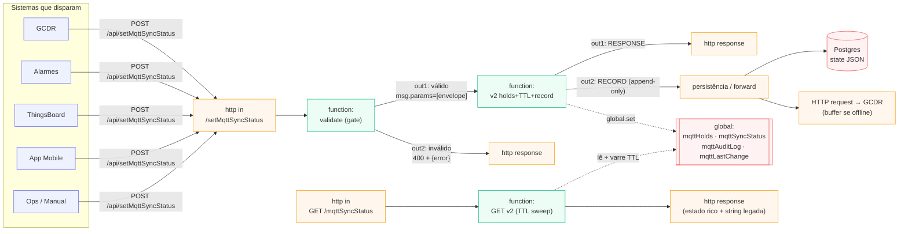
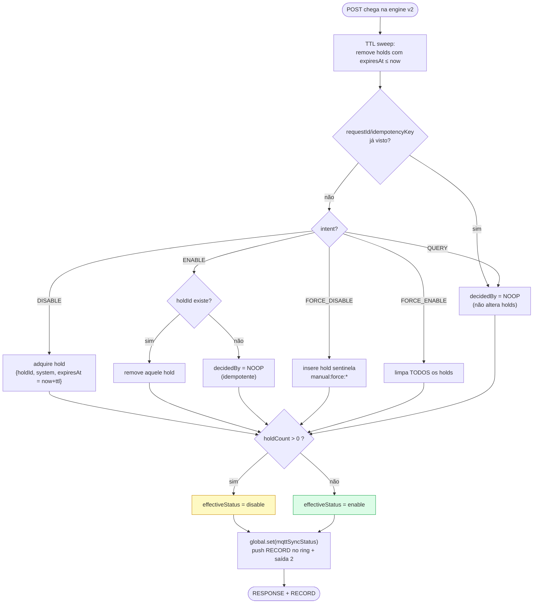
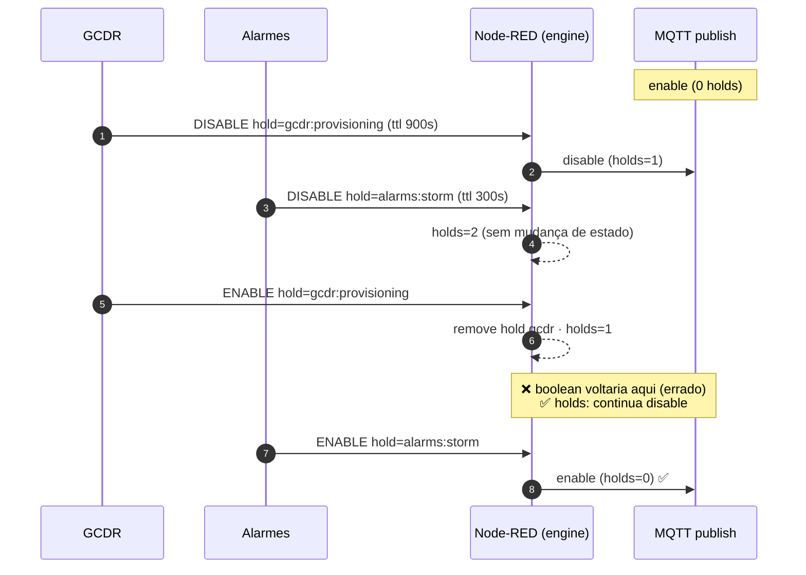
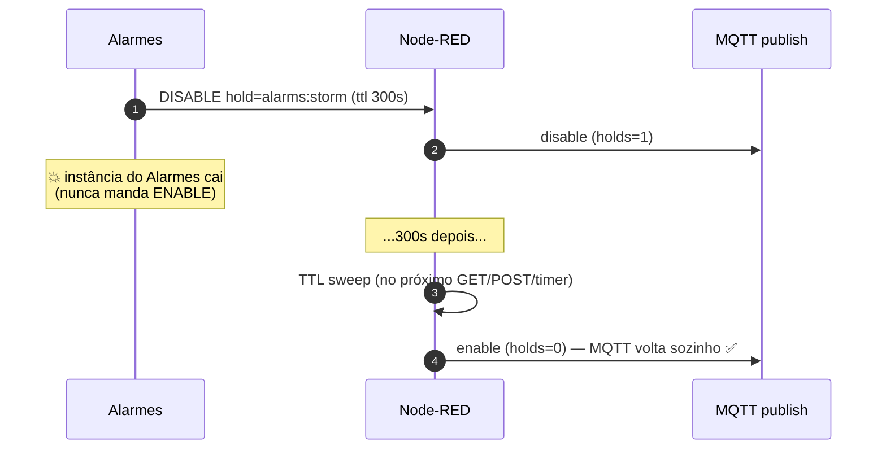
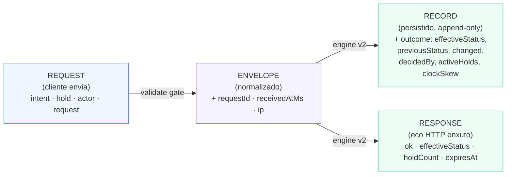

# mqttSyncStatus v2 — Diagramas do Fluxo

Central: **Ilha Plaza AL1** (Soul Malls) · Gateway `81a60176-222c-4bb9-88f5-bc2b47802d82`
Spec: [`../setMqttSyncStatus-payload-spec.md`](../setMqttSyncStatus-payload-spec.md)

Functions numeradas por step em [`v2/`](./v2/) (índice: [`v2/README.md`](./v2/README.md)):
- `v2/01-validate-gate.js` — step 1: gate de validação (2 saídas)
- `v2/02-engine-holds-ttl-record.js` — step 2: engine holds + TTL + record + global derivado (2 saídas)
- `v2/03-get-status-ttl-sweep.js` — step 3: leitura GET com TTL sweep (1 saída)

---

## 0. O que é o Node-RED

**Node-RED** é um runtime de automação baseado em **fluxos**: a lógica é montada
ligando **nós** (caixas) por **fios**, e cada mensagem (`msg`, um objeto JS com
`msg.payload`) percorre esses fios de nó em nó. Nas **centrais MyIO** (Orange Pi
com Linux) ele roda **embarcado** pelo `myio-api.service` e faz a ponte entre os
medidores no campo (Modbus/MQTT) e a nuvem — expondo a REST local em `/api/*`
(porta 8080), onde GCDR, Alarmes, ThingsBoard e o App disparam chamadas como
`POST /api/setMqttSyncStatus`. Os nós `function` são blocos de JavaScript; o
estado entre execuções fica no **contexto** `global` (em memória por padrão).
Editor em `/red`; fluxos salvos como JSON
(`../../bkp-all-flows-ilha-plaza-al1-2026-06-16.json`).

---

## 1. Topologia do flow no Node-RED

---

## 2. Decisão do `effectiveStatus` (modelo de holds)

> Regra única: **MQTT habilitado ⟺ nenhum hold ativo.**

---

## 3. O problema que o modelo resolve — concorrência multi-sistema

Linha do tempo: **GCDR** e **Alarmes** pausam o MQTT ao mesmo tempo, por razões diferentes.
Com boolean (last-writer-wins) o MQTT voltaria cedo demais. Com holds, não.

### Dead-man switch (TTL) — auto-recuperação

---

## 4. Três documentos, um por etapa

> `previousStatus` / `changed` / `effectiveStatus` são **resultado do servidor** — vivem só no RECORD/RESPONSE, nunca no REQUEST.

---

## 5. `decidedBy` — por que o estado é o que é

| valor | quando | observabilidade |
|-------|--------|-----------------|
| `HOLD_COUNT` | fluxo normal (acquire/release) | estado segue a contagem de holds |
| `FORCE` | `FORCE_ENABLE` / `FORCE_DISABLE` (override ops) | sempre auditado: quem forçou e por quê |
| `TTL_EXPIRED` | hold venceu e foi varrido | auto-recuperação registrada |
| `NOOP` | idempotência / `QUERY` / hold já liberado | retry seguro, sem efeito colateral |
