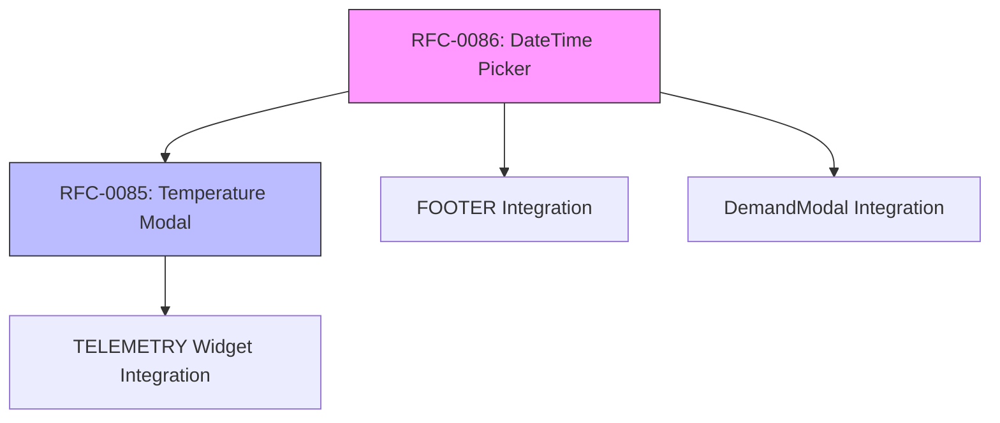

# Implementation Plan: RFC-0085 + RFC-0086

**Created**: 2025-11-28
**Updated**: 2025-11-28
**RFCs**: RFC-0085 (Temperature Modal) + RFC-0086 (DateTime Picker)
**Priority**: High

---

## Executive Summary

Este plano combina a implementação de duas RFCs interdependentes:

| RFC | Objetivo | Componente Principal |
|-----|----------|---------------------|
| **RFC-0085** | Extrair modal de temperatura do widget TELEMETRY | `openTemperatureModal()` |
| **RFC-0086** | Adicionar suporte a datetime no DateRangePicker | `createDateRangePicker({ includeTime: true })` |

**Dependência**: RFC-0086 deve ser implementado primeiro, pois RFC-0085 usa o DateTime Picker.

---

## Two Separate Components

### Overview

Este plano cria **2 componentes distintos** exportados pela biblioteca:

| Componente | Propósito | Código Fonte Atual | Linhas |
|------------|-----------|-------------------|--------|
| **`openTemperatureModal`** | Gráfico de **1 único device** | `TELEMETRY/controller.js` (if isTermostato) | 1276-1793 (~517 linhas) |
| **`openTemperatureComparisonModal`** | Gráfico comparativo **múltiplos devices** | `MYIO-SIM/v5.2.0/FOOTER/controller.js` | 1553-1849 (~296 linhas) |

### Exportação Final em `index.ts`

```typescript
// RFC-0085: Temperature Modals
export { openTemperatureModal } from './components/TemperatureModal';
export { openTemperatureComparisonModal } from './components/TemperatureComparisonModal';

export type {
  TemperatureModalParams,
  TemperatureModalInstance,
  TemperatureComparisonModalParams,
  TemperatureComparisonModalInstance,
  TemperatureGranularity
} from './components/temperature/types';
```

### Features Comuns a Ambos os Componentes

Cada modal **DEVE** ter:

| Feature | Descrição |
|---------|-----------|
| **DateRangePicker** | Seletor de período com hora (RFC-0086) |
| **Theme Toggle** | Dark/Light mode (persistido no localStorage) |
| **Granularity Select** | Hora (30min) / Dia (média) |
| **Premium Tooltip** | Data/hora + temperatura |
| **CSV Export** | Exportar dados para CSV |
| **Loading State** | Spinner durante fetch |
| **Error Handling** | Mensagens de erro amigáveis |

### Diferenças Entre os Componentes

| Aspecto | `openTemperatureModal` | `openTemperatureComparisonModal` |
|---------|------------------------|----------------------------------|
| **Dispositivos** | 1 único device | 2+ devices |
| **Gráfico** | Linha única | Múltiplas linhas coloridas |
| **Legenda** | Opcional | Obrigatória (identificar cada sensor) |
| **Stats** | avg/min/max do device | avg/min/max por device |
| **Fonte de dados** | ThingsBoard API | ThingsBoard API |
| **Cores** | Cor única (#1976d2) | Paleta de cores por sensor |

---

## New Feature: Granularity Control (Dia/Hora)

### Requisito

Adicionar um **select de granularidade** separado do DateRangePicker que altera como os dados são exibidos:

| Granularidade | Eixo X | Dados | Tooltip |
|---------------|--------|-------|---------|
| **Hora** | Data + Hora (30 min intervals) | Pontos a cada 30min | `25/01/2025 14:30 - 24.5°C` |
| **Dia** | Apenas Data | Média do dia | `25/01/2025 - Média: 23.8°C` |

### Interpolação de 30 Minutos (Modo Hora)

Quando granularidade = `Hora`:
- Gerar pontos a cada 30 minutos
- Se não há leitura no intervalo, **repetir última temperatura conhecida**
- Garante linha contínua no gráfico

```typescript
// Exemplo de interpolação
const interpolatedData = interpolateTemperature(rawData, {
  intervalMinutes: 30,
  fillStrategy: 'repeat-last' // Repete última temperatura se sem dados
});

// Input:  [{ ts: 14:00, value: 24 }, { ts: 15:30, value: 25 }]
// Output: [
//   { ts: 14:00, value: 24 },
//   { ts: 14:30, value: 24 },  // Interpolado (repeat-last)
//   { ts: 15:00, value: 24 },  // Interpolado (repeat-last)
//   { ts: 15:30, value: 25 }
// ]
```

### UI do Controle de Granularidade

```
┌─────────────────────────────────────────────────────────────┐
│  📅 Período: [01/01/2025 00:00] até [25/01/2025 23:59]     │
│                                                             │
│  📊 Granularidade: [▼ Hora (30 min) ]                      │
│                    ├─ Hora (30 min)  ← Pontos a cada 30min │
│                    └─ Dia            ← Média diária        │
└─────────────────────────────────────────────────────────────┘
```

### Aplicação

Este controle de granularidade se aplica a:

1. **Temperature Modal** (RFC-0085) - Gráfico individual
2. **FOOTER Comparison Modal** - Gráfico comparativo de múltiplos sensores

### Tooltip Premium

```
┌─────────────────────────┐
│ 📅 25/01/2025 14:30    │
│ 🌡️ 24.5°C              │
│ ─────────────────────  │
│ Min: 23.2°C            │
│ Max: 25.8°C            │
└─────────────────────────┘
```

---

## Phase 0: Preparation

### 0.1 Analyze Existing Code

| File | Action | Lines |
|------|--------|-------|
| `TELEMETRY/controller.js` | Read temperature modal code | 1276-1792 |
| `createDateRangePicker.ts` | Read current implementation | All |
| `DemandModal.ts` | Read current date handling | Date inputs |
| `FOOTER/controller.js` | Check for date picker usage | All |

### 0.2 Create Feature Branch

```bash
git checkout -b feature/rfc-0085-0086-temperature-datetime
```

---

## Phase 1: Extend DateRangePicker (RFC-0086)

**Version**: v0.1.140
**Duration**: 2-3 days

### 1.1 Modify `src/components/createDateRangePicker.ts`

#### Tasks:

- [ ] **1.1.1** Add `includeTime` option to interface
  ```typescript
  interface CreateDateRangePickerOptions {
    // Existing options...
    includeTime?: boolean;          // NEW
    timePrecision?: 'minute' | 'hour'; // NEW
  }
  ```

- [ ] **1.1.2** Add time input fields to popup HTML
  ```html
  <div class="daterangepicker-time-section">
    <label>Hora início: <input type="time" class="time-start" value="00:00" /></label>
    <label>Hora fim: <input type="time" class="time-end" value="23:59" /></label>
  </div>
  ```

- [ ] **1.1.3** Implement time presets
  ```typescript
  const TIME_PRESETS = {
    'Última hora': { hours: 1 },
    'Últimas 6 horas': { hours: 6 },
    'Últimas 12 horas': { hours: 12 },
    'Últimas 24 horas': { hours: 24 },
    'Hoje': { today: true },
    'Ontem': { yesterday: true }
  };
  ```

- [ ] **1.1.4** Update `formatResult()` to include time
  ```typescript
  function formatResult(startDate: Date, endDate: Date, includeTime: boolean): DateRangeResult {
    if (includeTime) {
      return {
        startISO: startDate.toISOString(),
        endISO: endDate.toISOString(),
        startDate,
        endDate
      };
    }
    // Existing date-only logic...
  }
  ```

- [ ] **1.1.5** Add CSS for time section
  ```css
  .daterangepicker-time-section {
    display: flex;
    gap: 16px;
    padding: 12px 16px;
    border-top: 1px solid var(--border-color);
  }
  ```

### 1.2 Update Types Export

**File**: `src/index.ts`

- [ ] Export new types if needed

### 1.3 Test DateTime Picker

- [ ] Test with `includeTime: false` (backward compatibility)
- [ ] Test with `includeTime: true` (new functionality)
- [ ] Test time presets
- [ ] Test manual time input
- [ ] Test timezone handling

---

## Phase 2A: Create `openTemperatureModal` (Single Device)

**Version**: v0.1.141
**Duration**: 3-4 days
**Source**: Extract from `TELEMETRY/controller.js` lines 1276-1793

### 2A.1 Create Component Structure

**File**: `src/components/TemperatureModal.ts`

#### Tasks:

- [ ] **2.1.1** Create file with TypeScript interfaces
  ```typescript
  export interface TemperatureModalParams {
    token: string;
    deviceId: string;
    startDate: string;
    endDate: string;
    label?: string;
    currentTemperature?: number;
    temperatureMin?: number;
    temperatureMax?: number;
    temperatureStatus?: 'ok' | 'above' | 'below';
    container?: HTMLElement | string;
    onClose?: () => void;
    locale?: 'pt-BR' | 'en-US';
    clampRange?: { min: number; max: number };
    styles?: Partial<TemperatureModalStyles>;

    // NEW: Granularity support
    granularity?: 'hour' | 'day';  // default: 'hour'
  }

  export interface TemperatureModalInstance {
    destroy: () => void;
    updateData: (startDate: string, endDate: string, granularity?: 'hour' | 'day') => Promise<void>;
  }

  // Granularity type for temperature domain
  export type TemperatureGranularity = 'hour' | 'day';
  ```

- [ ] **2.1.2** Implement `fetchTemperatureData()`
  - ThingsBoard API call
  - Error handling with retry
  - Return typed telemetry array

- [ ] **2.1.3** Implement `clampTemperature()`
  - Default range: 15-40°C
  - Handle outliers

- [ ] **2.1.4** Implement `calculateStats()`
  - Return: avg, min, max, count
  - Handle edge cases (empty data)

- [ ] **2.1.5** Implement `interpolateTemperature()` **[NEW]**
  ```typescript
  function interpolateTemperature(
    data: TemperatureTelemetry[],
    options: {
      intervalMinutes: number;  // 30 for hour mode
      fillStrategy: 'repeat-last' | 'linear';
      startTs: number;
      endTs: number;
    }
  ): TemperatureTelemetry[]
  ```
  - Generate points every 30 minutes (hour mode)
  - If no reading in interval, repeat last known temperature
  - Ensures continuous line in chart

- [ ] **2.1.6** Implement `aggregateByDay()` **[NEW]**
  ```typescript
  function aggregateByDay(
    data: TemperatureTelemetry[]
  ): DailyTemperatureStats[]

  interface DailyTemperatureStats {
    date: string;      // "2025-01-25"
    avg: number;
    min: number;
    max: number;
    count: number;
  }
  ```
  - Group readings by day
  - Calculate daily average, min, max

- [ ] **2.1.7** Implement `drawTemperatureChart()`
  - Canvas-based line chart
  - **Hour mode**: X-axis = datetime (30 min intervals)
  - **Day mode**: X-axis = date only (daily averages)
  - Y-axis: temperature
  - Threshold lines (min/max)
  - Premium tooltip with full datetime

- [ ] **2.1.8** Implement Premium Tooltip **[NEW]**
  ```typescript
  interface TooltipData {
    datetime: string;     // "25/01/2025 14:30" or "25/01/2025"
    temperature: number;
    isInterpolated?: boolean;  // Show indicator if interpolated
    dailyMin?: number;    // For day mode
    dailyMax?: number;    // For day mode
  }
  ```
  - Styled tooltip box
  - Show full date/time
  - Show min/max for day mode

- [ ] **2.1.9** Implement modal HTML structure
  - Header with device label
  - Stats cards (current, avg, min, max)
  - Chart container
  - **Granularity select** (Hora/Dia) **[NEW]**
  - DateTime picker (using RFC-0086)
  - Action buttons (Export CSV, Close)

- [ ] **2.1.10** Implement Granularity Select **[NEW]**
  ```html
  <div class="myio-temp-modal-controls">
    <div class="myio-granularity-select">
      <label>Granularidade:</label>
      <select id="temp-granularity">
        <option value="hour" selected>Hora (30 min)</option>
        <option value="day">Dia (média)</option>
      </select>
    </div>
    <div class="myio-date-range">
      <input type="text" id="temp-date-range" readonly />
    </div>
    <button id="temp-load-btn">Carregar</button>
  </div>
  ```
  - On change: re-fetch and re-render chart with new granularity

- [ ] **2.1.7** Implement `exportTemperatureCSV()`
  - Include stats summary
  - Include all data points
  - UTF-8 BOM for Excel compatibility

- [ ] **2.1.8** Implement `openTemperatureModal()`
  - Main export function
  - Return instance with destroy/updateData

### 2.2 Export in Index

**File**: `src/index.ts`

- [ ] Add exports:
  ```typescript
  export { openTemperatureModal } from './components/TemperatureModal';
  export type {
    TemperatureModalParams,
    TemperatureModalInstance,
    TemperatureStats
  } from './components/TemperatureModal';
  ```

### 2A.3 Unit Tests

**File**: `src/components/__tests__/TemperatureModal.test.ts`

- [ ] Test clampTemperature function
- [ ] Test calculateStats function
- [ ] Test interpolateTemperature function
- [ ] Test aggregateByDay function
- [ ] Test modal opens correctly
- [ ] Test granularity toggle
- [ ] Test theme toggle
- [ ] Test date range update
- [ ] Test CSV export

---

## Phase 2B: Create `openTemperatureComparisonModal` (Multiple Devices)

**Version**: v0.1.142
**Duration**: 3-4 days
**Source**: Extract from `MYIO-SIM/v5.2.0/FOOTER/controller.js` lines 1553-1849

### 2B.1 Create Component Structure

**File**: `src/components/TemperatureComparisonModal.ts`

#### Tasks:

- [ ] **2B.1.1** Create file with TypeScript interfaces
  ```typescript
  export interface TemperatureComparisonModalParams {
    token: string;                       // JWT token ThingsBoard
    devices: TemperatureDevice[];        // Array of devices to compare
    startDate: string;                   // ISO datetime
    endDate: string;                     // ISO datetime

    // Optional
    container?: HTMLElement | string;
    onClose?: () => void;
    locale?: 'pt-BR' | 'en-US';
    granularity?: 'hour' | 'day';        // default: 'hour'
    theme?: 'dark' | 'light';            // default: 'dark'
    clampRange?: { min: number; max: number };
  }

  export interface TemperatureDevice {
    id: string;           // ThingsBoard device UUID
    label: string;        // Device label for legend
    tbId?: string;        // Alternative ThingsBoard ID
  }

  export interface TemperatureComparisonModalInstance {
    destroy: () => void;
    updateData: (startDate: string, endDate: string, granularity?: 'hour' | 'day') => Promise<void>;
  }
  ```

- [ ] **2B.1.2** Implement `fetchMultipleDevicesData()`
  - Fetch temperature data for all devices in parallel
  - Use Promise.all for concurrent requests
  - Return typed array of results per device

- [ ] **2B.1.3** Reuse shared utilities
  - Import from `./temperature/utils.ts`:
    - `clampTemperature()`
    - `interpolateTemperature()`
    - `aggregateByDay()`
    - `calculateStats()`

- [ ] **2B.1.4** Implement `drawComparisonChart()`
  - Canvas-based multi-line chart
  - Different color per device (color palette)
  - Legend showing device labels + colors
  - **Hour mode**: 30-min intervals per device
  - **Day mode**: Daily averages per device

- [ ] **2B.1.5** Implement chart color palette
  ```typescript
  const CHART_COLORS = [
    '#1976d2', // Blue
    '#FF6B6B', // Red
    '#4CAF50', // Green
    '#FF9800', // Orange
    '#9C27B0', // Purple
    '#00BCD4', // Cyan
    '#E91E63', // Pink
    '#795548', // Brown
  ];
  ```

- [ ] **2B.1.6** Implement modal HTML structure
  ```html
  <div class="myio-temp-comparison-modal">
    <!-- Header -->
    <div class="myio-temp-comparison-header">
      <h2>🌡️ Comparação de Temperatura</h2>
      <p>${devices.length} sensores selecionados</p>
      <button class="close-btn">×</button>
    </div>

    <!-- Controls Row -->
    <div class="myio-temp-comparison-controls">
      <div class="granularity-select">
        <label>Granularidade:</label>
        <select id="comparison-granularity">
          <option value="hour">Hora (30 min)</option>
          <option value="day">Dia (média)</option>
        </select>
      </div>
      <div class="date-range">
        <input type="text" id="comparison-date-range" readonly />
      </div>
      <div class="theme-toggle">
        <button id="theme-toggle-btn">🌙/☀️</button>
      </div>
      <button id="load-btn">Carregar</button>
    </div>

    <!-- Legend -->
    <div class="myio-temp-comparison-legend" id="comparison-legend">
      <!-- Device labels with colors -->
    </div>

    <!-- Chart Container -->
    <div class="myio-temp-comparison-chart" id="comparison-chart">
      <canvas id="comparison-canvas"></canvas>
    </div>

    <!-- Stats per Device -->
    <div class="myio-temp-comparison-stats">
      <!-- Stats cards per device -->
    </div>

    <!-- Actions -->
    <div class="myio-temp-comparison-actions">
      <button id="export-csv-btn">Exportar CSV</button>
      <button id="close-btn">Fechar</button>
    </div>
  </div>
  ```

- [ ] **2B.1.7** Implement legend with device colors
  ```typescript
  function renderLegend(devices: TemperatureDevice[], colors: string[]): string {
    return devices.map((device, i) => `
      <div class="legend-item">
        <span class="legend-color" style="background: ${colors[i]}"></span>
        <span class="legend-label">${device.label}</span>
      </div>
    `).join('');
  }
  ```

- [ ] **2B.1.8** Implement theme toggle (dark/light)
  - Persist theme in localStorage (`myio-temp-comparison-theme`)
  - Update chart colors based on theme
  - Update modal background/text colors

- [ ] **2B.1.9** Implement CSV export for comparison
  - Header: Device Name, DateTime, Temperature
  - One row per reading per device
  - Include stats summary at top

### 2B.2 Export in Index

**File**: `src/index.ts`

- [ ] Add exports:
  ```typescript
  export { openTemperatureComparisonModal } from './components/TemperatureComparisonModal';
  export type {
    TemperatureComparisonModalParams,
    TemperatureComparisonModalInstance,
    TemperatureDevice
  } from './components/TemperatureComparisonModal';
  ```

### 2B.3 Unit Tests

**File**: `src/components/__tests__/TemperatureComparisonModal.test.ts`

- [ ] Test modal opens with multiple devices
- [ ] Test fetchMultipleDevicesData
- [ ] Test legend renders correctly
- [ ] Test color assignment
- [ ] Test granularity toggle
- [ ] Test theme toggle
- [ ] Test CSV export

---

## Phase 3A: Integrate `openTemperatureModal` in TELEMETRY Widget

**Version**: v0.1.143
**Duration**: 1-2 days

### 3.1 Simplify Widget Code

**File**: `src/thingsboard/.../WIDGET/TELEMETRY/controller.js`

#### Before (lines 1276-1792):
```javascript
// 500+ lines of inline modal code
if (isTermostato) {
  const url = `/api/plugins/telemetry/...`;
  // ... fetch, stats, HTML, canvas, etc.
}
```

#### After (~15 lines):
```javascript
if (isTermostato) {
  const jwtToken = localStorage.getItem('jwt_token');

  await MyIOLibrary.openTemperatureModal({
    token: jwtToken,
    deviceId: it.tbId || it.id,
    startDate: new Date(startTs).toISOString(),
    endDate: new Date(endTs).toISOString(),
    label: it.label || 'Dispositivo',
    currentTemperature: it.temperature,
    temperatureMin: it.temperatureMin,
    temperatureMax: it.temperatureMax,
    temperatureStatus: it.temperatureStatus,
    locale: 'pt-BR',
    onClose: () => {
      console.log('[TELEMETRY] Temperature modal closed');
    }
  });
}
```

### 3A.2 Remove Old Code

- [ ] Remove lines 1276-1792 from TELEMETRY/controller.js
- [ ] Keep any necessary helper functions
- [ ] Test widget still works

---

## Phase 3B: Integrate `openTemperatureComparisonModal` in FOOTER

**Version**: v0.1.144
**Duration**: 1-2 days

### 3B.1 Simplify FOOTER Code

**File**: `src/MYIO-SIM/v5.2.0/FOOTER/controller.js`

#### Before (lines 1553-1849):
```javascript
// ~296 lines of inline modal code
async _openTemperatureComparisonModal(selectedEntities) {
  const modalHtml = `<div id="${modalId}" style="...">...</div>`;
  // ... fetch data for all devices
  // ... create canvas
  // ... draw multi-line chart
  // ... handle events
}

_drawTemperatureComparisonChart(modalId, results, colors) {
  // ... 55 lines of canvas drawing
}
```

#### After (~15 lines):
```javascript
async _openTemperatureComparisonModal(selectedEntities) {
  const jwtToken = localStorage.getItem('jwt_token');

  // Map selected entities to devices array
  const devices = selectedEntities.map(entity => ({
    id: entity.tbId || entity.id,
    label: entity.label || entity.name || entity.id
  }));

  // Get date range from context
  const ctx = self.ctx || {};
  const startDateISO = ctx.scope?.startDateISO || new Date(Date.now() - 7 * 24 * 60 * 60 * 1000).toISOString();
  const endDateISO = ctx.scope?.endDateISO || new Date().toISOString();

  await MyIOLibrary.openTemperatureComparisonModal({
    token: jwtToken,
    devices: devices,
    startDate: startDateISO,
    endDate: endDateISO,
    granularity: 'hour',
    theme: 'dark',
    locale: 'pt-BR',
    onClose: () => {
      LogHelper.log('[FOOTER] Temperature comparison modal closed');
    }
  });
}
```

### 3B.2 Remove Old Code

- [ ] Remove `_openTemperatureComparisonModal` method (lines 1553-1786)
- [ ] Remove `_drawTemperatureComparisonChart` method (lines 1794-1849)
- [ ] Test FOOTER comparison still works

---

## Phase 4: Additional FOOTER Enhancements (Optional)

**Version**: v0.1.145
**Duration**: 1 day

### 4.1 Add Quick Access Controls (if needed)

**File**: `FOOTER/controller.js`

**Current Code:**
```html
<div>
  <h2 style="...">🌡️ Comparação de Temperatura</h2>
  <p style="...">${selectedEntities.length} sensores selecionados</p>
</div>
```

**New Code with Granularity + DateTime:**
```html
<div class="myio-comparison-header">
  <h2 style="...">🌡️ Comparação de Temperatura</h2>
  <p style="...">${selectedEntities.length} sensores selecionados</p>

  <!-- NEW: Controls Row -->
  <div class="myio-comparison-filters" style="display: flex; gap: 16px; margin-top: 16px; align-items: flex-end;">
    <div class="myio-granularity-select">
      <label style="color: rgba(255,255,255,0.8); font-size: 12px; display: block;">Granularidade:</label>
      <select id="comparison-granularity" style="padding: 8px 12px; border-radius: 8px; background: rgba(255,255,255,0.1); color: #fff; border: 1px solid rgba(255,255,255,0.2);">
        <option value="hour" selected>Hora (30 min)</option>
        <option value="day">Dia (média)</option>
      </select>
    </div>
    <div class="myio-date-range">
      <label style="color: rgba(255,255,255,0.8); font-size: 12px; display: block;">Período:</label>
      <input type="text" id="comparison-date-range" readonly placeholder="Selecione..." style="padding: 8px 12px; border-radius: 8px; background: rgba(255,255,255,0.1); color: #fff; border: 1px solid rgba(255,255,255,0.2); width: 280px;" />
    </div>
    <button id="comparison-load-btn" style="padding: 8px 16px; border-radius: 8px; background: #9E8CBE; color: #fff; border: none; cursor: pointer;">
      Carregar
    </button>
  </div>
</div>
```

### 4.2 Add Granularity Logic

**File**: `FOOTER/controller.js`

- [ ] **4.2.1** Add granularity state variable:
  ```javascript
  let currentGranularity = 'hour'; // 'hour' | 'day'
  ```

- [ ] **4.2.2** Initialize DateTime picker:
  ```javascript
  const dateInput = document.getElementById('comparison-date-range');

  MyIOLibrary.createDateRangePicker(dateInput, {
    presetStart: startISO,
    presetEnd: endISO,
    includeTime: true,
    timePrecision: 'minute',
    onApply: function(result) {
      currentStartDate = result.startISO;
      currentEndDate = result.endISO;
    }
  });
  ```

- [ ] **4.2.3** Add granularity change handler:
  ```javascript
  const granularitySelect = document.getElementById('comparison-granularity');
  granularitySelect.addEventListener('change', (e) => {
    currentGranularity = e.target.value;
    console.log('[FOOTER] Granularity changed to:', currentGranularity);
  });
  ```

- [ ] **4.2.4** Modify chart rendering based on granularity:
  ```javascript
  const loadBtn = document.getElementById('comparison-load-btn');
  loadBtn.addEventListener('click', async () => {
    // Pass granularity to chart
    await renderTemperatureComparisonChart({
      dataSources: selectedEntities,
      startDate: currentStartDate,
      endDate: currentEndDate,
      granularity: currentGranularity,  // 'hour' | 'day'
    });
  });
  ```

### 4.3 Chart Behavior by Granularity

| Granularity | X-Axis Format | Data Processing | Tooltip |
|-------------|---------------|-----------------|---------|
| `hour` | `25/01 14:30` | 30-min intervals, interpolate gaps | `25/01/2025 14:30 - 24.5°C` |
| `day` | `25/01/2025` | Daily average per sensor | `25/01/2025 - Média: 23.8°C (Min: 22.1, Max: 25.4)` |

---

## Phase 5: Integrate DateTime Picker in DemandModal

**Version**: v0.1.144
**Duration**: 1 day

### 5.1 Modify DemandModal

**File**: `src/components/DemandModal.ts`

- [ ] Replace native datetime-local inputs with DateRangePicker
- [ ] Use `includeTime: true` for temperature readingType
- [ ] Keep `includeTime: false` for energy/water

---

## Phase 6: Testing & Documentation

**Version**: v0.1.145
**Duration**: 2 days

### 6.1 Integration Testing

- [ ] Test Temperature Modal opens from TELEMETRY widget
- [ ] Test DateTime Picker in FOOTER (temperature domain)
- [ ] Test DateTime Picker in DemandModal
- [ ] Test CSV export
- [ ] Test date range updates chart
- [ ] Test backward compatibility (energy/water domains)

### 6.2 Update Documentation

- [ ] Update INGESTION-SDK docs if needed
- [ ] Add JSDoc comments to new functions
- [ ] Update CHANGELOG.md

---

## File Changes Summary

| Phase | File | Action |
|-------|------|--------|
| 1 | `src/components/createDateRangePicker.ts` | MODIFY - Add time support |
| 2A | `src/components/TemperatureModal.ts` | CREATE - Single device modal |
| 2A | `src/components/temperature/utils.ts` | CREATE - Shared utilities |
| 2B | `src/components/TemperatureComparisonModal.ts` | CREATE - Multi-device modal |
| 2A/2B | `src/index.ts` | MODIFY - Add exports |
| 3A | `TELEMETRY/controller.js` | SIMPLIFY - Remove 517 lines |
| 3B | `MYIO-SIM/.../FOOTER/controller.js` | SIMPLIFY - Remove 296 lines |
| 5 | `src/components/DemandModal.ts` | MODIFY - Use DateRangePicker |

### New Components

| Component | File | Purpose | Lines Removed |
|-----------|------|---------|---------------|
| `openTemperatureModal` | `TemperatureModal.ts` | Single device chart | 517 (TELEMETRY) |
| `openTemperatureComparisonModal` | `TemperatureComparisonModal.ts` | Multi-device comparison | 296 (FOOTER) |

### Shared Utilities (`src/components/temperature/utils.ts`)

| Function | Purpose | Used In |
|----------|---------|---------|
| `fetchTemperatureData()` | Fetch from ThingsBoard API | Both modals |
| `clampTemperature()` | Outlier handling (15-40°C) | Both modals |
| `interpolateTemperature()` | Fill 30-min gaps (repeat-last) | Both modals |
| `aggregateByDay()` | Calculate daily avg/min/max | Both modals |
| `calculateStats()` | Compute avg, min, max, count | Both modals |
| `formatTooltip()` | Premium tooltip with datetime | Both modals |

### Total Code Reduction

| Before | After | Reduction |
|--------|-------|-----------|
| 517 lines (TELEMETRY) | ~15 lines | **-502 lines** |
| 296 lines (FOOTER) | ~15 lines | **-281 lines** |
| **813 lines inline** | **~30 lines + components** | **-783 lines** |

---

## Dependencies



---

## Risk Assessment

| Risk | Impact | Mitigation |
|------|--------|------------|
| Breaking existing DateRangePicker | High | Backward compatibility tests |
| Temperature chart rendering issues | Medium | Use existing canvas code as reference |
| Timezone handling bugs | Medium | Test with São Paulo timezone |
| Widget regression | High | Test TELEMETRY widget thoroughly |

---

## Success Criteria

### `openTemperatureModal` (Single Device)
- [ ] Component builds without errors
- [ ] Modal opens and displays single device temperature data
- [ ] Statistics calculate correctly (avg, min, max)
- [ ] **Granularity select works** (Hora/Dia)
- [ ] **Theme toggle works** (Dark/Light)
- [ ] **Hour mode**: Chart renders 30-min intervals with interpolation
- [ ] **Day mode**: Chart renders daily averages
- [ ] **Premium tooltip** shows datetime + temperature
- [ ] DateTime picker works
- [ ] CSV export works
- [ ] TELEMETRY widget integration (replaces 517 lines)

### `openTemperatureComparisonModal` (Multiple Devices)
- [ ] Component builds without errors
- [ ] Modal opens with multiple devices
- [ ] **Legend shows** device labels with colors
- [ ] Multi-line chart renders correctly
- [ ] **Granularity select works** (Hora/Dia)
- [ ] **Theme toggle works** (Dark/Light)
- [ ] Stats per device displayed
- [ ] DateTime picker works
- [ ] CSV export works
- [ ] FOOTER widget integration (replaces 296 lines)

### RFC-0086 (DateTime Picker)
- [ ] `includeTime` option works
- [ ] Time presets work (última hora, últimas 6h, etc.)
- [ ] Time inputs accept manual entry
- [ ] Backward compatibility maintained
- [ ] DemandModal integration works

### Common Features (Both Modals)
- [ ] Granularity select dropdown renders correctly
- [ ] Hour mode: X-axis shows `DD/MM HH:mm`
- [ ] Day mode: X-axis shows `DD/MM/YYYY`
- [ ] Interpolation fills gaps with repeat-last
- [ ] Aggregation calculates daily avg/min/max
- [ ] Tooltip adapts to granularity
- [ ] Theme persists in localStorage

---

## Version Timeline

| Version | Phase | Features |
|---------|-------|----------|
| v0.1.140 | 1 | DateTime Picker with time support |
| v0.1.141 | 2 | Temperature Modal component |
| v0.1.142 | 3 | TELEMETRY widget integration |
| v0.1.143 | 4 | FOOTER DateTime Picker |
| v0.1.144 | 5 | DemandModal DateTime Picker |
| v0.1.145 | 6 | Testing & Documentation |

---

## Estimated Effort

| Phase | Duration | Complexity | Notes |
|-------|----------|------------|-------|
| Phase 1 | 2-3 days | Medium | DateTime picker extension |
| Phase 2A | 3-4 days | High | `openTemperatureModal` (single device) |
| Phase 2B | 3-4 days | High | `openTemperatureComparisonModal` (multi-device) |
| Phase 3A | 1 day | Low | TELEMETRY widget integration |
| Phase 3B | 1 day | Low | FOOTER widget integration |
| Phase 4 | 0.5 day | Low | Optional enhancements |
| Phase 5 | 1 day | Low | DemandModal integration |
| Phase 6 | 2 days | Medium | Testing & Documentation |
| **Total** | **13-17 days** | - | Two separate components + shared utils |

### Effort Breakdown by Component

| Component | Dev Time | Testing | Total |
|-----------|----------|---------|-------|
| DateTime Picker Extension | 2-3 days | 0.5 day | 2.5-3.5 days |
| `openTemperatureModal` | 3-4 days | 1 day | 4-5 days |
| `openTemperatureComparisonModal` | 3-4 days | 1 day | 4-5 days |
| Widget Integrations | 2 days | 1 day | 3 days |
| **Total** | **10-13 days** | **3.5 days** | **13.5-16.5 days** |

---

## Next Steps

1. Create feature branch
2. Start with Phase 1 (DateTime Picker extension)
3. Build and test incrementally
4. Move to Phase 2 once DateTime Picker is stable
