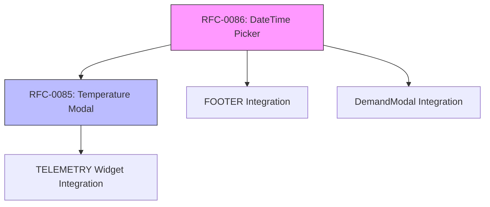

# Implementation Plan: RFC-0085 + RFC-0086

**Created**: 2025-11-28
**RFCs**: RFC-0085 (Temperature Modal) + RFC-0086 (DateTime Picker)
**Priority**: High

---

## Executive Summary

Este plano combina a implementação de duas RFCs interdependentes:

| RFC | Objetivo | Componente Principal |
|-----|----------|---------------------|
| **RFC-0085** | Extrair modal de temperatura do widget TELEMETRY | `openTemperatureModal()` |
| **RFC-0086** | Adicionar suporte a datetime no DateRangePicker | `createDateRangePicker({ includeTime: true })` |

**Dependência**: RFC-0086 deve ser implementado primeiro, pois RFC-0085 usa o DateTime Picker.

---

## Phase 0: Preparation

### 0.1 Analyze Existing Code

| File | Action | Lines |
|------|--------|-------|
| `TELEMETRY/controller.js` | Read temperature modal code | 1276-1792 |
| `createDateRangePicker.ts` | Read current implementation | All |
| `DemandModal.ts` | Read current date handling | Date inputs |
| `FOOTER/controller.js` | Check for date picker usage | All |

### 0.2 Create Feature Branch

```bash
git checkout -b feature/rfc-0085-0086-temperature-datetime
```

---

## Phase 1: Extend DateRangePicker (RFC-0086)

**Version**: v0.1.140
**Duration**: 2-3 days

### 1.1 Modify `src/components/createDateRangePicker.ts`

#### Tasks:

- [ ] **1.1.1** Add `includeTime` option to interface
  ```typescript
  interface CreateDateRangePickerOptions {
    // Existing options...
    includeTime?: boolean;          // NEW
    timePrecision?: 'minute' | 'hour'; // NEW
  }
  ```

- [ ] **1.1.2** Add time input fields to popup HTML
  ```html
  <div class="daterangepicker-time-section">
    <label>Hora início: <input type="time" class="time-start" value="00:00" /></label>
    <label>Hora fim: <input type="time" class="time-end" value="23:59" /></label>
  </div>
  ```

- [ ] **1.1.3** Implement time presets
  ```typescript
  const TIME_PRESETS = {
    'Última hora': { hours: 1 },
    'Últimas 6 horas': { hours: 6 },
    'Últimas 12 horas': { hours: 12 },
    'Últimas 24 horas': { hours: 24 },
    'Hoje': { today: true },
    'Ontem': { yesterday: true }
  };
  ```

- [ ] **1.1.4** Update `formatResult()` to include time
  ```typescript
  function formatResult(startDate: Date, endDate: Date, includeTime: boolean): DateRangeResult {
    if (includeTime) {
      return {
        startISO: startDate.toISOString(),
        endISO: endDate.toISOString(),
        startDate,
        endDate
      };
    }
    // Existing date-only logic...
  }
  ```

- [ ] **1.1.5** Add CSS for time section
  ```css
  .daterangepicker-time-section {
    display: flex;
    gap: 16px;
    padding: 12px 16px;
    border-top: 1px solid var(--border-color);
  }
  ```

### 1.2 Update Types Export

**File**: `src/index.ts`

- [ ] Export new types if needed

### 1.3 Test DateTime Picker

- [ ] Test with `includeTime: false` (backward compatibility)
- [ ] Test with `includeTime: true` (new functionality)
- [ ] Test time presets
- [ ] Test manual time input
- [ ] Test timezone handling

---

## Phase 2: Create Temperature Modal Component (RFC-0085)

**Version**: v0.1.141
**Duration**: 3-4 days

### 2.1 Create Component Structure

**File**: `src/components/TemperatureModal.ts`

#### Tasks:

- [ ] **2.1.1** Create file with TypeScript interfaces
  ```typescript
  export interface TemperatureModalParams {
    token: string;
    deviceId: string;
    startDate: string;
    endDate: string;
    label?: string;
    currentTemperature?: number;
    temperatureMin?: number;
    temperatureMax?: number;
    temperatureStatus?: 'ok' | 'above' | 'below';
    container?: HTMLElement | string;
    onClose?: () => void;
    locale?: 'pt-BR' | 'en-US';
    clampRange?: { min: number; max: number };
    styles?: Partial<TemperatureModalStyles>;
  }

  export interface TemperatureModalInstance {
    destroy: () => void;
    updateData: (startDate: string, endDate: string) => Promise<void>;
  }
  ```

- [ ] **2.1.2** Implement `fetchTemperatureData()`
  - ThingsBoard API call
  - Error handling with retry
  - Return typed telemetry array

- [ ] **2.1.3** Implement `clampTemperature()`
  - Default range: 15-40°C
  - Handle outliers

- [ ] **2.1.4** Implement `calculateStats()`
  - Return: avg, min, max, count
  - Handle edge cases (empty data)

- [ ] **2.1.5** Implement `drawTemperatureChart()`
  - Canvas-based line chart
  - X-axis: datetime
  - Y-axis: temperature
  - Threshold lines (min/max)
  - Tooltip on hover

- [ ] **2.1.6** Implement modal HTML structure
  - Header with device label
  - Stats cards (current, avg, min, max)
  - Chart container
  - DateTime picker (using RFC-0086)
  - Action buttons (Export CSV, Close)

- [ ] **2.1.7** Implement `exportTemperatureCSV()`
  - Include stats summary
  - Include all data points
  - UTF-8 BOM for Excel compatibility

- [ ] **2.1.8** Implement `openTemperatureModal()`
  - Main export function
  - Return instance with destroy/updateData

### 2.2 Export in Index

**File**: `src/index.ts`

- [ ] Add exports:
  ```typescript
  export { openTemperatureModal } from './components/TemperatureModal';
  export type {
    TemperatureModalParams,
    TemperatureModalInstance,
    TemperatureStats
  } from './components/TemperatureModal';
  ```

### 2.3 Unit Tests

**File**: `src/components/__tests__/TemperatureModal.test.ts`

- [ ] Test clampTemperature function
- [ ] Test calculateStats function
- [ ] Test modal opens correctly
- [ ] Test date range update
- [ ] Test CSV export

---

## Phase 3: Integrate in TELEMETRY Widget

**Version**: v0.1.142
**Duration**: 1-2 days

### 3.1 Simplify Widget Code

**File**: `src/thingsboard/.../WIDGET/TELEMETRY/controller.js`

#### Before (lines 1276-1792):
```javascript
// 500+ lines of inline modal code
if (isTermostato) {
  const url = `/api/plugins/telemetry/...`;
  // ... fetch, stats, HTML, canvas, etc.
}
```

#### After (~15 lines):
```javascript
if (isTermostato) {
  const jwtToken = localStorage.getItem('jwt_token');

  await MyIOLibrary.openTemperatureModal({
    token: jwtToken,
    deviceId: it.tbId || it.id,
    startDate: new Date(startTs).toISOString(),
    endDate: new Date(endTs).toISOString(),
    label: it.label || 'Dispositivo',
    currentTemperature: it.temperature,
    temperatureMin: it.temperatureMin,
    temperatureMax: it.temperatureMax,
    temperatureStatus: it.temperatureStatus,
    locale: 'pt-BR',
    onClose: () => {
      console.log('[TELEMETRY] Temperature modal closed');
    }
  });
}
```

### 3.2 Remove Old Code

- [ ] Remove lines 1276-1792 from controller.js
- [ ] Keep any necessary helper functions
- [ ] Test widget still works

---

## Phase 4: Integrate DateTime Picker in FOOTER

**Version**: v0.1.143
**Duration**: 1 day

### 4.1 Modify FOOTER Template

**File**: `FOOTER/template.html`

- [ ] Add date range input for temperature domain:
  ```html
  <div class="footer-datetime-picker" id="footerDatetimePicker" style="display: none;">
    <input type="text" id="footer-date-range" readonly placeholder="Selecione o período" />
  </div>
  ```

### 4.2 Modify FOOTER Controller

**File**: `FOOTER/controller.js`

- [ ] Initialize picker for temperature domain:
  ```javascript
  // Show datetime picker only for temperature
  const unitType = footerController.currentUnitType;

  if (unitType === 'temperature') {
    const pickerEl = document.getElementById('footerDatetimePicker');
    pickerEl.style.display = 'flex';

    const dateInput = document.getElementById('footer-date-range');

    MyIOLibrary.createDateRangePicker(dateInput, {
      presetStart: startISO,
      presetEnd: endISO,
      includeTime: true,
      timePrecision: 'minute',
      onApply: function(result) {
        // Update comparison dates
        footerController.updateComparisonDates(result.startISO, result.endISO);
      }
    });
  }
  ```

---

## Phase 5: Integrate DateTime Picker in DemandModal

**Version**: v0.1.144
**Duration**: 1 day

### 5.1 Modify DemandModal

**File**: `src/components/DemandModal.ts`

- [ ] Replace native datetime-local inputs with DateRangePicker
- [ ] Use `includeTime: true` for temperature readingType
- [ ] Keep `includeTime: false` for energy/water

---

## Phase 6: Testing & Documentation

**Version**: v0.1.145
**Duration**: 2 days

### 6.1 Integration Testing

- [ ] Test Temperature Modal opens from TELEMETRY widget
- [ ] Test DateTime Picker in FOOTER (temperature domain)
- [ ] Test DateTime Picker in DemandModal
- [ ] Test CSV export
- [ ] Test date range updates chart
- [ ] Test backward compatibility (energy/water domains)

### 6.2 Update Documentation

- [ ] Update INGESTION-SDK docs if needed
- [ ] Add JSDoc comments to new functions
- [ ] Update CHANGELOG.md

---

## File Changes Summary

| Phase | File | Action |
|-------|------|--------|
| 1 | `src/components/createDateRangePicker.ts` | MODIFY - Add time support |
| 2 | `src/components/TemperatureModal.ts` | CREATE - New component |
| 2 | `src/index.ts` | MODIFY - Add exports |
| 3 | `TELEMETRY/controller.js` | MODIFY - Simplify (remove 500+ lines) |
| 4 | `FOOTER/template.html` | MODIFY - Add date input |
| 4 | `FOOTER/controller.js` | MODIFY - Add picker init |
| 5 | `src/components/DemandModal.ts` | MODIFY - Use DateRangePicker |

---

## Dependencies



---

## Risk Assessment

| Risk | Impact | Mitigation |
|------|--------|------------|
| Breaking existing DateRangePicker | High | Backward compatibility tests |
| Temperature chart rendering issues | Medium | Use existing canvas code as reference |
| Timezone handling bugs | Medium | Test with São Paulo timezone |
| Widget regression | High | Test TELEMETRY widget thoroughly |

---

## Success Criteria

### RFC-0085 (Temperature Modal)
- [ ] Component builds without errors
- [ ] Modal opens and displays temperature data
- [ ] Statistics calculate correctly
- [ ] Chart renders timeline
- [ ] DateTime picker works
- [ ] CSV export works
- [ ] Widget integration replaces inline code

### RFC-0086 (DateTime Picker)
- [ ] `includeTime` option works
- [ ] Time presets work
- [ ] Time inputs accept manual entry
- [ ] Backward compatibility maintained
- [ ] FOOTER integration works
- [ ] DemandModal integration works

---

## Version Timeline

| Version | Phase | Features |
|---------|-------|----------|
| v0.1.140 | 1 | DateTime Picker with time support |
| v0.1.141 | 2 | Temperature Modal component |
| v0.1.142 | 3 | TELEMETRY widget integration |
| v0.1.143 | 4 | FOOTER DateTime Picker |
| v0.1.144 | 5 | DemandModal DateTime Picker |
| v0.1.145 | 6 | Testing & Documentation |

---

## Estimated Effort

| Phase | Duration | Complexity |
|-------|----------|------------|
| Phase 1 | 2-3 days | Medium |
| Phase 2 | 3-4 days | High |
| Phase 3 | 1-2 days | Low |
| Phase 4 | 1 day | Low |
| Phase 5 | 1 day | Low |
| Phase 6 | 2 days | Medium |
| **Total** | **10-13 days** | - |

---

## Next Steps

1. Create feature branch
2. Start with Phase 1 (DateTime Picker extension)
3. Build and test incrementally
4. Move to Phase 2 once DateTime Picker is stable
