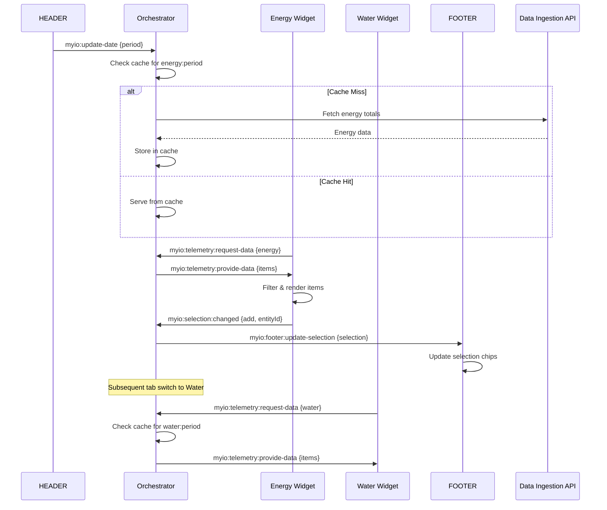

# RFC-0042: MAIN_VIEW Orchestrator for Shopping Dashboard Shell

- **Feature Name**: main-view-orchestrator-shopping-shell
- **Start Date**: 2025-10-02
- **Authors**: MYIO Frontend Guild
- **Status**: Draft
- **Related**: rfc_responsive_shopping_shell_extended-rev1.md

## Summary

This RFC defines a robust orchestrator service living in the `MAIN_VIEW` widget that centralizes data hydration and caching for Energy, Water, and Temperature panels in the shopping dashboard shell. The orchestrator coordinates date changes from the `HEADER` widget, maintains a browser cache with configurable TTL to minimize redundant Data Ingestion API calls, and serves as the single source of truth for enriched telemetry data across multiple child widgets.

The orchestrator will:
- Centralize `fetch` + `enrichItemsWithTotals` operations for Energy and Water domains (from Data Ingestion API)
- Maintain a browser cache with configurable 5-minute TTL—single fetch per domain per period
- Propagate date changes from `HEADER` to visible tabs (Energy/Water/Temperature)
- Serve hydrated data to child widgets (including three Energy columns: Substation/Entry & Meters, Common Area, Stores)
- Integrate click/drag selections with `FOOTER`

## Motivation

Currently, each telemetry widget performs its own data fetching, leading to redundant API calls when multiple widgets need the same data. Entering the Energy tab triggers 3 separate ingestion calls for the three energy columns (Substation/Entry & Meters, Common Area, Stores). This creates unnecessary network overhead and inconsistent loading states.

We need:
- **Single orchestration point**: One fetch → shared results across all widgets
- **Intelligent caching**: Avoid redundant calls when switching tabs or reopening the same period
- **Selective cache usage**: `openDashboardPopupAllReport` leverages cache when period matches, while `openDashboardPopupEnergy` remains uncached (always live)
- **Centralized state management**: Consistent data flow and loading states

## Goals

1. **Single orchestration point** in `MAIN_VIEW` to hydrate and cache lists:
   - `itemsEnergyEnriched` (from Ingestion API)
   - `itemsWaterEnriched` (from Ingestion API)  
   - `itemsTemperature` (from ThingsBoard only; no ingestion yet)

2. **Cache by period** with a browser TTL (configurable, default 5 minutes)

3. **Propagate date changes** from `HEADER` and update only the visible tab (Energy/Water/Temperature), but keep cache warm for others on demand

4. **Provide a typed API + events** for child widgets to request/receive hydrated data

5. **Track card selections** and broadcast to `FOOTER`; support drag-and-drop interoperability

## Non-Goals

- Rewriting existing widgets' internal rendering logic
- Caching device-level modal `openDashboardPopupEnergy` (must stay uncached for real-time data)
- Migrating temperature telemetry to ingestion API (future work)
- Replacing ThingsBoard's native datasource management

## Architecture Overview

The orchestrator is implemented as a singleton service hosted by `MAIN_VIEW`, exposed via:
- `window.MyIOOrchestrator` (or a scoped object attached to `ctx`)
- A lightweight event bus based on `window.dispatchEvent` / `addEventListener`

### Key Responsibilities

#### Period Orchestration
- Listen to `HEADER` date emissions (`myio:update-date`)
- Normalize to `{ startISO, endISO, granularity }`
- Invalidate/reuse cache per domain (energy/water/temperature)

#### Centralized Hydration
**For Energy & Water:**
- Build authoritative device list from ThingsBoard datasources
- Fetch totals once from Data Ingestion endpoint
- Run `enrichItemsWithTotals(devices, apiMap)` → store result

**For Temperature:**
- Read last values directly from ThingsBoard (no ingestion)

#### Caching
- In-memory `Map` + persistent `localStorage` or `IndexedDB`
- Key format: `${domain}:${startISO}:${endISO}:${granularity}`
- Policy: stale-while-revalidate with TTL = 5 minutes (configurable)

#### Distribution
Serve hydrated lists to widgets on demand:
- **Energy**: three columns use the same hydrated data, filtered by group
- **Water**: similar pattern
- **Temperature**: direct TB data

### API Surface

```typescript
interface OrchestratorAPI {
  getEnergy(periodKey: string): Promise<EnrichedItem[]>;
  getWater(periodKey: string): Promise<EnrichedItem[]>;
  getTemperature(periodKey: string): Promise<TemperatureItem[]>;
  on(event: OrchestratorEvent, handler: (payload: any) => void): () => void;
  setVisibleTab(tab: 'energy' | 'water' | 'temperature'): void;
  getVisibleTab(): 'energy' | 'water' | 'temperature';
  invalidateCache(domain?: Domain): void;
  getCacheStats(): CacheStats;
}
```

#### Selection & Footer Sync
- Listen to card clicks (`myio:selection:changed`) and DnD events from Telemetry
- Maintain a selection store and broadcast to `FOOTER`
- Support multi-select with 6-item limit (as per existing toast implementation)

## Data Model

```typescript
type Domain = 'energy' | 'water' | 'temperature';

interface BaseItem {
  id: string;            // ThingsBoard entityId
  identifier: string;    // e.g. '104H'
  label: string;         // display name
  groupType: 'entry_meters' | 'common_area' | 'stores' | 'substation';
  attrs?: Record<string, any>; // slaveId, centralId, deviceType, etc.
}

interface EnrichedItem extends BaseItem {
  total: number;         // numeric total from ingestion
  units: 'kWh' | 'm³';   // domain dependent
  percentage: number;    // calculated percentage of group total
}

interface TemperatureItem extends BaseItem {
  value: number;         // last temp from TB
  units: '°C';
  timestamp: number;     // last update epoch ms
}

interface CacheEntry<T> {
  periodKey: string;
  hydratedAt: number;    // epoch ms
  ttlMinutes: number;
  data: T[];
  stale: boolean;        // true if TTL exceeded (serve stale + revalidate)
}

interface CacheStats {
  hitRate: number;       // percentage
  totalRequests: number;
  cacheSize: number;     // number of entries
  lastCleanup: number;   // epoch ms
}
```

## Event Bus

Standardized event names (all bubble on `window`):

```typescript
// Date coordination
'myio:update-date' { startISO, endISO, granularity } // emitted by HEADER

// Data flow
'myio:telemetry:request-data' { domain, periodKey } // from child widget
'myio:telemetry:provide-data' { domain, periodKey, items } // from orchestrator
'myio:orchestrator:cache-hydrated' { domain, periodKey, count } // cache update

// Selection coordination  
'myio:selection:changed' { selection } // from Telemetry to Footer

// UI state
'myio:dashboard-state' { tab: 'energy'|'water'|'temperature' } // tab switching
```

## Caching Strategy

### Configuration
- **Default TTL**: 5 minutes (configurable via TB widget settings)
- **Storage**: In-memory cache for speed; persist to `localStorage` (or `IndexedDB` if payload exceeds ~5MB)
- **Cleanup**: Automatic cleanup of expired entries every 10 minutes

### Keying
```typescript
const generateCacheKey = (domain: Domain, period: Period): string => {
  return `${domain}:${period.startISO}:${period.endISO}:${period.granularity}`;
};

// Examples:
// "energy:2025-10-01T00:00:00-03:00:2025-10-01T23:59:59-03:00:day"
// "water:2025-09-01T00:00:00-03:00:2025-09-30T23:59:59-03:00:month"
```

### Stale-While-Revalidate
1. If entry exists and not expired → serve immediately
2. If expired → serve stale immediately + trigger background refresh → re-emit `myio:orchestrator:cache-hydrated`
3. If miss → show loading state + fetch fresh → emit when ready

## API Contracts (with Telemetry Widgets)

Each Telemetry widget (Energy, Water, Temperature) **MUST**:

1. **On init**, announce itself and request data:
```javascript
window.dispatchEvent(new CustomEvent('myio:telemetry:request-data', { 
  detail: { domain: 'energy', periodKey: currentPeriodKey() }
}));
```

2. **Listen for data provision** and filter by its datasource:
```javascript
window.addEventListener('myio:telemetry:provide-data', (event) => {
  const { domain, periodKey, items } = event.detail;
  if (domain === myDomain && periodKey === currentPeriodKey()) {
    const filteredItems = items.filter(item => myDatasourceIds.includes(item.id));
    renderItems(filteredItems);
  }
});
```

3. **For Energy specifically**: three columns (Entry & Meters, Common Area, Stores) filter against the same provided array; **do not call ingestion directly**

## Pseudocode (MAIN_VIEW Orchestrator)

```javascript
const Orchestrator = (() => {
  const memCache = new Map(); // periodKey -> CacheEntry
  const config = {
    ttlMinutes: 5,
    enableStaleWhileRevalidate: true,
    maxCacheSize: 50
  };
  let visibleTab = 'energy';
  let currentPeriod = null;

  // Cache key generation
  const periodKeyOf = (domain, {startISO, endISO, granularity}) =>
    `${domain}:${startISO}:${endISO}:${granularity}`;

  // Main hydration logic
  async function hydrateDomain(domain, period) {
    const key = periodKeyOf(domain, period);
    const now = Date.now();
    const entry = memCache.get(key);

    // Cache hit - not expired
    if (entry && now - entry.hydratedAt < entry.ttlMinutes * 60_000) {
      emit('myio:telemetry:provide-data', { 
        domain, 
        periodKey: key, 
        items: entry.data 
      });
      return;
    }

    // Stale-while-revalidate: serve stale then refresh
    if (entry?.data?.length && config.enableStaleWhileRevalidate) {
      emit('myio:telemetry:provide-data', { 
        domain, 
        periodKey: key, 
        items: entry.data 
      });
    }

    try {
      // Fetch fresh data
      const items = await fetchAndEnrich(domain, period);
      
      // Update cache
      memCache.set(key, { 
        periodKey: key, 
        hydratedAt: now, 
        ttlMinutes: config.ttlMinutes, 
        data: items, 
        stale: false 
      });
      
      // Persist to storage
      persistToStorage(key, memCache.get(key));
      
      // Emit events
      emit('myio:orchestrator:cache-hydrated', { 
        domain, 
        periodKey: key, 
        count: items.length 
      });
      emit('myio:telemetry:provide-data', { 
        domain, 
        periodKey: key, 
        items 
      });
      
    } catch (error) {
      console.error(`[Orchestrator] Failed to hydrate ${domain}:`, error);
      emit('myio:orchestrator:error', { domain, error: error.message });
    }
  }

  // Fetch and enrich data based on domain
  async function fetchAndEnrich(domain, period) {
    switch (domain) {
      case 'energy':
      case 'water':
        return await fetchIngestionData(domain, period);
      case 'temperature':
        return await fetchThingsBoardData(domain, period);
      default:
        throw new Error(`Unknown domain: ${domain}`);
    }
  }

  // Event handlers
  function onDateUpdate(period) {
    currentPeriod = period;
    if (visibleTab) {
      hydrateDomain(visibleTab, period);
    }
  }

  function onTabChange(tab) {
    visibleTab = tab;
    if (currentPeriod) {
      hydrateDomain(tab, currentPeriod);
    }
  }

  function onDataRequest(event) {
    const { domain, periodKey } = event.detail;
    if (currentPeriod) {
      hydrateDomain(domain, currentPeriod);
    }
  }

  // Utility functions
  function emit(eventName, detail) {
    window.dispatchEvent(new CustomEvent(eventName, { detail }));
  }

  function getCurrentPeriod() {
    return currentPeriod;
  }

  function invalidateCache(domain) {
    if (domain) {
      // Remove entries for specific domain
      for (const [key, entry] of memCache.entries()) {
        if (key.startsWith(`${domain}:`)) {
          memCache.delete(key);
        }
      }
    } else {
      // Clear all cache
      memCache.clear();
    }
    clearStorageCache(domain);
  }

  // Wire up event listeners
  window.addEventListener('myio:update-date', ev => onDateUpdate(ev.detail));
  window.addEventListener('myio:dashboard-state', ev => onTabChange(ev.detail.tab));
  window.addEventListener('myio:telemetry:request-data', onDataRequest);

  // Cleanup expired entries periodically
  setInterval(() => {
    const now = Date.now();
    for (const [key, entry] of memCache.entries()) {
      if (now - entry.hydratedAt > entry.ttlMinutes * 60_000 * 2) { // 2x TTL
        memCache.delete(key);
      }
    }
  }, 10 * 60 * 1000); // Every 10 minutes

  // Public API
  return { 
    hydrateDomain, 
    setVisibleTab: onTabChange, 
    getVisibleTab: () => visibleTab,
    getCurrentPeriod,
    invalidateCache,
    getCacheStats: () => ({
      hitRate: calculateHitRate(),
      totalRequests: getTotalRequests(),
      cacheSize: memCache.size,
      lastCleanup: getLastCleanup()
    })
  };
})();

// Expose globally
window.MyIOOrchestrator = Orchestrator;
```

## Ingestion & Modal Rules

### Data Sources
- **Energy & Water list hydration**: Orchestrated & cached via Data Ingestion API
- **Temperature**: From ThingsBoard last values (no ingestion yet)

### Modal Behavior
- **Device modal** `openDashboardPopupEnergy`: **never cached** (always live for real-time data)
- **All-Report modal** `openDashboardPopupAllReport` (HEADER controller): May use cache **only if** requested period matches cache key exactly; else fetch fresh

### Cache Bypass
```javascript
// Example: Energy device modal always bypasses cache
async function openDeviceModal(deviceId, period) {
  const freshData = await fetchIngestionData('energy', period, { 
    bypassCache: true,
    deviceId 
  });
  // ... open modal with fresh data
}
```

## Footer Integration

The orchestrator subscribes to selection events from Telemetry widgets and maintains selection state:

```javascript
// Selection management
const selectionStore = new Set();

window.addEventListener('myio:selection:changed', (event) => {
  const { action, entityId, selection } = event.detail;
  
  switch (action) {
    case 'add':
      if (selectionStore.size < 6) { // Enforce 6-item limit
        selectionStore.add(entityId);
      }
      break;
    case 'remove':
      selectionStore.delete(entityId);
      break;
    case 'clear':
      selectionStore.clear();
      break;
  }
  
  // Broadcast to footer
  emit('myio:footer:update-selection', {
    selectedIds: Array.from(selectionStore),
    count: selectionStore.size
  });
});
```

**DnD Compatibility**: Dragging a card from Telemetry to Footer remains supported through existing `MyIOSelectionStore` integration.

## Security & Tokens

- **Tokens** (`tbJwtToken`, `ingestionToken`) must be passed via parameters from the hosting environment
- **No direct** `localStorage.getItem('jwt_token')` inside widgets
- **Orchestrator must never persist tokens** to storage; keep them in memory only
- **Token refresh** handled by parent widget context, not orchestrator
- **Token rotation**: Orchestrator must drop all cached data and invalidate state when token rotation occurs

```javascript
// Token management example
class TokenManager {
  constructor(initialTokens) {
    this.tokens = { ...initialTokens }; // In-memory only
  }
  
  updateTokens(newTokens) {
    this.tokens = { ...this.tokens, ...newTokens };
    // On token rotation, invalidate all cache
    if (window.MyIOOrchestrator) {
      window.MyIOOrchestrator.invalidateCache();
    }
  }
  
  getToken(type) {
    return this.tokens[type];
  }
  
  // Handle token expiration
  onTokenExpired(type) {
    console.warn(`[Orchestrator] Token expired: ${type}`);
    // Clear cache and request fresh tokens from parent
    if (window.MyIOOrchestrator) {
      window.MyIOOrchestrator.invalidateCache();
    }
    // Emit event for parent to handle token refresh
    window.dispatchEvent(new CustomEvent('myio:token-expired', { 
      detail: { tokenType: type } 
    }));
  }
}
```

## Configuration (Widget Settings)

```javascript
interface OrchestratorConfig {
  cacheTtlMinutes: number;           // default: 5
  enableStaleWhileRevalidate: boolean; // default: true
  maxCacheSize: number;              // default: 50
  domainsEnabled: {                  // default: all true
    energy: boolean;
    water: boolean;
    temperature: boolean;
  };
  debugMode: boolean;                // default: false
}
```

## Migration Plan

1. **Phase 1**: Introduce orchestrator in `MAIN_VIEW` without removing existing per-widget fetches (feature flag)
2. **Phase 2**: Update Energy/Water/Temperature widgets to request data from orchestrator first; fall back to legacy fetch if orchestrator not present
3. **Phase 3**: After validation, remove legacy direct calls from widgets
4. **Phase 4**: Update `HEADER` to emit `myio:update-date` and accept cache hits for `openDashboardPopupAllReport`
5. **Phase 5**: Performance monitoring and optimization

## Testing Strategy

### Unit Tests
- Cache keying and TTL behavior
- Stale-while-revalidate logic
- Event emission and handling
- Token management (no persistence)

### Integration Tests
- Switching tabs triggers correct domain hydration
- Changing periods invalidates appropriate cache entries
- Only 1 ingestion call per domain/period combination
- Selection events propagate correctly to footer

### E2E Tests (ThingsBoard)
- Energy columns render from the same hydrated array
- Footer updates on click & DnD interactions
- Modal behavior (cached vs uncached) works correctly
- Performance under load (multiple rapid tab switches)

## Telemetry & Metrics

**Metrics will be logged to ThingsBoard console (dev mode) and optionally exposed via custom telemetry key `orchestrator_stats` in production.**

```javascript
// Enhanced metrics collection
const metrics = {
  hydrationTimes: [],
  cacheHitRatio: 0,
  totalRequests: 0,
  cacheHits: 0,
  itemCounts: {},
  errorCounts: {},
  
  recordHydration(domain, duration, fromCache) {
    this.hydrationTimes.push({ domain, duration, fromCache, timestamp: Date.now() });
    this.totalRequests++;
    if (fromCache) {
      this.cacheHits++;
    }
    this.cacheHitRatio = (this.cacheHits / this.totalRequests) * 100;
    
    // Log to ThingsBoard console in dev mode
    if (config.debugMode) {
      console.log(`[Orchestrator] ${domain} hydration: ${duration}ms (${fromCache ? 'cache' : 'fresh'})`);
    }
  },
  
  recordCacheHit(domain) {
    this.cacheHits++;
    this.cacheHitRatio = (this.cacheHits / this.totalRequests) * 100;
  },
  
  recordError(domain, error) {
    this.errorCounts[domain] = (this.errorCounts[domain] || 0) + 1;
    
    // Log errors to ThingsBoard console
    console.error(`[Orchestrator] ${domain} error:`, error);
    
    // Optionally send to ThingsBoard telemetry
    if (window.tbClient && config.enableTelemetryReporting) {
      window.tbClient.sendTelemetry({
        orchestrator_error_count: this.errorCounts[domain],
        orchestrator_error_domain: domain,
        orchestrator_error_message: error.message || String(error)
      });
    }
  },
  
  // Generate summary for ThingsBoard telemetry
  generateTelemetrySummary() {
    return {
      orchestrator_cache_hit_ratio: this.cacheHitRatio,
      orchestrator_total_requests: this.totalRequests,
      orchestrator_cache_hits: this.cacheHits,
      orchestrator_avg_hydration_time: this.getAverageHydrationTime(),
      orchestrator_memory_usage: this.getMemoryUsage(),
      orchestrator_active_domains: Object.keys(this.itemCounts).length
    };
  },
  
  getAverageHydrationTime() {
    if (!this.hydrationTimes.length) return 0;
    const sum = this.hydrationTimes.reduce((acc, h) => acc + h.duration, 0);
    return Math.round(sum / this.hydrationTimes.length);
  },
  
  getMemoryUsage() {
    // Estimate cache memory usage in KB
    const cacheSize = memCache.size;
    const avgEntrySize = 2; // KB estimate per cache entry
    return cacheSize * avgEntrySize;
  }
};

// Send metrics to ThingsBoard every 5 minutes in production
if (!config.debugMode && window.tbClient) {
  setInterval(() => {
    const telemetry = metrics.generateTelemetrySummary();
    window.tbClient.sendTelemetry(telemetry);
  }, 5 * 60 * 1000); // Every 5 minutes
}

// Optional debug panel in dev mode
if (config.debugMode) {
  window.MyIOOrchestratorDebug = {
    getMetrics: () => metrics,
    getCacheContents: () => Array.from(memCache.entries()),
    clearCache: () => invalidateCache(),
    simulateError: (domain) => { 
      metrics.recordError(domain, new Error('Simulated error for testing'));
    },
    exportMetrics: () => {
      const data = {
        timestamp: new Date().toISOString(),
        metrics: metrics.generateTelemetrySummary(),
        cacheContents: Array.from(memCache.entries()).map(([key, entry]) => ({
          key,
          hydratedAt: new Date(entry.hydratedAt).toISOString(),
          itemCount: entry.data.length,
          stale: entry.stale
        }))
      };
      console.log('[Orchestrator Debug Export]', JSON.stringify(data, null, 2));
      return data;
    }
  };
}
```

## Drawbacks

- **Complexity increase** in `MAIN_VIEW` widget
- **Requires disciplined event contracts** across widgets
- **Memory usage** for cache storage (mitigated by size limits and cleanup)
- **Debugging complexity** when cache behavior is unexpected

## Alternatives

### Rejected: Server-side cache only
- Still duplicates network chatter between widgets
- Worse UX due to network latency
- No offline capability

### Rejected: Per-widget caching
- Doesn't solve the redundant API calls problem
- Inconsistent cache invalidation
- More complex to maintain

### Considered: Service Worker caching
- More complex implementation
- Browser compatibility concerns
- Harder to debug and monitor

## Future Work

1. **Temperature Domain Migration**: Migrate temperature telemetry into Data Ingestion API when schema becomes available, enabling unified caching strategy across all domains

2. **Advanced Prefetching**: Implement intelligent prefetching for non-visible tabs based on user behavior patterns and time-of-day usage analytics

3. **Cross-Session Cache Persistence**: Evaluate IndexedDB for persistent cache across browser sessions, with appropriate cache invalidation on version updates

4. **Real-time Data Streaming**: Integrate WebSocket connections for real-time updates to cached data, maintaining cache coherency with live telemetry streams

5. **Multi-Tenant Orchestration**: Extend orchestrator to support multiple customer contexts simultaneously for head office deployments

6. **Performance Analytics**: Add detailed performance profiling and bottleneck detection for cache optimization and API call patterns

## Unresolved Questions

1. **Storage choice**: Final decision on IndexedDB vs localStorage for large payloads
2. **Prefetch strategy**: Background prefetch for non-visible tabs after date change?
3. **Error recovery**: How to handle partial failures when some domains succeed and others fail?
4. **Cache warming**: Should we pre-populate cache on widget initialization?

## Acceptance Criteria

✅ **Primary Goals**:
- [ ] Entering Energy with a new period triggers **1 ingestion call total** for the page (not 3)
- [ ] Switching to Water with the same period uses cache (if warm) or **1 ingestion call**
- [ ] Temperature renders from TB without ingestion calls
- [ ] `openDashboardPopupEnergy` is **always live** (uncached)
- [ ] `openDashboardPopupAllReport` uses cache **only on exact period match**

✅ **Integration**:
- [ ] Footer reflects selections from Telemetry (click and DnD)
- [ ] Selection limit of 6 items enforced with toast notification
- [ ] Tab switching preserves cache and doesn't trigger unnecessary fetches

✅ **Performance**:
- [ ] Cache hit ratio > 70% in typical usage
- [ ] Page load time improvement > 30% for subsequent tab switches
- [ ] Memory usage stays under 10MB for cache

✅ **Reliability**:
- [ ] Graceful degradation when orchestrator fails
- [ ] No token persistence to storage
- [ ] Proper cleanup on widget destroy

## Sequence Diagram



## Formatting Notes

This RFC uses:
- **Fenced code blocks** for TypeScript/JavaScript snippets
- **Mermaid sequence diagram** for event flow visualization  
- **Technical, implementation-oriented tone**
- **Explicit acceptance criteria** with checkboxes
- **Concrete code examples** that can be directly implemented

The orchestrator design prioritizes performance, maintainability, and clear separation of concerns while providing a robust foundation for the shopping dashboard's data management needs.
