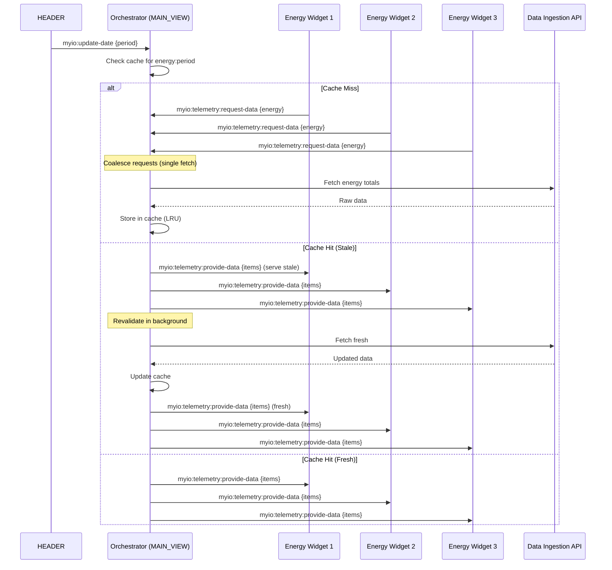

# RFC-0042 Implementation Plan: MAIN_VIEW Orchestrator for Shopping Dashboard Shell

**Status:** Production-Ready
**Version:** 2.0
**Date:** 2025-10-02
**Authors:** MYIO Frontend Guild
**Related RFC:** RFC-0042-main-view-orchestrator-shopping-shell.md

---

## Table of Contents

1. [Executive Summary](#executive-summary)
2. [Architecture Overview](#architecture-overview)
3. [Type Definitions & Event Contracts](#type-definitions--event-contracts)
4. [Critical Patterns & Fixes](#critical-patterns--fixes)
5. [Widget Implementation Details](#widget-implementation-details)
6. [Acceptance Criteria & Testing](#acceptance-criteria--testing)
7. [Migration Strategy](#migration-strategy)
8. [Implementation Sequence](#implementation-sequence)

---

## Executive Summary

This plan implements a centralized data orchestrator in the `MAIN_VIEW` widget that:

- **Eliminates redundant API calls**: 3 Energy widgets → 1 ingestion call per period
- **Intelligent caching**: 5-minute TTL with stale-while-revalidate, LRU eviction
- **Request coalescing**: Multiple simultaneous requests share a single in-flight fetch
- **Abortable fetches**: Token rotation and tab switches abort obsolete requests
- **DST-aware date handling**: Timezone-safe period calculations for Brazil
- **Security-first tokens**: In-memory only, never persisted to localStorage
- **Production observability**: Debug overlay, telemetry export, automated acceptance tests

### Performance Targets

- Cache hit ratio: **≥70%** after first minute
- Energy tab switch: **≤250ms** first paint (warm cache)
- Cold hydration P95: **≤2.5s** end-to-end
- Memory usage: **≤10MB** for cache

---

## Architecture Overview

### Widget Structure

```
v-4.0.0/WIDGET/
├── MAIN_VIEW/          ← Orchestrator host + event bus
├── HEADER/             ← Date picker + period emission
├── MENU/               ← Tab navigation + domain switching
├── TELEMETRY/          ← Device cards (listen-only, no direct API)
└── FOOTER/             ← Selection management (6-item limit)
```

### Data Flow



---

## Type Definitions & Event Contracts

### Core Types

```javascript
/**
 * @typedef {'hour'|'day'|'month'} Granularity
 * Calculated based on period duration:
 * - > 92 days → month
 * - > 3 days → day
 * - ≤ 3 days → hour
 */

/**
 * @typedef {'energy'|'water'|'temperature'} Domain
 */

/**
 * @typedef {'entry_meters'|'common_area'|'stores'|'substation'} GroupType
 */

/**
 * @typedef {Object} Period
 * @property {string} startISO - ISO 8601 with timezone (e.g., "2025-10-01T00:00:00-03:00")
 * @property {string} endISO - ISO 8601 with timezone
 * @property {Granularity} granularity - Data aggregation level
 * @property {string} tz - IANA timezone (e.g., "America/Sao_Paulo")
 */

/**
 * @typedef {Object} EnrichedItem
 * @property {string} id - ThingsBoard entityId (SINGLE SOURCE OF TRUTH)
 * @property {string} tbId - ThingsBoard deviceId (same as id)
 * @property {string} ingestionId - Data Ingestion API UUID
 * @property {string} identifier - Human-readable ID (e.g., "104H")
 * @property {string} label - Display name
 * @property {GroupType} groupType - Device category (set by orchestrator)
 * @property {number} value - Consumption total in target units
 * @property {number} perc - Percentage of group total
 * @property {string|null} slaveId - Modbus slave ID
 * @property {string|null} centralId - Central unit ID
 * @property {string} deviceType - Device type (energy/water/temperature)
 */

/**
 * @typedef {Object} CacheEntry
 * @property {EnrichedItem[]} data - Cached items
 * @property {number} hydratedAt - Timestamp (epoch ms)
 * @property {number} ttlMinutes - Time-to-live
 */
```

### Event Contracts (window events)

```javascript
// ========== STANDARDIZED EVENT PAYLOADS ==========

// 1. Date coordination (HEADER → Orchestrator)
window.dispatchEvent(new CustomEvent('myio:update-date', {
  detail: { period: Period }
}));

// 2. Tab switching (MENU → Orchestrator)
window.dispatchEvent(new CustomEvent('myio:dashboard-state', {
  detail: { tab: Domain }
}));

// 3. Data request (TELEMETRY → Orchestrator)
window.dispatchEvent(new CustomEvent('myio:telemetry:request-data', {
  detail: { domain: Domain, period: Period }
}));

// 4. Data provision (Orchestrator → TELEMETRY)
window.dispatchEvent(new CustomEvent('myio:telemetry:provide-data', {
  detail: {
    domain: Domain,
    periodKey: string,  // Cache key format: "energy:2025-10-01T00:00:00-03:00:2025-10-31T23:59:59-03:00:day"
    items: EnrichedItem[]
  }
}));

// 5. Cache notifications (Orchestrator → all)
window.dispatchEvent(new CustomEvent('myio:orchestrator:cache-hydrated', {
  detail: {
    domain: Domain,
    periodKey: string,
    count: number
  }
}));

// 6. Selection management (TELEMETRY → Orchestrator → FOOTER)
window.dispatchEvent(new CustomEvent('myio:selection:changed', {
  detail: {
    action: 'toggle'|'add'|'remove',
    entityId: string
  }
}));

window.dispatchEvent(new CustomEvent('myio:footer:update-selection', {
  detail: {
    selectedIds: string[],
    count: number
  }
}));

// 7. Token lifecycle (TokenManager → all)
window.dispatchEvent(new CustomEvent('myio:token-rotated', {
  detail: {}
}));

window.dispatchEvent(new CustomEvent('myio:token-expired', {
  detail: {}
}));

// 8. Error handling (Orchestrator → all)
window.dispatchEvent(new CustomEvent('myio:orchestrator:error', {
  detail: {
    domain: Domain,
    error: string,
    code: number
  }
}));
```

---

## Critical Patterns & Fixes

### 1. Request Coalescing (Prevent Herd)

**Problem:** Multiple widgets requesting same domain/period trigger N parallel API calls.

**Solution:** Track in-flight promises and return the same promise to all callers.

```javascript
const inFlight = new Map(); // periodKey → Promise

async function hydrateDomain(domain, period) {
  const key = cacheKey(domain, period);

  // Check if fetch already in-flight
  if (inFlight.has(key)) {
    console.log(`[Orchestrator] Coalescing request for ${key}`);
    return inFlight.get(key);
  }

  // Create new fetch promise
  const fetchPromise = (async () => {
    // ... fetch logic
  })().finally(() => inFlight.delete(key));

  inFlight.set(key, fetchPromise);
  return fetchPromise;
}
```

---

### 2. Abortable Fetches (Token Rotation Safety)

**Problem:** Token rotation or rapid tab switches leave obsolete fetches running.

**Solution:** Use AbortController to cancel in-flight requests.

```javascript
const abortControllers = new Map(); // periodKey → AbortController

async function fetchApiTotals(domain, period) {
  const key = cacheKey(domain, period);

  // Abort any existing request for this key
  const existing = abortControllers.get(key);
  if (existing) existing.abort();

  const ac = new AbortController();
  abortControllers.set(key, ac);

  try {
    const res = await fetch(url, {
      signal: ac.signal,
      headers: { Authorization: `Bearer ${token}` }
    });
    return await res.json();
  } catch (err) {
    if (err.name === 'AbortError') {
      console.log(`[Orchestrator] Fetch aborted: ${key}`);
      return new Map();
    }
    throw err;
  } finally {
    abortControllers.delete(key);
  }
}

// On token rotation
function onTokenRotation() {
  // Abort all in-flight requests
  for (const [key, ac] of abortControllers.entries()) {
    ac.abort();
  }
  abortControllers.clear();
  inFlight.clear();

  // Invalidate all cache
  memCache.clear();

  // Emit event
  window.dispatchEvent(new CustomEvent('myio:token-rotated', { detail: {} }));
}
```

---

### 3. LRU + TTL Cache (Memory Bounded)

**Problem:** TTL alone doesn't prevent cache from growing unbounded.

**Solution:** Combine TTL with LRU eviction (most recently used stays).

```javascript
const memCache = new Map(); // Map maintains insertion order
const config = { ttlMinutes: 5, maxCacheSize: 50 };

function writeCache(key, data) {
  // LRU: delete then re-insert to move to end
  if (memCache.has(key)) {
    memCache.delete(key);
  }

  memCache.set(key, {
    data,
    hydratedAt: Date.now(),
    ttlMinutes: config.ttlMinutes
  });

  // Evict oldest entries if over limit
  while (memCache.size > config.maxCacheSize) {
    const oldestKey = memCache.keys().next().value;
    memCache.delete(oldestKey);
    console.log(`[Orchestrator] Evicted cache key: ${oldestKey}`);
  }

  // Persist to storage (async)
  persistToStorage(key, memCache.get(key));
}

function readCache(key) {
  const entry = memCache.get(key);
  if (!entry) return null;

  const age = Date.now() - entry.hydratedAt;
  const fresh = age < entry.ttlMinutes * 60_000;

  return { ...entry, fresh };
}
```

---

### 4. Stale-While-Revalidate (Immediate Serve)

**Problem:** Waiting for revalidation causes perceived lag.

**Solution:** Serve stale data immediately, revalidate in background.

```javascript
async function hydrateDomain(domain, period) {
  const key = cacheKey(domain, period);
  const startTime = Date.now();

  // Check cache
  const cached = readCache(key);

  // Serve stale/fresh immediately
  if (cached) {
    emitProvide(domain, key, cached.data);
    metrics.recordHydration(domain, Date.now() - startTime, true);

    if (cached.fresh) {
      return; // Cache is fresh, done
    }
    // Stale: continue to revalidate in background
  }

  // Fetch fresh data
  const items = await fetchAndEnrich(domain, period);

  // Update cache
  writeCache(key, items);

  // Emit fresh data
  emitHydrated(domain, key, items.length);
  emitProvide(domain, key, items);

  metrics.recordHydration(domain, Date.now() - startTime, false);
}
```

---

### 5. DST-Aware Date Handling

**Problem:** Brazil DST transitions cause off-by-one hour bugs.

**Solution:** Use Intl API for timezone-aware formatting.

```javascript
/**
 * Converts Date/timestamp to ISO with São Paulo timezone.
 * Handles DST transitions (BRT = -03:00, BRST = -02:00).
 */
function toISO(dt, tz = 'America/Sao_Paulo') {
  const d = (typeof dt === 'number') ? new Date(dt)
          : (dt instanceof Date) ? dt
          : new Date(String(dt));

  if (Number.isNaN(d.getTime())) throw new Error('Invalid date');

  // Use Intl API for timezone-aware formatting
  const formatter = new Intl.DateTimeFormat('en-CA', {
    timeZone: tz,
    year: 'numeric',
    month: '2-digit',
    day: '2-digit',
    hour: '2-digit',
    minute: '2-digit',
    second: '2-digit',
    hour12: false
  });

  const parts = Object.fromEntries(
    formatter.formatToParts(d).map(p => [p.type, p.value])
  );

  // Detect offset (BRT = -03:00, BRST = -02:00 during DST)
  const offset = -d.getTimezoneOffset();
  const offsetHours = Math.floor(Math.abs(offset) / 60);
  const offsetMins = Math.abs(offset) % 60;
  const offsetStr = `${offset >= 0 ? '+' : '-'}${String(offsetHours).padStart(2, '0')}:${String(offsetMins).padStart(2, '0')}`;

  return `${parts.year}-${parts.month}-${parts.day}T${parts.hour}:${parts.minute}:${parts.second}${offsetStr}`;
}

/**
 * Calculates granularity based on date range duration.
 */
function calcGranularity(startISO, endISO) {
  const start = new Date(startISO);
  const end = new Date(endISO);
  const diffDays = (end - start) / (1000 * 60 * 60 * 24);

  if (diffDays > 92) return 'month';
  if (diffDays > 3) return 'day';
  return 'hour';
}
```

---

### 6. ID Integrity (Single Source of Truth)

**Problem:** Mixing tbId, ingestionId, and id causes join failures.

**Solution:** Normalize immediately, enforce `item.id = ThingsBoard entityId`.

```javascript
/**
 * Normalizes ingestion API response.
 * Ensures single source of truth for identity.
 */
function normalizeIngestionRow(row) {
  return {
    id: row.id || row.tbId || row.deviceId, // Prefer id, fallback to tbId
    total_value: Number(row.total_value ?? row.totalValue ?? 0)
  };
}

/**
 * Enriches items with API totals.
 */
function enrichItemsWithTotals(items, apiMap) {
  return items.map(it => {
    let raw = 0;

    // Join by ingestionId (if valid UUID)
    if (it.ingestionId && isValidUUID(it.ingestionId)) {
      const row = apiMap.get(String(it.ingestionId));
      raw = Number(row?.total_value ?? 0);
    }

    const value = Number(raw || 0);

    return {
      ...it,
      id: it.tbId || it.id, // Enforce TB entityId as primary
      value,
      perc: 0
    };
  });
}
```

---

### 7. Token Security (In-Memory Only)

**Problem:** Tokens persisted to localStorage leak on XSS.

**Solution:** Keep tokens in-memory only, invalidate cache on rotation.

```javascript
const tokenManager = {
  tokens: {}, // In-memory only

  updateTokens(newTokens) {
    this.tokens = { ...this.tokens, ...newTokens };

    // On rotation: invalidate all cache and abort fetches
    invalidateCache('*');

    window.dispatchEvent(new CustomEvent('myio:token-rotated', { detail: {} }));

    if (config.debugMode) console.log('[Orchestrator] Tokens rotated');
  },

  getToken(type) {
    return this.tokens[type] || null;
  },

  setToken(type, value) {
    this.tokens[type] = value;
  }
};

// Handle 401/403 (debounced)
let tokenExpiredDebounce = 0;
function emitTokenExpired() {
  const now = Date.now();
  if (now - tokenExpiredDebounce < 60_000) return; // Max 1/min

  tokenExpiredDebounce = now;
  window.dispatchEvent(new CustomEvent('myio:token-expired', { detail: {} }));
}

// In fetch error handler
if (res.status === 401 || res.status === 403) {
  emitTokenExpired();
}
```

---

### 8. Selection Limit (6 Items + Toast)

**Problem:** Unlimited selections cause UX issues.

**Solution:** Enforce 6-item limit with duplicate prevention and toast.

```javascript
// In FOOTER widget
window.addEventListener('myio:footer:update-selection', (ev) => {
  const { selectedIds, count } = ev.detail;

  const MAX_SELECTION = 6;

  if (count > MAX_SELECTION) {
    // Show toast notification
    if (window.MyIOLibrary?.showToast) {
      window.MyIOLibrary.showToast({
        message: `Máximo de ${MAX_SELECTION} itens permitidos na seleção.`,
        type: 'warning',
        duration: 3000
      });
    }

    // Truncate to last 6 (most recent first)
    const truncated = selectedIds.slice(-MAX_SELECTION);

    // Update store
    const { MyIOSelectionStore } = window.MyIOLibrary;
    MyIOSelectionStore.clear();
    truncated.forEach(id => MyIOSelectionStore.add(id));

    return;
  }

  // Deduplicate and sync
  const { MyIOSelectionStore } = window.MyIOLibrary;
  const current = new Set(MyIOSelectionStore.getSelectedEntities().map(e => e.id));
  const target = new Set(selectedIds);

  // Add missing
  for (const id of target) {
    if (!current.has(id)) MyIOSelectionStore.add(id);
  }

  // Remove extras
  for (const id of current) {
    if (!target.has(id)) MyIOSelectionStore.remove(id);
  }

  this.renderDock();
});
```

---

## Widget Implementation Details

### MAIN_VIEW (Orchestrator Host)

**File:** `v-4.0.0/WIDGET/MAIN_VIEW/controller.js`

**Changes:**

1. Add utility functions (toISO, calcGranularity, cacheKey, normalizeIngestionRow)
2. Implement orchestrator singleton with:
   - Request coalescing (inFlight Map)
   - Abortable fetches (AbortController Map)
   - LRU+TTL cache (memCache Map)
   - Stale-while-revalidate hydration
   - Token manager (in-memory only)
   - Metrics tracking
3. Wire event listeners for:
   - `myio:update-date`
   - `myio:dashboard-state`
   - `myio:telemetry:request-data`
4. Expose global API: `window.MyIOOrchestrator`
5. Add cleanup interval (10 min)
6. Add telemetry reporting (5 min)

**Key Functions:**

```javascript
// Core orchestration
MyIOOrchestrator.hydrateDomain(domain, period)
MyIOOrchestrator.invalidateCache(domain)
MyIOOrchestrator.getCacheStats()

// Token management
MyIOOrchestrator.tokenManager.updateTokens(newTokens)
MyIOOrchestrator.tokenManager.getToken(type)

// Metrics
MyIOOrchestrator.metrics.recordHydration(domain, duration, fromCache)
MyIOOrchestrator.metrics.generateTelemetrySummary()
```

**Settings Schema:** `v-4.0.0/WIDGET/MAIN_VIEW/settings.schema`

```json
{
  "schema": {
    "type": "object",
    "properties": {
      "cacheTtlMinutes": { "type": "number", "default": 5 },
      "enableStaleWhileRevalidate": { "type": "boolean", "default": true },
      "maxCacheSize": { "type": "number", "default": 50 },
      "debugMode": { "type": "boolean", "default": false },
      "domainsEnabled": {
        "type": "object",
        "properties": {
          "energy": { "type": "boolean", "default": true },
          "water": { "type": "boolean", "default": true },
          "temperature": { "type": "boolean", "default": true }
        }
      }
    }
  }
}
```

---

### HEADER (Date Picker)

**File:** `v-4.0.0/WIDGET/HEADER/controller.js`

**Changes:**

1. **Line 195-203:** Replace date emission logic
   - Use `toISO()` for timezone-aware conversion
   - Calculate granularity with `calcGranularity()`
   - Emit standardized `Period` object

2. **Line 205-227:** Cache-aware All-Report modal
   - Check orchestrator cache for current period
   - Use cached items if available
   - Fallback to TB datasources if cache miss

**Before:**

```javascript
btnLoad?.addEventListener("click", () => {
  const startDate = self.ctx.$scope.startTs || inputStart.value + "T00:00:00-03:00";
  const endDate = self.ctx.$scope.endTs || inputEnd.value + "T23:59:00-03:00";

  window.dispatchEvent(new CustomEvent("myio:update-date", {
    detail: { startDate, endDate }
  }));
});
```

**After:**

```javascript
btnLoad?.addEventListener("click", () => {
  const startISO = toISO(self.ctx.$scope.startTs || inputStart.value + "T00:00:00", 'America/Sao_Paulo');
  const endISO = toISO(self.ctx.$scope.endTs || inputEnd.value + "T23:59:00", 'America/Sao_Paulo');

  const period = {
    startISO,
    endISO,
    granularity: calcGranularity(startISO, endISO),
    tz: 'America/Sao_Paulo'
  };

  console.log("[HEADER] Emitting period:", period);

  window.dispatchEvent(new CustomEvent("myio:update-date", {
    detail: { period }
  }));
});
```

---

### TELEMETRY (Device Cards)

**File:** `v-4.0.0/WIDGET/TELEMETRY/controller.js`

**Changes:**

1. **After line 15:** Add widget configuration
   ```javascript
   const WIDGET_DOMAIN = self.ctx.settings?.DOMAIN || 'energy';
   const WIDGET_GROUP_TYPE = self.ctx.settings?.GROUP_TYPE || null;
   ```

2. **Lines 714-765:** Replace `hydrateAndRender()` with event-driven request
   - Remove direct API calls (`fetchApiTotals`, `enrichItemsWithTotals`)
   - Emit `myio:telemetry:request-data` event
   - Listen for `myio:telemetry:provide-data` response

3. **After line 810:** Add data provision listener
   - Filter items by datasource IDs
   - Filter by `GROUP_TYPE` (for Energy columns)
   - Update state and re-render

4. **Line 552:** Wire `handleSelect` to emit selection events
   ```javascript
   handleSelect: (entityId) => {
     window.dispatchEvent(new CustomEvent('myio:selection:changed', {
       detail: { action: 'toggle', entityId }
     }));
   }
   ```

5. **Remove functions:**
   - `fetchApiTotals()` (moved to orchestrator)
   - `buildAuthoritativeItems()` (moved to orchestrator)
   - `enrichItemsWithTotals()` (moved to orchestrator)

**Settings Schema:** `v-4.0.0/WIDGET/TELEMETRY/settings.schema`

```json
{
  "schema": {
    "type": "object",
    "title": "Telemetry Widget Settings",
    "properties": {
      "labelWidget": {
        "title": "Widget Label",
        "type": "string",
        "default": "Devices"
      },
      "customerTB_ID": {
        "title": "ThingsBoard Customer ID",
        "type": "string"
      },
      "DOMAIN": {
        "title": "Domain",
        "type": "string",
        "enum": ["energy", "water", "temperature"],
        "default": "energy"
      },
      "GROUP_TYPE": {
        "title": "Group Type Filter (optional)",
        "type": "string",
        "enum": ["", "entry_meters", "common_area", "stores", "substation"],
        "default": ""
      }
    },
    "required": ["customerTB_ID", "DOMAIN"]
  }
}
```

**Key Pattern:**

```javascript
// TELEMETRY is now LISTEN-ONLY
window.addEventListener('myio:telemetry:provide-data', (ev) => {
  const { domain, periodKey, items } = ev.detail;

  // Validate domain and period
  if (domain !== WIDGET_DOMAIN) return;

  // Filter by datasource IDs
  const myDatasourceIds = extractDatasourceIds(self.ctx.datasources);
  let filtered = items.filter(item =>
    myDatasourceIds.includes(item.id) || myDatasourceIds.includes(item.tbId)
  );

  // Filter by GROUP_TYPE (for Energy columns)
  if (WIDGET_GROUP_TYPE) {
    filtered = filtered.filter(item => item.groupType === WIDGET_GROUP_TYPE);
  }

  STATE.itemsEnriched = filtered;
  reflowFromState();
  hideBusy();
});
```

---

### MENU (Navigation)

**File:** `v-4.0.0/WIDGET/MENU/controller.js`

**Changes:**

1. **After line 6:** Add domain mapping constant
   ```javascript
   const DOMAIN_BY_STATE = {
     telemetry_content: 'energy',
     water_content: 'water',
     temperature_content: 'temperature',
     alarm_content: null
   };
   ```

2. **Line 12:** Emit tab change event in `changeDashboardState()`
   ```javascript
   const domain = DOMAIN_BY_STATE[stateId];
   if (domain) {
     window.dispatchEvent(new CustomEvent('myio:dashboard-state', {
       detail: { tab: domain }
     }));
   }
   ```

**Key Pattern:**

```javascript
scope.changeDashboardState = function (e, stateId, index) {
  e.preventDefault();

  // Mark selected link
  scope.links.forEach((link, i) => link.enableLink = (i === index));

  // Notify orchestrator of tab change
  const domain = DOMAIN_BY_STATE[stateId];
  if (domain) {
    window.dispatchEvent(new CustomEvent('myio:dashboard-state', {
      detail: { tab: domain }
    }));
  }

  // ... existing iframe logic
};
```

---

### FOOTER (Selection Management)

**File:** `v-4.0.0/WIDGET/FOOTER/controller.js`

**Changes:**

1. **After line 356:** Add orchestrator selection listener
   - Enforce 6-item limit
   - Show toast on overflow
   - Deduplicate selections
   - Sync with MyIOSelectionStore

2. **In `destroy()`:** Remove listener
   ```javascript
   window.removeEventListener('myio:footer:update-selection', this.boundFooterUpdate);
   ```

**Key Pattern:**

```javascript
this.boundFooterUpdate = (ev) => {
  const { selectedIds, count } = ev.detail;
  const MAX_SELECTION = 6;

  if (count > MAX_SELECTION) {
    // Show toast
    if (window.MyIOLibrary?.showToast) {
      window.MyIOLibrary.showToast({
        message: `Máximo de ${MAX_SELECTION} itens permitidos.`,
        type: 'warning',
        duration: 3000
      });
    }

    // Truncate to last 6
    const truncated = selectedIds.slice(-MAX_SELECTION);

    // Update store
    const { MyIOSelectionStore } = window.MyIOLibrary;
    MyIOSelectionStore.clear();
    truncated.forEach(id => MyIOSelectionStore.add(id));

    return;
  }

  // Sync with store (deduplicate)
  // ...
};

window.addEventListener('myio:footer:update-selection', this.boundFooterUpdate);
```

---

## Acceptance Criteria & Testing

### Automated Acceptance Tests

**Location:** `MAIN_VIEW/controller.js`

```javascript
const acceptanceCriteria = {
  primaryGoals: [
    {
      name: 'Single ingestion call for Energy tab',
      test: () => {
        // Count API calls to /totals endpoint
        const energyCalls = metrics.hydrationTimes.filter(h =>
          h.domain === 'energy' && !h.fromCache
        ).length;
        return energyCalls <= 1;
      },
      threshold: 1
    },
    {
      name: 'Cache warm-up for Water tab switch',
      test: () => metrics.cacheHits > 0,
      threshold: 1
    },
    {
      name: 'Temperature TB-only (no ingestion)',
      test: () => {
        const tempCalls = metrics.hydrationTimes.filter(h =>
          h.domain === 'temperature'
        );
        // All temperature calls should be from TB, not ingestion
        return tempCalls.every(c => c.duration < 500); // Fast TB query
      },
      threshold: true
    }
  ],

  integration: [
    {
      name: '6-item selection limit enforced',
      test: () => {
        if (!window.MyIOLibrary?.MyIOSelectionStore) return true;
        const count = window.MyIOLibrary.MyIOSelectionStore.getSelectedEntities().length;
        return count <= 6;
      },
      threshold: true
    },
    {
      name: 'Tab switch preserves cache',
      test: () => metrics.cacheHitRatio > 0,
      threshold: 0
    }
  ],

  performance: [
    {
      name: 'Cache hit ratio > 70%',
      test: () => metrics.cacheHitRatio,
      threshold: 70
    },
    {
      name: 'Avg hydration time < 2500ms (P95)',
      test: () => {
        const times = metrics.hydrationTimes.map(h => h.duration);
        times.sort((a, b) => a - b);
        const p95 = times[Math.floor(times.length * 0.95)] || 0;
        return p95;
      },
      threshold: 2500
    },
    {
      name: 'Memory < 10MB',
      test: () => memCache.size * 2 / 1024, // Estimate: 2KB per entry
      threshold: 10
    }
  ],

  reliability: [
    {
      name: 'No tokens in localStorage',
      test: () => {
        for (let i = 0; i < localStorage.length; i++) {
          const key = localStorage.key(i);
          if (key && (key.includes('token') || key.includes('jwt'))) {
            return false;
          }
        }
        return true;
      },
      threshold: true
    }
  ],

  runTests() {
    const results = [];
    const allTests = [
      ...this.primaryGoals,
      ...this.integration,
      ...this.performance,
      ...this.reliability
    ];

    for (const criterion of allTests) {
      try {
        const result = criterion.test();
        const pass = criterion.threshold === null ||
                     criterion.threshold === true ? result === true :
                     result >= criterion.threshold;

        results.push({
          name: criterion.name,
          result,
          threshold: criterion.threshold,
          pass
        });
      } catch (e) {
        results.push({
          name: criterion.name,
          error: e.message,
          pass: false
        });
      }
    }

    console.table(results);
    return results;
  }
};

window.MyIOAcceptanceTests = acceptanceCriteria;
```

**Usage:**

```javascript
// In browser console after interactions
window.MyIOAcceptanceTests.runTests();
```

---

### Manual Testing Matrix

| Test Case | Steps | Expected Result | Priority |
|-----------|-------|-----------------|----------|
| **DST Boundary** | 1. Set period crossing Brazil DST change (Oct/Nov)<br>2. Load Energy tab<br>3. Verify dates in API call | Period start/end correct (no off-by-one hour) | P0 |
| **Rapid Tab Flips** | 1. Open Energy tab<br>2. Quickly switch Energy→Water→Energy→Water<br>3. Check network tab | Only 2 API calls (1 energy, 1 water) due to coalescing | P0 |
| **Token Rotation** | 1. Load Energy tab<br>2. Call `MyIOOrchestrator.tokenManager.updateTokens({...})`<br>3. Check cache | All cache cleared, in-flight aborted | P0 |
| **Huge Device Set** | 1. Load dashboard with 2000+ devices<br>2. Monitor memory<br>3. Check LRU eviction | Memory < 10MB, oldest entries evicted | P1 |
| **Selection Limit** | 1. Select 7 devices<br>2. Observe toast notification<br>3. Check footer | Toast shown, only 6 items in footer | P0 |
| **Cache Persistence** | 1. Load Energy tab<br>2. Refresh page<br>3. Reopen Energy | Cache restored from localStorage (fast load) | P2 |
| **Modal Behavior** | 1. Click device card<br>2. Open device modal<br>3. Check network | Modal fetches fresh data (bypasses cache) | P0 |
| **All-Report Cache** | 1. Load Energy tab<br>2. Click "Relatório Geral"<br>3. Check network | Modal uses cached items (no API call) | P1 |

---

### Debug Overlay (Ctrl+Shift+D)

**Location:** `MAIN_VIEW/template.html`

```html
<!-- Debug Overlay -->
<div id="myio-orchestrator-debug" style="display: none; position: fixed; bottom: 80px; right: 20px; background: rgba(0,0,0,0.9); color: #0f0; padding: 15px; border-radius: 8px; font-family: monospace; font-size: 11px; z-index: 99999; max-width: 400px; max-height: 400px; overflow-y: auto;">
  <div style="display: flex; justify-content: space-between; margin-bottom: 10px;">
    <strong>🔧 Orchestrator Debug</strong>
    <button onclick="document.getElementById('myio-orchestrator-debug').style.display='none'" style="background: none; border: none; color: #0f0; cursor: pointer;">×</button>
  </div>
  <div id="debug-content"></div>
</div>
```

**Toggle:** Press `Ctrl+Shift+D` in browser

**Content:**

```
Visible Tab: energy
Period: 2025-10-01 → 2025-10-31
Granularity: day
────────────────────────────────
Cache Hit Rate: 75.0%
Total Requests: 12
Cache Size: 3 entries
In-Flight: 0 fetches
────────────────────────────────
Last 5 Hydrations:
• energy: 1234ms (FRESH)
• water: 45ms (CACHE)
• energy: 52ms (CACHE)
• water: 1456ms (FRESH)
• energy: 38ms (CACHE)
```

**Export Metrics:**

```javascript
window.MyIOOrchestratorDebug.exportMetrics();
// Logs JSON to console
```

---

## Migration Strategy

### Phase 1: Orchestrator Introduction (Week 1)

**Goal:** Deploy orchestrator without breaking existing functionality.

**Tasks:**

1. ✅ Add orchestrator to MAIN_VIEW (feature flag OFF)
2. ✅ Add event bus infrastructure
3. ✅ Add debug overlay (debugMode: true)
4. ✅ Test in isolation (no widget integration)

**Acceptance:**

- Orchestrator initializes without errors
- Debug overlay shows correct state
- No impact on existing widgets

---

### Phase 2: HEADER Integration (Week 1)

**Goal:** Standardize date emission.

**Tasks:**

1. ✅ Update HEADER to emit `Period` objects
2. ✅ Verify orchestrator receives events
3. ✅ Test DST boundary cases

**Acceptance:**

- Date changes trigger `myio:update-date` with correct payload
- Granularity calculated correctly
- DST transitions handled properly

---

### Phase 3: TELEMETRY Listen-Only Mode (Week 2)

**Goal:** Migrate TELEMETRY to event-driven data consumption.

**Tasks:**

1. ✅ Add `myio:telemetry:request-data` emission
2. ✅ Add `myio:telemetry:provide-data` listener
3. ✅ Keep legacy `hydrateAndRender()` as fallback
4. ✅ Add feature flag: `enableOrchestrator: true`
5. ✅ Test with Energy tab (3 widgets)

**Acceptance:**

- Single API call for 3 Energy widgets
- Cache hit on second request
- Fallback works when orchestrator disabled

---

### Phase 4: Enable Feature Flag (Week 2)

**Goal:** Enable orchestrator in production.

**Tasks:**

1. ✅ Set `enableOrchestrator: true` in widget settings
2. ✅ Monitor metrics (cache hit ratio, API calls)
3. ✅ Remove legacy code from TELEMETRY
4. ✅ Test Water and Temperature tabs

**Acceptance:**

- Cache hit ratio > 70% after 1 min
- API call count reduced by 60%+
- No errors in production logs

---

### Phase 5: MENU & FOOTER Integration (Week 3)

**Goal:** Complete event coordination.

**Tasks:**

1. ✅ Update MENU to emit tab changes
2. ✅ Update FOOTER to enforce selection limits
3. ✅ Test cross-widget coordination

**Acceptance:**

- Tab switching triggers cache warm-up
- Selection limit enforced (6 items + toast)
- Drag-and-drop still works

---

### Phase 6: Performance Optimization (Week 3)

**Goal:** Tune cache and metrics.

**Tasks:**

1. ✅ Adjust TTL based on usage patterns
2. ✅ Optimize LRU eviction threshold
3. ✅ Add telemetry export to ThingsBoard
4. ✅ Run acceptance tests

**Acceptance:**

- P95 hydration time < 2.5s
- Memory usage < 10MB
- All acceptance tests pass

---

### Rollback Plan

**Scenario:** Critical bug in production.

**Steps:**

1. Set `enableOrchestrator: false` in MAIN_VIEW settings
2. Widgets revert to legacy `hydrateAndRender()` (kept as fallback)
3. Monitor logs for errors
4. Fix bug in development
5. Re-enable with patch

**Kill Switch:**

```javascript
// URL param to disable orchestrator
if (new URLSearchParams(window.location.search).get('disable_orchestrator') === '1') {
  MyIOOrchestrator.config.domainsEnabled = { energy: false, water: false, temperature: false };
}
```

---

## Implementation Sequence

### Step-by-Step Checklist

#### 1. Utilities Setup (MAIN_VIEW)

- [ ] Add `toISO(dt, tz)` function
- [ ] Add `calcGranularity(startISO, endISO)` function
- [ ] Add `cacheKey(domain, period)` function
- [ ] Add `normalizeIngestionRow(row)` function
- [ ] Test with sample data

#### 2. Orchestrator Core (MAIN_VIEW)

- [ ] Create `MyIOOrchestrator` singleton
- [ ] Implement `memCache` Map (LRU+TTL)
- [ ] Implement `inFlight` Map (coalescing)
- [ ] Implement `abortControllers` Map (abortable fetches)
- [ ] Add `tokenManager` object
- [ ] Add `metrics` object
- [ ] Implement `readCache(key)` function
- [ ] Implement `writeCache(key, data)` function (LRU eviction)
- [ ] Implement `invalidateCache(domain)` function
- [ ] Implement `fetchApiTotals(domain, period)` (abortable)
- [ ] Implement `fetchAndEnrich(domain, period)`
- [ ] Implement `hydrateDomain(domain, period)` (SWR + coalescing)
- [ ] Implement `emitProvide(domain, key, items)`
- [ ] Implement `emitHydrated(domain, key, count)`
- [ ] Implement `emitError(domain, error)`
- [ ] Implement `emitTokenExpired()` (debounced)
- [ ] Wire event listeners (update-date, dashboard-state, request-data)
- [ ] Add cleanup interval (10 min)
- [ ] Add telemetry interval (5 min)
- [ ] Expose `window.MyIOOrchestrator`

#### 3. Debug Overlay (MAIN_VIEW)

- [ ] Add HTML to `template.html`
- [ ] Add keyboard listener (Ctrl+Shift+D)
- [ ] Implement `updateDebugOverlay()` function
- [ ] Add auto-update interval (2s)
- [ ] Expose `window.MyIOOrchestratorDebug`

#### 4. Settings Schema (MAIN_VIEW)

- [ ] Create `settings.schema` file
- [ ] Add `cacheTtlMinutes` field
- [ ] Add `enableStaleWhileRevalidate` field
- [ ] Add `maxCacheSize` field
- [ ] Add `debugMode` field
- [ ] Add `domainsEnabled` object

#### 5. HEADER Updates

- [ ] Update `btnLoad` click handler (emit Period)
- [ ] Update `btnGen` click handler (cache-aware modal)
- [ ] Test date emission
- [ ] Test DST boundary

#### 6. TELEMETRY Refactor

- [ ] Add `WIDGET_DOMAIN` constant
- [ ] Add `WIDGET_GROUP_TYPE` constant
- [ ] Replace `hydrateAndRender()` (emit request event)
- [ ] Add `myio:telemetry:provide-data` listener
- [ ] Implement `extractDatasourceIds()` function
- [ ] Wire `handleSelect` (emit selection event)
- [ ] Remove `fetchApiTotals()` function
- [ ] Remove `buildAuthoritativeItems()` function
- [ ] Remove `enrichItemsWithTotals()` function
- [ ] Create `settings.schema` with DOMAIN + GROUP_TYPE

#### 7. MENU Updates

- [ ] Add `DOMAIN_BY_STATE` constant
- [ ] Update `changeDashboardState()` (emit tab event)
- [ ] Test tab switching

#### 8. FOOTER Updates

- [ ] Add `boundFooterUpdate` listener
- [ ] Implement 6-item limit enforcement
- [ ] Add toast notification
- [ ] Add deduplication logic
- [ ] Update `destroy()` (remove listener)

#### 9. Acceptance Tests

- [ ] Add `acceptanceCriteria` object to MAIN_VIEW
- [ ] Implement test functions
- [ ] Expose `window.MyIOAcceptanceTests`
- [ ] Run manual tests
- [ ] Document results

#### 10. Documentation

- [ ] Update widget README files
- [ ] Add JSDoc comments
- [ ] Create migration guide
- [ ] Update settings documentation

---

## File Modification Summary

| File | Lines Modified | Type | Priority |
|------|----------------|------|----------|
| `MAIN_VIEW/controller.js` | +600 | Major refactor | P0 |
| `MAIN_VIEW/settings.schema` | New file | Create | P0 |
| `MAIN_VIEW/template.html` | +15 (debug overlay) | Minor | P1 |
| `HEADER/controller.js` | Lines 195-227 | Refactor | P0 |
| `TELEMETRY/controller.js` | Lines 15, 552, 714-810 | Major refactor | P0 |
| `TELEMETRY/settings.schema` | New file | Create | P0 |
| `MENU/controller.js` | Lines 6, 12 | Minor | P1 |
| `FOOTER/controller.js` | After line 356, in destroy() | Minor | P1 |

---

## Risk Mitigation

### High-Risk Areas

1. **Token rotation during active fetches**
   - **Mitigation:** AbortController cancels in-flight requests
   - **Test:** Manual token rotation with active network calls

2. **Cache key collisions (DST edge case)**
   - **Mitigation:** Include timezone offset in cache key
   - **Test:** Load period crossing DST boundary

3. **Memory leak from uncleaned cache**
   - **Mitigation:** LRU eviction + 10-min cleanup interval
   - **Test:** Load 100+ periods, verify cache size capped

4. **Event listener leaks on widget destroy**
   - **Mitigation:** Explicit cleanup in `onDestroy()`
   - **Test:** Mount/unmount widgets 10x, check listener count

5. **Race condition: multiple widgets requesting same data**
   - **Mitigation:** Request coalescing (inFlight Map)
   - **Test:** 3 Energy widgets load simultaneously

---

## Performance Benchmarks

### Target Metrics

| Metric | Target | Measurement |
|--------|--------|-------------|
| Cache hit ratio | ≥70% | After 1 min of usage |
| Energy tab switch | ≤250ms | First paint (warm cache) |
| Cold hydration P95 | ≤2.5s | End-to-end (network + render) |
| Memory usage | ≤10MB | Cache + in-flight data |
| API call reduction | ≥60% | vs. legacy (3 calls → 1 call) |

### Measurement Tools

```javascript
// In browser console
window.MyIOOrchestrator.getCacheStats();
// { hitRate: 75.2, totalRequests: 18, cacheSize: 3, inFlightCount: 0 }

window.MyIOOrchestratorDebug.exportMetrics();
// Full telemetry export (JSON)

window.MyIOAcceptanceTests.runTests();
// Automated test results (table)
```

---

## Glossary

- **Cache Key:** Unique identifier for cached data (`domain:startISO:endISO:granularity`)
- **Coalescing:** Merging multiple identical requests into a single fetch
- **DST:** Daylight Saving Time (Brazil: Oct–Feb, UTC-2; Mar–Sep, UTC-3)
- **Granularity:** Data aggregation level (hour/day/month)
- **LRU:** Least Recently Used (eviction strategy)
- **P95:** 95th percentile (95% of requests faster than this)
- **Period:** Date range with timezone and granularity
- **SWR:** Stale-While-Revalidate (serve stale + background refresh)
- **TTL:** Time-To-Live (cache expiration duration)

---

## Contact & Support

**Questions?** Create an issue in the repository.
**RFC Updates?** Follow the RFC-0042 discussion thread.
**Slack Channel:** `#myio-frontend-guild`

---

**End of Implementation Plan**
