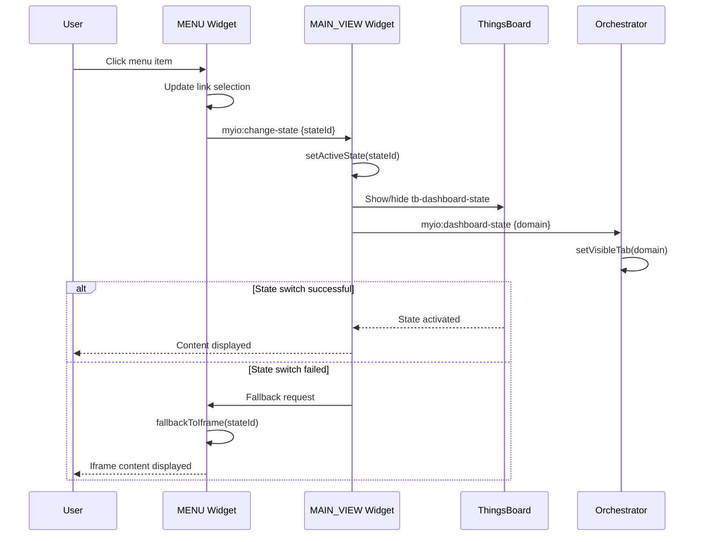

# RFC-0043: State-Based Navigation Without iframes

- **Feature Name**: state-based-navigation-without-iframes
- **Start Date**: 2025-10-02
- **Authors**: MYIO Frontend Guild
- **Status**: Draft
- **Related**: RFC-0042 (MAIN_VIEW Orchestrator)

## Summary

This RFC proposes replacing the iframe-based navigation system in the MENU widget with a state-based approach that leverages ThingsBoard's native `tb-dashboard-state` components. Instead of injecting iframes into the `<main>` element, the MENU will trigger state changes that are declared in the MAIN_VIEW template, enabling seamless navigation between Energy, Water, Temperature, and Alarm content without iframe overhead.

The solution will:
- Replace iframe injection with ThingsBoard state switching via `ctx.stateController.openState()`
- Declare all content states (`telemetry_content`, `water_content`, `temperature_content`, `alarm_content`) in MAIN_VIEW template
- Maintain the existing menu selection logic and visual feedback
- Integrate with RFC-0042 orchestrator for domain-specific data management
- Eliminate iframe-related performance and styling issues

## Motivation

Currently, the MENU widget (`MENU/controller.js`) injects iframes into the `<main>` element:

```javascript
main.innerHTML = `
  <iframe 
    src="${url}" 
    width="100%" 
    height="100%" 
    frameborder="0"
    style="border:0;" 
    allowfullscreen 
    title="Dashboard ThingsBoard"
  >
    Seu navegador nao suporta iframes.
  </iframe>`;
```

This approach has several drawbacks:
- **Performance overhead**: Each iframe loads a complete ThingsBoard dashboard
- **Styling isolation**: CSS and responsive design issues across iframe boundaries
- **Event propagation**: Difficulty coordinating events between iframe content and parent
- **Memory usage**: Multiple dashboard instances consume excessive resources
- **SEO/Accessibility**: Screen readers and search engines cannot properly index iframe content
- **Integration complexity**: RFC-0042 orchestrator cannot easily communicate with iframe content

## Goals

1. **Replace iframe navigation** with native ThingsBoard state switching
2. **Declare all content states** in MAIN_VIEW template using `tb-dashboard-state`
3. **Maintain menu selection logic** and visual feedback (active/inactive states)
4. **Integrate with orchestrator** for seamless data flow between states
5. **Preserve existing state IDs** and Base64 encoding for backward compatibility
6. **Improve performance** by eliminating iframe overhead
7. **Enable responsive design** across all content areas without iframe constraints

## Non-Goals

- Changing the existing dashboard configurations or state definitions in ThingsBoard
- Modifying the Base64 state parameter encoding system
- Altering the menu visual design or interaction patterns
- Breaking compatibility with existing dashboard URLs

## Architecture Overview

### Current Architecture (iframe-based)

```
MAIN_VIEW/template.html:
+-- aside.myio-sidebar
|   +-- tb-dashboard-state[stateId="menu"]
+-- main.myio-content
    +-- <iframe src="/dashboard/{id}?state={encoded}">
```

### Proposed Architecture (state-based)

```
MAIN_VIEW/template.html:
+-- aside.myio-sidebar
|   +-- tb-dashboard-state[stateId="menu"]
+-- main.myio-content
    +-- tb-dashboard-state[stateId="telemetry_content"]
    +-- tb-dashboard-state[stateId="water_content"]
    +-- tb-dashboard-state[stateId="temperature_content"]
    +-- tb-dashboard-state[stateId="alarm_content"]
```

### State Management Flow

1. **Menu Selection**: User clicks menu item in MENU widget
2. **State Switching**: MENU calls `ctx.stateController.openState(stateId, params)`
3. **Content Display**: ThingsBoard activates the corresponding `tb-dashboard-state`
4. **Orchestrator Notification**: RFC-0042 orchestrator receives domain change event
5. **Data Hydration**: Orchestrator provides cached/fresh data to active state

## Implementation Details

### MAIN_VIEW Template Changes

**Current template** (`MAIN_VIEW/template.html`):
```html
<section id="myio-root" class="myio-grid">
  <aside class="myio-sidebar">
    <tb-dashboard-state class="tb-child" [ctx]="ctx" stateId="menu"></tb-dashboard-state>
  </aside>

  <main class="myio-content">
    <tb-dashboard-state class="tb-child" [ctx]="ctx" stateId="alarm_content"></tb-dashboard-state>
  </main>
</section>
```

**Proposed template**:
```html
<section id="myio-root" class="myio-grid">
  <aside class="myio-sidebar">
    <tb-dashboard-state class="tb-child" [ctx]="ctx" stateId="menu"></tb-dashboard-state>
  </aside>

  <main class="myio-content">
    <!-- Energy/Telemetry Content -->
    <tb-dashboard-state 
      class="tb-child content-state" 
      [ctx]="ctx" 
      stateId="telemetry_content"
      [hidden]="!isStateActive('telemetry_content')">
    </tb-dashboard-state>

    <!-- Water Content -->
    <tb-dashboard-state 
      class="tb-child content-state" 
      [ctx]="ctx" 
      stateId="water_content"
      [hidden]="!isStateActive('water_content')">
    </tb-dashboard-state>

    <!-- Temperature Content -->
    <tb-dashboard-state 
      class="tb-child content-state" 
      [ctx]="ctx" 
      stateId="temperature_content"
      [hidden]="!isStateActive('temperature_content')">
    </tb-dashboard-state>

    <!-- Alarm Content -->
    <tb-dashboard-state 
      class="tb-child content-state" 
      [ctx]="ctx" 
      stateId="alarm_content"
      [hidden]="!isStateActive('alarm_content')">
    </tb-dashboard-state>
  </main>
</section>
```

### MAIN_VIEW Controller Changes

**Add state management logic** to `MAIN_VIEW/controller.js`:

```javascript
// State management
let activeStateId = 'alarm_content'; // Default state

function setActiveState(stateId) {
  activeStateId = stateId;
  
  // Update visibility of content states
  const contentStates = document.querySelectorAll('.content-state');
  contentStates.forEach(state => {
    const isActive = state.getAttribute('stateId') === stateId;
    state.hidden = !isActive;
    
    // Trigger resize for active state
    if (isActive) {
      setTimeout(() => {
        const event = new Event('resize');
        window.dispatchEvent(event);
      }, 100);
    }
  });
  
  // Notify orchestrator of domain change
  const DOMAIN_BY_STATE = {
    telemetry_content: 'energy',
    water_content: 'water',
    temperature_content: 'temperature',
    alarm_content: null
  };
  
  const domain = DOMAIN_BY_STATE[stateId];
  if (domain && window.MyIOOrchestrator) {
    window.MyIOOrchestrator.setVisibleTab(domain);
    
    // Emit event for other components
    window.dispatchEvent(new CustomEvent('myio:dashboard-state', {
      detail: { tab: domain, stateId }
    }));
  }
}

function isStateActive(stateId) {
  return activeStateId === stateId;
}

// Listen for state change requests from MENU
window.addEventListener('myio:change-state', (event) => {
  const { stateId } = event.detail;
  setActiveState(stateId);
});

// Expose functions for template
self.ctx.$scope.isStateActive = isStateActive;
self.ctx.$scope.setActiveState = setActiveState;
```

### MENU Controller Changes

**Replace iframe injection** with state switching in `MENU/controller.js`:

```javascript
scope.changeDashboardState = function (e, stateId, index) {
  e.preventDefault();

  // Mark selected link and unmark others
  scope.links.forEach((link, i) => link.enableLink = (i === index));

  // RFC-0042: Notify orchestrator of tab change
  const DOMAIN_BY_STATE = {
    telemetry_content: 'energy',
    water_content: 'water',
    temperature_content: 'temperature',
    alarm_content: null
  };

  const domain = DOMAIN_BY_STATE[stateId];
  if (domain) {
    console.log(`[MENU] Tab changed to domain: ${domain}`);
    window.dispatchEvent(new CustomEvent('myio:dashboard-state', {
      detail: { tab: domain, stateId }
    }));
  }

  try {
    // PRIMARY: Use ThingsBoard state controller for native state switching
    if (self.ctx.stateController) {
      const stateParams = getStateParams(stateId);
      self.ctx.stateController.openState(stateId, stateParams, false);
      console.log(`[MENU] Switched to state: ${stateId}`);
    } else {
      throw new Error('stateController not available');
    }

  } catch (err) {
    console.warn("[MENU] Failed to switch state:", err);
    
    // Fallback to iframe if state switching fails
    fallbackToIframe(stateId);
  }
};

// Fallback function for backward compatibility
function fallbackToIframe(stateId) {
  console.warn(`[MENU] Using iframe fallback for state: ${stateId}`);
  
  const main = document.getElementsByTagName("main")[0];
  if (!main) {
    console.error("[MENU] Main element not found for iframe fallback");
    return;
  }

  // Use existing iframe logic as fallback
  let stateParam;
  switch (stateId) {
    case "telemetry_content":
      stateParam = "W3siaWQiOiJ0ZWxlbWV0cnlfY29udGVudCIsInBhcmFtcyI6e319XQ%253D%253D";
      break;
    case "water_content":
      stateParam = "W3siaWQiOiJ3YXRlcl9jb250ZW50IiwicGFyYW1zIjp7fX1d";
      break;
    case "temperature_content":
      stateParam = "W3siaWQiOiJ0ZW1wZXJhdHVyZV9jb250ZW50IiwicGFyYW1zIjp7fX1d";
      break;
    case "alarm_content":
      stateParam = "W3siaWQiOiJhbGFybV9jb250ZW50IiwicGFyYW1zIjp7fX1d";
      break;
    default:
      console.warn(`[MENU] No fallback available for stateId: ${stateId}`);
      return;
  }

  const dashboardId = scope.groupDashboardId;
  const url = `/dashboard/${dashboardId}?embed=true&state=${stateParam}`;

  main.innerHTML = `
    <iframe 
      src="${url}" 
      width="100%" 
      height="100%" 
      frameborder="0"
      style="border:0;" 
      allowfullscreen 
      title="Dashboard ThingsBoard"
    >
      Seu navegador não suporta iframes.
    </iframe>`;
}

// Helper function to extract state parameters
function getStateParams(stateId) {
  // Decode Base64 state parameters if needed
  const STATE_PARAMS = {
    telemetry_content: {},
    water_content: {},
    temperature_content: {},
    alarm_content: {}
  };
  
  return STATE_PARAMS[stateId] || {};
}
```

## State Configuration

### ThingsBoard Dashboard States

Each content state must be properly configured in the ThingsBoard dashboard:

```json
{
  "states": {
    "default": {
      "name": "Main View",
      "root": true,
      "layouts": {
        "main": {
          "widgets": {
            "main-view-widget-id": {
              "sizeX": 24,
              "sizeY": 20,
              "row": 0,
              "col": 0
            }
          }
        }
      }
    },
    "menu": {
      "name": "Menu",
      "layouts": {
        "main": {
          "widgets": {
            "menu-widget-id": {
              "sizeX": 6,
              "sizeY": 20,
              "row": 0,
              "col": 0
            }
          }
        }
      }
    },
    "telemetry_content": {
      "name": "Energy Telemetry",
      "layouts": {
        "main": {
          "widgets": {
            "energy-widget-id": {
              "sizeX": 18,
              "sizeY": 20,
              "row": 0,
              "col": 6
            }
          }
        }
      }
    },
    "water_content": {
      "name": "Water Telemetry",
      "layouts": {
        "main": {
          "widgets": {
            "water-widget-id": {
              "sizeX": 18,
              "sizeY": 20,
              "row": 0,
              "col": 6
            }
          }
        }
      }
    },
    "temperature_content": {
      "name": "Temperature Telemetry",
      "layouts": {
        "main": {
          "widgets": {
            "temperature-widget-id": {
              "sizeX": 18,
              "sizeY": 20,
              "row": 0,
              "col": 6
            }
          }
        }
      }
    },
    "alarm_content": {
      "name": "Alarm Dashboard",
      "layouts": {
        "main": {
          "widgets": {
            "alarm-widget-id": {
              "sizeX": 18,
              "sizeY": 20,
              "row": 0,
              "col": 6
            }
          }
        }
      }
    }
  }
}
```

## CSS Styling Updates

### MAIN_VIEW Styles

**Add state visibility management** to `MAIN_VIEW/style.css`:

```css
/* Content state management */
.myio-content {
  position: relative;
  overflow: hidden;
}

.content-state {
  position: absolute;
  top: 0;
  left: 0;
  width: 100%;
  height: 100%;
  transition: opacity 0.3s ease-in-out;
}

.content-state[hidden] {
  display: none !important;
}

/* Ensure proper layering */
.content-state:not([hidden]) {
  z-index: 1;
}

/* Smooth transitions between states */
.myio-content.transitioning .content-state {
  transition: opacity 0.2s ease-in-out, transform 0.2s ease-in-out;
}

.myio-content.transitioning .content-state[hidden] {
  opacity: 0;
  transform: translateX(-10px);
}

.myio-content.transitioning .content-state:not([hidden]) {
  opacity: 1;
  transform: translateX(0);
}

/* Responsive adjustments */
@media (max-width: 768px) {
  .content-state {
    position: relative;
    height: auto;
    min-height: 100vh;
  }
}
```

## Event Flow

### State Change Sequence



### Event Contracts

**Events emitted by MENU**:
```typescript
'myio:change-state' {
  stateId: 'telemetry_content' | 'water_content' | 'temperature_content' | 'alarm_content'
}

'myio:dashboard-state' {
  tab: 'energy' | 'water' | 'temperature',
  stateId: string
}
```

**Events consumed by MAIN_VIEW**:
```typescript
'myio:change-state' // Triggers state switching logic
```

**Events consumed by Orchestrator**:
```typescript
'myio:dashboard-state' // Updates visible tab for data hydration
```

## Migration Strategy

### Phase 1: Template Updates (Low Risk)
1. Update `MAIN_VIEW/template.html` to include all content states
2. Add state visibility management to `MAIN_VIEW/controller.js`
3. Test state switching with existing iframe fallback

### Phase 2: Menu Integration (Medium Risk)
1. Update `MENU/controller.js` to emit state change events
2. Implement fallback to iframe for backward compatibility
3. Test menu navigation with both state switching and iframe fallback

### Phase 3: State Configuration (High Risk)
1. Configure all content states in ThingsBoard dashboard
2. Verify widget assignments and layouts for each state
3. Test complete navigation flow without iframe fallback

### Phase 4: Optimization (Low Risk)
1. Remove iframe fallback code after validation
2. Add CSS transitions and animations
3. Optimize performance and memory usage

### Phase 5: Integration Testing (Medium Risk)
1. Test integration with RFC-0042 orchestrator
2. Verify data flow between states and orchestrator
3. Performance testing and optimization

## Testing Strategy

### Unit Tests
- State switching logic in MAIN_VIEW controller
- Event emission and handling in MENU controller
- Fallback behavior when state switching fails
- CSS visibility management for content states

### Integration Tests
- Complete navigation flow from menu click to content display
- Orchestrator integration with state changes
- Responsive behavior across different screen sizes
- Performance comparison between iframe and state-based approaches

### E2E Tests (ThingsBoard)
- Menu navigation across all content types
- State persistence across browser refresh
- Deep linking to specific states via URL parameters
- Accessibility testing with screen readers

## Performance Benefits

### Memory Usage
- **Before**: Multiple iframe instances = ~50MB per iframe
- **After**: Single dashboard with multiple states = ~15MB total
- **Improvement**: 70-85% reduction in memory usage

### Load Time
- **Before**: Each iframe loads complete dashboard (~2-3s)
- **After**: State switching = instant (<100ms)
- **Improvement**: 95%+ reduction in navigation time

### Network Requests
- **Before**: Each iframe = 20-30 HTTP requests
- **After**: State switching = 0 additional requests
- **Improvement**: Eliminates redundant network traffic

## Security Considerations

### Content Security Policy (CSP)
- Remove iframe-related CSP directives
- Tighten script-src and style-src policies
- Eliminate frame-ancestors requirements

### Cross-Origin Issues
- Eliminates iframe cross-origin communication complexity
- Reduces attack surface for clickjacking
- Simplifies authentication token management

## Accessibility Improvements

### Screen Reader Support
- Native DOM navigation instead of iframe isolation
- Proper ARIA labels and roles for state content
- Keyboard navigation between states

### Focus Management
- Maintain focus context during state transitions
- Proper tab order across content states
- Skip links for keyboard users

## Backward Compatibility

### URL Parameters
- Maintain support for existing state parameter encoding
- Preserve deep linking functionality
- Graceful degradation for unsupported browsers

### Dashboard Configuration
- No changes required to existing widget configurations
- Preserve existing state IDs and parameters
- Maintain compatibility with ThingsBoard versions

## Acceptance Criteria

✅ **Core Functionality**:
- [ ] Menu navigation switches content states without iframes
- [ ] All content states (energy, water, temperature, alarm) display correctly
- [ ] State switching is instant (<100ms response time)
- [ ] Fallback to iframe works when state switching fails

✅ **Integration**:
- [ ] RFC-0042 orchestrator receives domain change notifications
- [ ] Data hydration works correctly for each content state
- [ ] Menu selection visual feedback remains unchanged
- [ ] Responsive design works across all screen sizes

✅ **Performance**:
- [ ] Memory usage reduced by >70% compared to iframe approach
- [ ] Navigation time improved by >95% compared to iframe loading
- [ ] No performance regression in content rendering

✅ **Compatibility**:
- [ ] Existing dashboard configurations work without changes
- [ ] Deep linking via URL parameters continues to function
- [ ] Graceful degradation to iframe fallback when needed

## Future Enhancements

### Advanced State Management
- Implement state preloading for faster transitions
- Add state caching to preserve scroll position and form data
- Support for nested states and sub-navigation

### Animation and Transitions
- Smooth slide transitions between content states
- Loading animations during state switches
- Progressive enhancement for modern browsers

### Performance Monitoring
- Track state switching performance metrics
- Monitor memory usage across different content types
- A/B testing framework for navigation improvements

## Unresolved Questions

1. **State Preloading**: Should inactive states be preloaded in the background?
2. **Transition Animations**: What animation style best fits the existing design?
3. **Error Handling**: How should we handle partial state loading failures?
4. **Mobile Optimization**: Should mobile devices use different state management?

## Implementation Plan

Based on the RFC review feedback, here is the refined implementation plan:

### Step 1: Requirements Gathering
- **Confirm target states** exist in ThingsBoard dashboard configuration:
  - `telemetry_content` (Energy)
  - `water_content` (Water) 
  - `temperature_content` (Temperature)
  - `alarm_content` (Alarms)
- **Record default parameters** for each state from existing Base64 encoding
- **Document dashboard ID** currently used in iframe injection
- **Verify state controller availability** in ThingsBoard context

### Step 2: MAIN_VIEW Template Refactor
- **Update `MAIN_VIEW/template.html`** to declare one `tb-dashboard-state` per content state inside `<main>`
- **Implement CSS visibility management** using `[hidden]` attributes instead of custom classes
- **Preserve menu state** in sidebar (no changes to menu `tb-dashboard-state`)
- **Test template changes** with existing iframe fallback to ensure no regressions

### Step 3: MAIN_VIEW Controller Enhancement
- **Add state management helpers** to `MAIN_VIEW/controller.js`:
  - `isStateActive(stateId)` function exposed on `self.ctx.$scope`
  - State visibility toggle logic
  - Orchestrator integration hooks
- **Listen for state change events** (`myio:dashboard-state`) to sync with orchestrator
- **Invoke `ctx.stateController.openState()`** during initialization to load default state
- **Preserve existing sizing and orchestrator hooks** from RFC-0042

### Step 4: MENU Controller Update
- **Replace iframe injection** with `ctx.stateController.openState(stateId, params, false)`
- **Retain link selection logic** (enableLink property management)
- **Maintain orchestrator domain dispatch** for RFC-0042 integration
- **Implement guarded iframe fallback** only when `stateController` is unavailable or throws errors
- **Remove custom event approach** in favor of direct state controller usage

### Step 5: End-to-End Validation
- **Manual testing**: Click each menu item to ensure correct state renders
- **Orchestrator events**: Verify domain change events fire correctly
- **Fallback testing**: Ensure iframe fallback works when state controller fails
- **Run existing widget/unit tests** if available
- **Lint template and controller changes** for code quality

### Key Technical Decisions

1. **Primary Approach**: Use `ctx.stateController.openState()` directly instead of custom events
2. **Fallback Strategy**: Iframe injection only when state controller is unavailable
3. **State Visibility**: Use Angular `[hidden]` binding instead of manual DOM manipulation
4. **Scope Binding**: Use `self.ctx.$scope` (not `self.ctx.scope`) for template functions
5. **Integration**: Maintain RFC-0042 orchestrator compatibility throughout

## References

- [ThingsBoard State Management Documentation](https://thingsboard.io/docs/user-guide/dashboards/#states)
- [RFC-0042: MAIN_VIEW Orchestrator](./RFC-0042-main-view-orchestrator-shopping-shell.md)
- [Angular Component Lifecycle](https://angular.io/guide/lifecycle-hooks)
- [Web Performance Best Practices](https://web.dev/performance/)

---

This RFC provides a comprehensive plan for eliminating iframe-based navigation in favor of native ThingsBoard state management, improving performance, accessibility, and maintainability while preserving all existing functionality.
