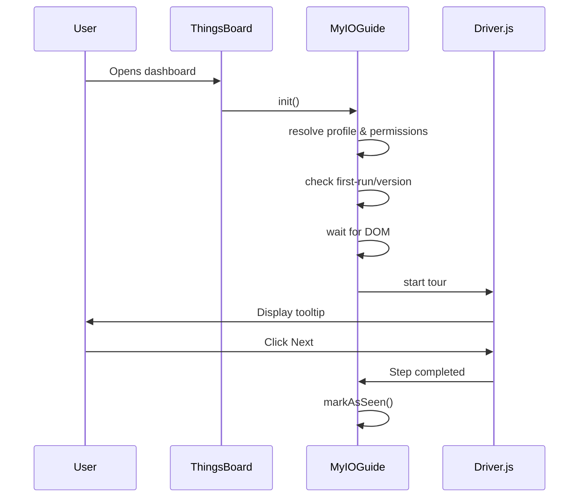

# RFC 0144: MYIO Onboarding Guide Library

- **Feature Name:** `onboarding-guide-library`
- **Start Date:** 2025-01-11
- **RFC PR:** [myio-js-library#0144](https://github.com/gh-myio/myio-js-library/pull/0144)
- **MYIO Issue:** [myio-js-library#0144](https://github.com/gh-myio/myio-js-library/issues/0144)

## Summary

This RFC proposes the design and implementation of a **JavaScript-based onboarding and guided tour library** for the MYIO platform, fully compatible with ThingsBoard dashboards and widgets.

The library provides **first-run experiences, contextual tips, and guided walkthroughs**, highlighting UI elements, explaining features, and onboarding users progressively — without relying on Angular, React, or Vue, and operating directly on the DOM.

**Key architectural principle:**

```
Driver.js  = Engine (visual rendering)
MYIO Guide = Brain (rules, state, permissions, versioning, UX)
```

The solution introduces:

- A **MYIO-owned orchestration layer** that controls the entire onboarding experience
- **Driver.js as an external, encapsulated engine** — not forked, not modified
- A **server-side JSON-based permission and preference model**
- Integration with **ThingsBoard user profiles and attributes**
- Version-aware onboarding to avoid repetitive full tours

## Motivation

MYIO dashboards have grown significantly in complexity, incorporating:

- Switches and device controls
- Advanced telemetry visualizations
- Alarm panels and automation logic
- Multi-module dashboards with role-based access

New users (and even existing ones) face a steep learning curve. Currently, there is no guided experience to help users discover features, understand workflows, or navigate complex dashboards.

This leads to several operational challenges:

1. **Slow User Adoption**: New users struggle to find and use key features
2. **High Support Demand**: Support teams repeatedly answer basic "how to" questions
3. **Poor Feature Discovery**: Advanced features go unused because users don't know they exist
4. **Inconsistent Onboarding**: Each client receives ad-hoc training with varying quality

A guided onboarding system addresses these challenges by providing:

1. **Faster User Adoption**: Interactive tutorials reduce time-to-productivity
2. **Reduced Support Demand**: Self-service guidance for common questions
3. **Clear Feature Discovery**: Highlight new and advanced features contextually
4. **Better UX for Enterprise Clients**: Professional onboarding experience

## Guide-level explanation

### Design Principles

The MYIO Onboarding Guide library is designed as a **thin orchestration layer** on top of an external guided-tour engine.

The underlying engine (**Driver.js**) is treated strictly as a **rendering and interaction engine**, not as a source of business logic.

The following principles are enforced:

| Principle | Description |
|-----------|-------------|
| No Fork | The MYIO library **MUST NOT** fork, modify, or patch Driver.js |
| External Dependency | Driver.js **MUST** be consumed as an external dependency |
| Separation of Concerns | All MYIO-specific logic (permissions, first-run, versioning, profiles) **MUST** live outside Driver.js |
| Single Adapter | A single adapter layer **MUST** isolate the external library |
| Replaceability | The onboarding engine **MUST** be replaceable without impacting MYIO APIs |

This ensures long-term maintainability and avoids vendor lock-in.

### Architecture Philosophy

**CRITICAL: This is NOT a fork or modification of Driver.js.**

The architecture uses Driver.js as an **external visual engine**, completely encapsulated by a MYIO-owned layer:

```
┌─────────────────────────────────────────┐
│         MYIO Onboarding Library         │
│                                         │
│  ┌───────────────────────────────────┐  │
│  │         GuideEngine               │  │  ← Rules, versioning, permissions
│  ├───────────────────────────────────┤  │
│  │         ProfileResolver           │  │  ← User profile access control
│  ├───────────────────────────────────┤  │
│  │         FirstRunManager           │  │  ← First-run & version tracking
│  ├───────────────────────────────────┤  │
│  │         DOMWatcher                │  │  ← ThingsBoard async handling
│  └───────────────────────────────────┘  │
│                    │                    │
│                    ▼                    │
│  ┌───────────────────────────────────┐  │
│  │         DriverAdapter             │  │  ← ONLY direct dependency
│  └───────────────────────────────────┘  │
│                    │                    │
└────────────────────┼────────────────────┘
                     ▼
            Driver.js (external)
```

**If tomorrow we need to swap Driver.js for Shepherd.js, the impact is minimal** — only the `DriverAdapter` changes.

### Execution Flow



### What NOT To Do

| Anti-Pattern | Problem |
|--------------|---------|
| Copy Driver.js code into MYIO | Lock-in, painful upgrades |
| Modify Driver.js internal files | Bugs hard to track, no upstream updates |
| Spread Driver.js calls across widgets | Tight coupling, maintenance nightmare |
| Fork Driver.js | High maintenance burden |

### What TO Do

| Pattern | Benefit |
|---------|---------|
| Use Driver.js as external dependency | Easy upgrades |
| Encapsulate via `DriverAdapter` | Single point of change |
| Keep business logic in MYIO layer | Clean, testable code |
| Override styles via CSS only | No lib modifications needed |

### Product/UX Requirements

The Onboarding Guide provides two main modes of operation:

#### 1. First-Run Tour

When a user accesses a module for the first time, a guided tour automatically starts:

```
+----------------------------------------------------------+
|  Welcome to Energy Dashboard!                     [Skip]  |
+----------------------------------------------------------+
|                                                           |
|  This tour will guide you through the main features.     |
|                                                           |
|  [Start Tour]                        [Maybe Later]        |
+----------------------------------------------------------+
```

The tour highlights UI elements sequentially with tooltips:

```
+----------------------------------------------------------+
|  Dashboard                                                |
|  +--------------------------------------------------+    |
|  |  ┌─────────────────────────────────────────────┐ |    |
|  |  │  Energy Chart                               │ |    |
|  |  │  ════════════════════════════════════════   │ |    |
|  |  │  ▓▓▓▓▓▓▓▓░░░░░░░░░░░░░░░░░░░░░░░░░░░░░░░   │ |    |
|  |  └─────────────────────────────────────────────┘ |    |
|  |        ↑                                         |    |
|  |  +------------------------------------------+   |    |
|  |  | This chart shows your energy consumption |   |    |
|  |  | over time. Click to see detailed stats.  |   |    |
|  |  |                                          |   |    |
|  |  |              [Next →]                    |   |    |
|  |  +------------------------------------------+   |    |
|  +--------------------------------------------------+    |
+----------------------------------------------------------+
```

#### 2. Contextual Help

Users can access contextual help for specific features via a help button:

```
+----------------------------------------------------------+
|  Device Card                                    [?]       |
|  +--------------------------------------------------+    |
|  |  Status: Online                                   |    |
|  |  Consumption: 1,234 kWh                          |    |
|  +--------------------------------------------------+    |
+----------------------------------------------------------+
```

Clicking [?] shows a tooltip explaining that specific element.

### User Profiles

The system respects user profiles defined at the customer level:

| Profile | Energy | Water | Automation | Description |
|---------|--------|-------|------------|-------------|
| `ADMIN` | ✓ | ✓ | ✓ | Full access to all modules |
| `OPERATOR` | ✓ | ✓ | ✗ | Operational access only |
| `VIEWER` | ✓ | ✗ | ✗ | Read-only energy access |

Users only see onboarding for modules they have access to.

### Version-Aware Onboarding

The system tracks which version of the tour each user has seen:

| Scenario | Behavior |
|----------|----------|
| First visit | Full tour for the module |
| Version update | Only new/changed steps shown |
| Return visit (same version) | No automatic tour |
| User requests help | Manual contextual help available |

### API Usage

```javascript
// Initialize the guide engine
MyIOGuide.init({
  userId: 'user-uuid',
  customerId: 'customer-uuid',
  dashboardId: 'dashboard-uuid',
  version: '1.2.0'
});

// Start a module tour
MyIOGuide.startModule('energy');

// Show contextual help for a specific element
MyIOGuide.showContextHelp('switch-power');

// Wait for an element before starting tour
MyIOGuide.waitFor('#energyChart', () => {
  MyIOGuide.startTour('energy-dashboard');
});

// Reset module onboarding (for testing or user request)
MyIOGuide.resetModule('energy');
```

## Reference-level explanation

### Guided Tour Engine

#### External Engine Strategy

The MYIO Onboarding Guide does **not reimplement** a guided-tour system from scratch.

Instead, it adopts an **external open-source engine** and encapsulates it behind a MYIO-controlled interface.

#### Engine Choice: Driver.js

Driver.js is selected as the initial rendering engine due to:

| Criteria | Value |
|----------|-------|
| License | MIT (fully open source) |
| Framework | No dependency |
| API | DOM-based |
| Size | Lightweight (~15KB) |
| Maintenance | Active GitHub project |

#### Encapsulation Rule

Driver.js is treated as a **black-box engine**.

- No internal Driver.js code is modified
- No private APIs are accessed
- All interaction occurs via a MYIO adapter

Any future replacement (e.g., Shepherd.js) only requires implementing a new adapter.

#### Adapter Pattern

All communication with Driver.js is handled through a dedicated adapter:

```
MYIO Guide Engine
        │
        ▼
  DriverAdapter (MYIO)
        │
        ▼
  Driver.js (external)
```

The adapter is responsible **only** for:

- Translating MYIO steps into Driver.js steps
- Applying theme options
- Starting and stopping tours

The adapter **MUST NOT**:

- Contain permission logic
- Contain versioning logic
- Store user state

### Package Structure (Boilerplate)

```
@myio/onboarding-guide/
├─ package.json
├─ README.md
├─ src/
│  ├─ index.js                    # Public API
│  ├─ core/
│  │  ├─ GuideEngine.js           # Main orchestration
│  │  ├─ PermissionResolver.js    # Profile-based access
│  │  ├─ FirstRunManager.js       # First-run tracking
│  │  ├─ VersionManager.js        # Version comparison
│  │  └─ DOMWatcher.js            # Async element detection
│  ├─ adapters/
│  │  └─ DriverAdapter.js         # ONLY place Driver.js is used
│  ├─ themes/
│  │  └─ myio-theme.css           # CSS overrides only
│  └─ utils/
│     └─ logger.js                # Debug logging
├─ dist/
│  └─ myio-onboarding.min.js      # Built bundle
└─ build/
   └─ rollup.config.js            # Build configuration
```

### Public API Implementation

```javascript
// src/index.js
import { GuideEngine } from './core/GuideEngine';
import { DriverAdapter } from './adapters/DriverAdapter';
import { waitFor } from './core/DOMWatcher';

export const MyIOGuide = {
  engine: null,
  adapter: null,

  init(config) {
    this.engine = new GuideEngine(config);
    this.adapter = new DriverAdapter(config.theme);
  },

  startModule(moduleName) {
    if (!this.engine.shouldRun(moduleName)) return;

    waitFor(this.engine.getSelector(moduleName), () => {
      const steps = this.engine.getSteps(moduleName);
      this.adapter.start(steps);
      this.engine.markAsSeen(moduleName);
    });
  },

  showContextHelp(elementId) {
    const step = this.engine.getContextStep(elementId);
    if (step) {
      this.adapter.highlight(step.selector, step.popover);
    }
  },

  resetModule(moduleName) {
    this.engine.resetModule(moduleName);
  }
};
```

### Driver.js Integration

Driver.js is included as an **external dependency**, NOT bundled or modified:

```html
<!-- Via CDN -->
<script src="https://unpkg.com/driver.js/dist/driver.min.js"></script>
<link rel="stylesheet" href="https://unpkg.com/driver.js/dist/driver.min.css">

<!-- Or via ThingsBoard widget addResources -->
```

### DriverAdapter: The Single Dependency Point

**No business logic lives here.** This is purely a translation layer:

```javascript
// adapters/DriverAdapter.js
export class DriverAdapter {
  constructor(theme) {
    this.driver = new Driver({
      className: theme?.className || 'myio-driver',
      animate: true,
      opacity: 0.6
    });
  }

  start(steps) {
    this.driver.defineSteps(
      steps.map(step => ({
        element: step.selector,
        popover: {
          title: step.title,
          description: step.description,
          position: step.position || 'bottom'
        }
      }))
    );
    this.driver.start();
  }

  highlight(selector, options) {
    this.driver.highlight({
      element: selector,
      popover: options
    });
  }

  destroy() {
    this.driver.reset();
  }
}
```

**Key principle:** If we replace Driver.js with Shepherd.js, ONLY this file changes.

### GuideEngine: The Brain

All business logic, rules, and orchestration live here:

```javascript
// core/GuideEngine.js
export class GuideEngine {
  constructor({ profile, userPrefs, version }) {
    this.profile = profile;
    this.userPrefs = userPrefs;
    this.version = version;
  }

  canRun(module) {
    // Check if user's profile has access to this module
    return this.profile.modules[module] === true;
  }

  shouldRun(module) {
    if (!this.canRun(module)) return false;

    // Check if tour should auto-start based on first-run or version change
    const prefs = this.userPrefs.onboarding.modules[module];
    if (!prefs) return true; // New module, show tour

    return prefs.firstRun || prefs.lastSeenVersion !== this.version;
  }

  getSteps(module) {
    const allSteps = this.getModuleSteps(module);
    const prefs = this.userPrefs.onboarding.modules[module];

    // First run: show all steps
    if (!prefs || prefs.firstRun) return allSteps;

    // Version update: show only new steps
    return allSteps.filter(step =>
      step.addedInVersion &&
      this.compareVersions(step.addedInVersion, prefs.lastSeenVersion) > 0
    );
  }

  compareVersions(v1, v2) {
    const parts1 = v1.split('.').map(Number);
    const parts2 = v2.split('.').map(Number);
    for (let i = 0; i < 3; i++) {
      if (parts1[i] > parts2[i]) return 1;
      if (parts1[i] < parts2[i]) return -1;
    }
    return 0;
  }

  markAsSeen(module) {
    // Update user preferences after tour completion
    this.userPrefs.onboarding.modules[module] = {
      firstRun: false,
      lastSeenVersion: this.version
    };
    // Persist to server...
  }
}
```

### DOMWatcher: ThingsBoard Async Handling

Isolates the problem of ThingsBoard's asynchronous widget rendering:

```javascript
// core/DOMWatcher.js
export function waitFor(selector, callback, timeout = 5000) {
  // Check if element already exists
  if (document.querySelector(selector)) {
    callback();
    return;
  }

  const start = Date.now();
  const interval = setInterval(() => {
    if (document.querySelector(selector)) {
      clearInterval(interval);
      callback();
    }
    if (Date.now() - start > timeout) {
      clearInterval(interval);
      console.warn(`[MyIOGuide] Element ${selector} not found within ${timeout}ms`);
    }
  }, 100);
}

// Alternative: MutationObserver for complex dashboards
export function waitForWithObserver(selector, callback, timeout = 5000) {
  if (document.querySelector(selector)) {
    callback();
    return;
  }

  const observer = new MutationObserver((mutations, obs) => {
    if (document.querySelector(selector)) {
      obs.disconnect();
      callback();
    }
  });

  observer.observe(document.body, {
    childList: true,
    subtree: true
  });

  setTimeout(() => {
    observer.disconnect();
  }, timeout);
}
```

### Data Model

#### Customer-Level Configuration

Stored in **Customer Attributes – Server Scope**:

```typescript
interface CustomerOnboardingConfig {
  profiles: {
    [profileName: string]: {
      modules: {
        [moduleName: string]: boolean;
      };
    };
  };
}
```

Example JSON:

```json
{
  "profiles": {
    "ADMIN": {
      "modules": {
        "energy": true,
        "water": true,
        "automation": true
      }
    },
    "OPERATOR": {
      "modules": {
        "energy": true,
        "water": false,
        "automation": false
      }
    }
  }
}
```

#### User-Level Configuration

Stored in **User Attributes – Server Scope**:

```typescript
interface UserOnboardingState {
  profile: string;                    // Reference to customer profile
  onboarding: {
    version: string;                  // Current library version
    modules: {
      [moduleName: string]: {
        firstRun: boolean;            // Has user completed first tour?
        lastSeenVersion: string | null; // Last tour version shown
      };
    };
  };
}
```

Example JSON:

```json
{
  "profile": "OPERATOR",
  "onboarding": {
    "version": "1.2.0",
    "modules": {
      "energy": {
        "firstRun": false,
        "lastSeenVersion": "1.1.0"
      },
      "automation": {
        "firstRun": true,
        "lastSeenVersion": null
      }
    }
  }
}
```

### Theme Customization (CSS Only)

**We do NOT modify Driver.js.** We override styles via CSS:

```css
/* themes/myio-theme.css */

/* Dark theme with MYIO branding */
.driver-popover {
  background: #1b1f2a;
  color: #fff;
  border-radius: 12px;
  box-shadow: 0 12px 40px rgba(0, 0, 0, 0.35);
}

.driver-popover-title {
  color: #00d4ff;
  font-weight: 600;
  font-size: 16px;
}

.driver-popover-description {
  color: #e0e0e0;
  font-size: 14px;
  line-height: 1.5;
}

.driver-popover-footer button {
  background: #007bff;
  color: white;
  border: none;
  border-radius: 6px;
  padding: 8px 16px;
  cursor: pointer;
  transition: background 0.2s;
}

.driver-popover-footer button:hover {
  background: #0056b3;
}

.driver-overlay {
  backdrop-filter: blur(4px);
}
```

### Security Model

| Aspect | Implementation |
|--------|----------------|
| Configuration Storage | `server_scope` attributes (not client-editable) |
| Profile Resolution | Server-side validation before serving config |
| Read Access | Frontend can read onboarding state |
| Write Access | Only via authenticated API calls |
| Sensitive Data | No PII stored in onboarding config |

## Non-Functional Requirements

### Responsiveness

The MYIO Onboarding Guide MUST be designed with **responsive behavior in mind**, even though the initial implementation targets **desktop and large-screen dashboards**.

While mobile applications are not the primary focus in the first version, the architecture and visual layer MUST NOT prevent future support for tablets and smartphones.

#### Initial Scope (v1)

| Aspect | Support Level |
|--------|---------------|
| Desktop & large displays | **Full support** |
| ThingsBoard web dashboards | **Full support** |
| Tablets | Limited (graceful degradation) |
| Mobile phones | **Out of scope** for v1 |

#### Design Constraints

To ensure future extensibility:

- No hard-coded pixel values that assume fixed screen sizes
- All UI elements MUST rely on relative units where possible
- The onboarding engine MUST detect viewport size when rendering steps
- Visual components MUST degrade gracefully on smaller screens

#### Future Roadmap (Post v1)

The following enhancements are explicitly planned:

- Responsive tooltip positioning for tablets
- Adaptive step layouts for touch-based devices
- Reduced step density for smaller viewports
- Optional mobile-specific onboarding flows
- Improved accessibility for gesture-based navigation

The initial design MUST allow these features to be implemented without architectural changes.

## Non-Invasive Dependency Policy

The MYIO Onboarding Guide follows a strict non-invasive policy regarding third-party libraries.

| Rule | Description |
|------|-------------|
| No Modifications | External libraries MUST NOT be modified |
| No Forks | No forks are allowed inside the MYIO codebase |
| Composition Only | Custom behavior MUST be implemented via adapters or composition |
| CSS Overrides | Visual customization MUST be done via CSS overrides |

This policy guarantees:

- **Safe dependency upgrades** — Update Driver.js without code changes
- **Clear separation of responsibilities** — MYIO logic vs rendering logic
- **Reduced maintenance cost** — No fork synchronization needed

## Drawbacks

1. **Additional Library Dependency**: Driver.js adds ~15KB to bundle size
2. **Maintenance Burden**: Tour steps must be updated when UI changes
3. **Async Complexity**: ThingsBoard's async rendering requires careful element detection
4. **Translation Overhead**: Tour content needs i18n support for multilingual clients
5. **Version Tracking**: More data stored per user in ThingsBoard attributes

## Rationale and alternatives

### Why This Architecture?

#### Technical Benefits

| Benefit | Description |
|---------|-------------|
| Easy Driver.js upgrades | Just update the dependency, adapter stays stable |
| Clean, testable code | Business logic isolated from visual engine |
| Zero framework coupling | Works in any DOM environment |
| Lower risk in ThingsBoard | Encapsulated, predictable behavior |

#### Product Benefits

| Benefit | Description |
|---------|-------------|
| Versioned onboarding | Track what each user has seen |
| Profile-based control | Different tours for different roles |
| Intelligent first-run | Don't annoy returning users |
| Partial tours | Show only new features on updates |

#### Strategic Benefits

| Benefit | Description |
|---------|-------------|
| MYIO owns the experience | Not dependent on third-party UX decisions |
| Library becomes an asset | Can be reused, licensed, or extended |
| Platform portable | Can work outside ThingsBoard in the future |

### Why Driver.js?

| Criteria | Driver.js | Intro.js | Shepherd.js | Custom |
|----------|-----------|----------|-------------|--------|
| License | MIT | Commercial | MIT | N/A |
| Size | ~15KB | ~20KB | ~40KB | Variable |
| Framework | None | None | None | None |
| Maintenance | Active | Active | Active | High |
| Theming | Easy | Easy | Medium | Full Control |

**Decision**: Driver.js offers the best balance of features, size, and licensing.

### Alternatives Considered

#### Forking Driver.js

**Rejected.**

Forking introduces:

- Upgrade complexity
- Long-term maintenance risk
- Tight coupling to third-party internals

#### Direct Driver.js Usage in Widgets

**Rejected.**

Direct usage would:

- Spread dependency logic across widgets
- Make replacement difficult
- Break separation of concerns

#### Why Server-Side Configuration?

Alternatives considered:

1. **Client-side JSON files**: Rejected — no access control, version sync issues
2. **Database tables**: Rejected — requires ThingsBoard schema changes
3. **ThingsBoard attributes**: **Selected** — native, secure, version-controlled

#### Why Version-Aware Tours?

Alternatives considered:

1. **Always show full tour**: Rejected — annoying for returning users
2. **Never auto-show**: Rejected — new features go unnoticed
3. **Version delta**: **Selected** — best UX balance

### When Would We Modify Driver.js?

**Only if:**

1. We need behavior impossible via the public API
2. We want to contribute upstream (GitHub PR)
3. We decide to maintain a fork (NOT recommended for product)

**Current status:** None of these apply. Use as external dependency.

## Prior art

1. **GitHub's Feature Tours**: Progressive disclosure of new features
2. **Slack's Onboarding**: Contextual tips triggered by user actions
3. **Notion's Guided Setup**: Step-by-step first-run experience
4. **Figma's What's New**: Version-based feature announcements
5. **Driver.js Examples**: Reference implementations in the library docs

## Unresolved questions

1. **Tour Analytics**: Should we track completion rates and drop-off points?
2. **A/B Testing**: How to test different onboarding flows?
3. **Offline Mode**: Should tours work without network connectivity?
4. **Mobile Support**: How to adapt tours for mobile/tablet views?
5. **Multi-Language**: How to manage tour translations efficiently?
6. **Tour Editor**: Should we build a visual editor for non-developers?

## Future possibilities

1. **Visual Tour Editor**: Admin UI for creating/editing tours without code
2. **Analytics Dashboard**: Metrics on tour engagement and completion
3. **A/B Testing Framework**: Compare different onboarding approaches
4. **Contextual Triggers**: Start tours based on user behavior or alarms
5. **Documentation Links**: Deep links to MYIO docs from tour steps
6. **Video Integration**: Embed video tutorials in tour popovers
7. **AI-Powered Tours**: Personalized tours based on user role and behavior
8. **Responsive Experience**: Full support for tablets and mobile devices
9. **Touch Optimization**: Touch-friendly interactions and step navigation

## Implementation Plan

### Phase 1: Core Infrastructure
- [ ] Create `@myio/onboarding-guide` package structure
- [ ] Setup build system (Rollup)
- [ ] Implement `GuideEngine` core class
- [ ] Implement `DOMWatcher` for element detection
- [ ] Implement `DriverAdapter` wrapper

### Phase 2: Storage & Permissions
- [ ] Implement `CustomerProfiles` config reader
- [ ] Implement `UserPreferences` state manager
- [ ] Implement `ProfileResolver` for profile checks
- [ ] Implement `VersionManager` for version comparison
- [ ] Implement `FirstRunManager` for first-run tracking

### Phase 3: Theming & Integration
- [ ] Create `myio-theme.css` with brand styling
- [ ] Integrate with ThingsBoard widget lifecycle
- [ ] Add i18n support for tour content
- [ ] Create sample tours for energy/water modules

### Phase 4: Testing & Documentation
- [ ] Create showcase examples in `/showcase`
- [ ] Write API documentation
- [ ] Create tour authoring guide
- [ ] Performance testing and optimization

## References

- [Driver.js](https://github.com/kamranahmedse/driver.js) — Lightweight tour library
- [ThingsBoard Documentation](https://thingsboard.io/docs/) — Platform reference
- [MYIO Platform Architecture](./MYIO-Architecture.md) — Internal architecture docs
- [C4 Model](https://c4model.com/) — Software architecture visualization
