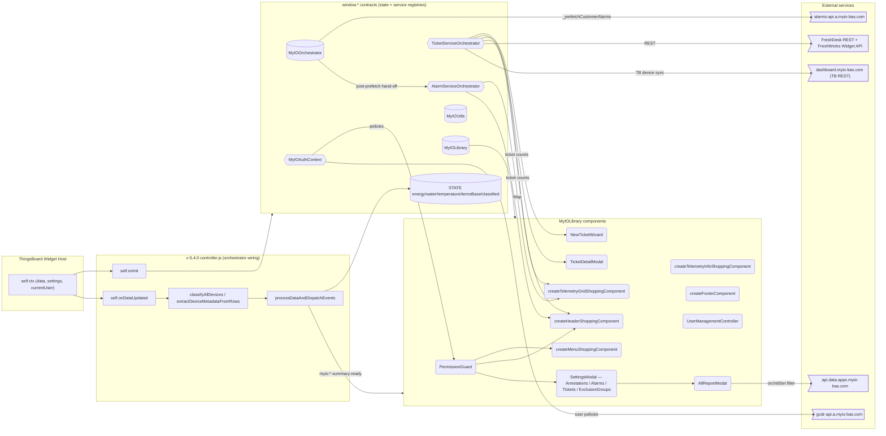

# RFC-0201 — MainDashboardShopping v-5.4.0 Sync from v-5.2.0

- **Status**: Draft — Design In Progress
- **Date**: 2026-04-29
- **Authors**: BMAD party-mode roundtable — Mary (📊 Business Analyst), John (📋 Product Manager), Winston (🏗️ System Architect), Sally (🎨 UX Designer), Amelia (💻 Senior Software Engineer), Paige (📚 Technical Writer)
- **Related**: RFC-0145, RFC-0146, RFC-0147, RFC-0149, RFC-0150, RFC-0180, RFC-0181, RFC-0182, RFC-0183, RFC-0190, RFC-0193, RFC-0194, RFC-0195, RFC-0196, RFC-0197, RFC-0198, RFC-0199, RFC-0200

---

## Summary

The MYIO Shopping Dashboard exists today in **three rendering surfaces**: the
production `v-5.2.0` ThingsBoard widget set (seven widgets, ~27,000 lines —
the source of truth that receives every new feature first), the consolidated
`v-5.4.0` single-widget controller (1,138 lines, last RFC tag `RFC-0180` in
code), and the `showcase/main-view-shopping/index.html` local demo (~3,235
lines, drifts in tandem with `v-5.4.0`). Between them, **ten RFCs (RFC-0181
through RFC-0200) and a documented family of bugfixes have landed only in
`v-5.2.0`**, while `v-5.4.0` and the showcase have stood still.

This RFC specifies the ordered, low-risk plan to bring `v-5.4.0` and the
showcase back to feature parity with `v-5.2.0` — without copying 27k lines of
multi-widget code into the library — by phasing the sync, locking the missing
`window.*` contracts, identifying the library-export gaps, and committing to
showcase-driven acceptance for every phase. The document is the output of a
six-author party-mode roundtable; section authorship is preserved inline so
disagreements stay visible.

---

## Motivation

📚 *Paige* — The pain is not that `v-5.4.0` is broken. The pain is that
`v-5.4.0` is the *direction of travel* (single-widget, library-driven,
embeddable) and **it is silently shipping behind the architecture it was
meant to replace**.

| Surface | Path | Lines | Last RFC tag in code | Status |
|---|---|---|---|---|
| `v-5.2.0` multi-widget | `src/thingsboard/main-dashboard-shopping/v-5.2.0/WIDGET/` | ~27,000 | RFC-0181 → RFC-0200 | Source of truth. Legacy production. |
| `v-5.4.0` single-widget | `src/thingsboard/main-dashboard-shopping/v-5.4.0/` | ~1,138 | **RFC-0180** | Direction of travel. Lagging by ten RFCs. |
| Showcase | `showcase/main-view-shopping/index.html` | ~3,235 | mirrors v-5.4.0 | Local validation. Lagging in tandem. |

The consequences (Minto-style — answer first, support after):

> **A customer demoed on `v-5.4.0` today would not see alarm badges on
> device cards, would not be able to open or triage a FreshDesk ticket from
> the dashboard, would not see a consolidated reports menu, would have no
> RBAC affordances, and would silently consume an offline-alarm flood that
> v-5.2.0 has gated for two months. The library — which is the *only*
> integration path for `v-5.4.0` and the showcase — is missing the public
> exports those features need.**

Three forces compound the risk:

1. **Customer optics.** `v-5.4.0` is the consolidation story we tell to new
   customers. Every demo on the lagging surface is a lost trust-multiplier.
2. **Engineering ergonomics.** Every fix shipped only into `v-5.2.0` widgets
   is a fix that must be re-shipped, re-reviewed, and re-tested when the
   sync finally happens. The longer we wait, the larger the diff.
3. **Public API ossification.** Every month `v-5.4.0` runs without
   needing `AlarmServiceOrchestrator` / `MyIOAuthContext` /
   `TicketServiceOrchestrator`, the library defers committing to the
   public contracts those orchestrators need. When we *do* commit, we
   commit cold — without the field signal that production usage gives.

**Theory of change.** RFC-0201 unblocks the migration by making the gap
*visible* (Mary's matrix), *quantified* (Amelia's costed work list),
*sequenced* (John's phasing), *architecturally bounded* (Winston's
contracts), *user-visible-tested* (Sally's parity checklist + Showcase
Validation), and *safely rollback-able* (John's risk register). Every
agent's section names the next concrete action. No section hand-waves.

---

## Guide-Level Explanation

📚 *Paige* — Read RFC-0201 like a play book, not a treatise.

If you are **a developer assigned a Phase-1 ticket**, jump to
`§ Phased Migration Plan` (John) and find your phase's exit criteria, then
cross-reference the work items in `§ Concrete Work List with Porting Cost`
(Amelia) for file paths and effort. Then read the matching ACs in
`§ Test Plan / Acceptance Criteria` (Amelia) — those are what you commit
against. Validate locally in showcase per `§ Showcase Validation`.

If you are **a product or design stakeholder**, start with
`§ Capability Gap Matrix` (Mary) to see what users lose, then
`§ Visual-Parity Checklist` (Sally) for the user-visible artifacts, then
`§ Customer Migration Story` (John) for the rollout narrative.

If you are **an architect or library maintainer**, start with
`§ Target Architecture` (Winston), then `§ Wiring Delta — window.* Globals`
(Winston), then `§ Library Export Audit` (Amelia).

### Quick Reference Index

| RFC / Family | Owning section(s) |
|---|---|
| RFC-0181 — Reports menu | Gap Matrix · Phased Plan (Phase 2) · Visual-Parity (Menu) · Work List |
| RFC-0182 — Orch group classification + AllReportModal API filter | Gap Matrix · Phased Plan (Phase 2) · Misuse Audit · Work List |
| RFC-0183 — AlarmServiceOrchestrator + alarm badges | Gap Matrix · Phased Plan (Phase 1) · Wiring Delta · Visual-Parity (Header/Cards) · Work List |
| RFC-0190 / 0197 — UserManagement | Gap Matrix · Phased Plan (Phase 3) · Visual-Parity (Menu) · Work List |
| RFC-0193 — Closed-alarm toast | Gap Matrix · Visual-Parity (Toasts) · Work List |
| RFC-0194 — Customer default dashboard | Gap Matrix · Visual-Parity (Menu) · Work List |
| RFC-0195 — Telemetry sync button | Gap Matrix · Visual-Parity (Cards) · Work List |
| RFC-0196 — Info-cards click-by-group + error | Gap Matrix · Visual-Parity (Info) · Work List |
| RFC-0198 — FreshDesk tickets | Gap Matrix · Phased Plan (Phase 3) · Wiring Delta · Visual-Parity (Header/Cards/Settings) · Work List |
| RFC-0199 — MyIOAuthContext + PermissionGuard | Gap Matrix · Phased Plan (Phase 3 — gates RFC-0198) · Wiring Delta · Work List |
| RFC-0200 — deviceIcons | Gap Matrix · Phased Plan (Phase 1) · Library Export Audit · Work List |
| Bugfix family — `gcdrDeviceId` propagation | Misuse Audit · Phased Plan (Phase 1) · Work List |
| Bugfix family — `showOfflineAlarms` gating | Settings-Schema Strategy · Visual-Parity (Header) · Work List |
| Bugfix family — alarm-tooltip width + `isInternalSupportRule` | Visual-Parity (Header) · Work List |
| Bugfix family — `DATA_API_HOST` double-prefix | Misuse Audit · Work List |
| Bugfix family — export filenames + "Gerado em" PDF header | Work List |
| Bugfix family — realtime FP÷255 + session countdown + chart title | Work List |
| Bugfix family — device-report 1h/1d tab + comparison SDK format | Work List |
| Bugfix family — light default theme | Settings-Schema Strategy · Work List |

---

## Reference-Level Explanation — Document Conventions

📚 *Paige* — These conventions apply to every section below. Define once,
reference everywhere.

### Severity tiers (Mary's matrix)

| Tier | Meaning |
|---|---|
| **T1** (blocker) | A customer cannot adopt `v-5.4.0` without this; it is a daily-driver workflow in `v-5.2.0`. |
| **T2** (important) | Adoption is possible but a meaningful workflow is degraded; needs roadmap commitment. |
| **T3** (nice-to-have) | Quality-of-life; can be staged over time. |

### Porting cost (Amelia's work list)

| Cost | Hour budget | Typical shape |
|---|---|---|
| **S** | ≤ 1 h | Mechanical edit (rename, add a key, lift a constant). |
| **M** | ≤ 4 h | Single-function rewrite or one new helper with tests. |
| **L** | 1–2 days | New component or orchestrator wired across 3+ files. |
| **XL** | > 2 days | Requires its own RFC or library refactor before work can start. |

### Phase tags (John's plan)

| Phase | Theme | Default cadence |
|---|---|---|
| **Phase 1** | Foundation — gcdrDeviceId, AlarmServiceOrchestrator, deviceIcons, light-theme default. | 1–2 sprints. |
| **Phase 2** | Visibility — reports menu, AllReportModal API filter, info-cards click-by-group, telemetry sync button, closed-alarm toast, customer-default-dashboard. | 1–2 sprints. |
| **Phase 3** | Identity & Tickets — MyIOAuthContext + PermissionGuard, then FreshDesk tickets (gated by 0199), then UserManagement. | 2–3 sprints. |

### Mermaid conventions

- Direction: `LR` for system architecture (left-to-right reads as
  data-flow); `TD` for sequence-like diagrams.
- Node shapes: rectangles for the controller; rounded rectangles for
  components; cylinders for state globals; hexagons for services /
  orchestrators; clouds for external HTTP endpoints.

### Status column legend

`EXISTS` — fully wired and identical to `v-5.2.0`.
`PARTIAL` — wired but missing one or more sub-features (called out in the
  Notes column).
`MISSING` — not wired at all.

### Acceptance-criteria format

`AC-RFC-<rfc>-<n>` — one Given/When/Then per AC. Each AC must be
verifiable in the showcase or via a unit test, and must trace back to
exactly one row in `§ Concrete Work List with Porting Cost`.

### Sample commit message header

`<type>(<scope>): RFC-<n> <subject> (Phase 
)`

Example: `feat(v-5.4.0): RFC-0183 AlarmServiceOrchestrator wiring + alarm badges (Phase 1)`

---

## § Capability Gap Matrix (Authored by Mary)

📊 *Mary* — A pattern emerges the moment we line up the surfaces side by
side: this is not a *bug list*, it is a *contract drift*. Three quarters of
what a power user touches every day in `v-5.2.0` is silently absent from
`v-5.4.0`. Tier-1 items below are the daily-driver capabilities a customer
would notice within the first hour of demo.

| RFC / Fix | User-visible capability | v-5.2.0 | v-5.4.0 | Showcase | Tier | Justification |
|---|---|---|---|---|---|---|
| RFC-0181 | Reports submenu in MENU opens "All Devices Report" + per-group reports (Stores, Equipment, Entrada). | ✅ | ❌ | ❌ | **T1** | Daily workflow for FM teams; a v-5.4.0 user has *no path* to a consolidated report from the dashboard chrome. |
| RFC-0182 | "All Devices Report" modal renders only the devices in the active group (server-side filter via `orchIdSet`), not the full customer fleet. | ✅ | ❌ | ❌ | **T1** | Without 0182, the report shows the entire fleet — an operator opening "Stores Report" sees AC, elevators, hydrometers. Cognitive load + wrong data = adoption blocker. |
| RFC-0183 | Red bell badge on device cards with open-alarm count; alarm tooltip on header KPI strip; Alarms tab in Settings shows open alarms grouped by device. | ✅ | ❌ | ❌ | **T1** | Alarm visibility is the #1 reason operators open the dashboard. Without it, `v-5.4.0` is observability-blind. |
| RFC-0190 / 0197 | UserManagement modal stack (users, roles, policies, groups, profiles) accessible from MENU. | ✅ | ❌ | ❌ | **T2** | Tenant admins need self-service. Today they fall back to the ThingsBoard admin UI — workable but degraded. **I disagree with anyone calling this T1**: most operators never open it. |
| RFC-0193 | Toast notification when a previously-open alarm is auto-resolved. | ✅ | ❌ | ❌ | **T3** | Confirmation cue. Useful for trust ("the alarm I saw 5 min ago is gone"); not a workflow blocker. |
| RFC-0194 | "Set as default dashboard" affordance in MENU; dashboard auto-opens for the user on subsequent logins. | ✅ | ❌ | ❌ | **T3** | Convenience for multi-customer operators; absence is felt only by repeat users. |
| RFC-0195 | "Sync devices" button on telemetry cards triggers manual ingestion-side sync job. | ✅ | ❌ | ❌ | **T2** | Used by support to recover devices stuck in odd states. Without it, support escalates → back-channel work → longer MTTR. |
| RFC-0196 | Info pie-chart click-by-group filters telemetry grid; pie includes calculated "Erro" category for unaccounted consumption. | ✅ | ❌ | ❌ | **T2** | Major analytical workflow. Operators *click the pie* to drill in; absence breaks the muscle memory. |
| RFC-0198 | NewTicketWizard launchable from HEADER; ticket badges on device cards; Tickets tab in Settings; TicketDetailModal; FreshWorks Widget API embed. | ✅ | ❌ | ❌ | **T1 (for Moxuara cohort)** / **T2 (other customers)** | For Moxuara, FreshDesk-from-the-dashboard is *the* point of integration; for everyone else it is a productivity feature. **I'd flag this T1 for any customer with a FreshDesk contract attached.** |
| RFC-0199 | UI affordances appear/disappear based on user policy (admin sees user-management; viewer doesn't); permission errors render as friendly toasts not 403s. | ✅ | ❌ | ❌ | **T2** | Security baseline. Without it the UI shows menu items the user cannot use, which is confusing more than dangerous (TB enforces server-side too). |
| RFC-0200 | Single shared device-icon map across cards / tooltips / Settings device-image picker. | ✅ (via duplicated copies) | ⚠️ partial via inlined copies | ⚠️ partial | **T3** | Already works visually (icons render); the gap is *consistency drift over time*, not user-visible today. |
| Fix — `showOfflineAlarms` gating | Setting toggles whether offline-device alarms count toward badges and tooltips. | ✅ | ❌ | ❌ | **T2** | Without it, when a central goes offline, *every* device under it shows an alarm badge — a flood of false-positive red bells. Operators learn to ignore the badge → bad outcome. |
| Fix — alarm tooltip width + inline toggles + `isInternalSupportRule` | HEADER alarm tooltip width tightened; inline category/status/alarm/ticket toggles; internal-support tickets filtered out of customer-facing counts. | ✅ | ❌ | ❌ | **T2** | Polish + correctness. Without `isInternalSupportRule`, customers see internal-MYIO ticket counts inflating their numbers. Embarrassing. |
| Fix — `gcdrDeviceId` propagation chain | Per-device GCDR identifier flows from `ctx.data` → metadata map → orchestrator item → STATE.itemsBase, enabling all GCDR lookups. | ✅ | ❌ (only customer/tenant IDs propagate) | ❌ | **T1 (foundation)** | Not user-visible itself, but every alarm/ticket/auth lookup that uses gcdrDeviceId fails silently without it. **This is the single most leveraged fix** — RFC-0183 cannot land without it. |
| Fix — `DATA_API_HOST` double-prefix | EnergyDataFetcher constructs URLs without prepending the host twice. | ✅ | ❓ inherit if copied | ❓ | **T2** | Real-data energy charts are 500-broken without this. |
| Fix — blank-screen GAP after contract modal | After dismissing the contract modal, the dashboard renders cleanly instead of a blank gap. | ✅ | ❓ likely absent | ❓ | **T3** | Cosmetic, but a power user notices. |
| Fix — export filenames + "Gerado em" PDF header | CSV/PDF exports prefixed with customer name + timestamp header on PDF. | ✅ | ❌ | ❌ | **T2** | Customer-deliverable artifacts; matters when reports are circulated. |
| Fix — realtime telemetry: FP÷255, session countdown, dynamic chart title, status icon, friendly errors | Realtime drawer shows correct decoded values, time-to-expiry, contextual title, status indicator, human errors. | ✅ | ❌ | ❌ | **T2** | Realtime drawer is the operator's debugging tool — fidelity matters. |
| Fix — device-report 1h/1d tab + comparison SDK format | Device Report modal exposes 1h vs 1d granularity tabs and the comparison flow uses the SDK-canonical payload shape. | ✅ | ❌ | ❌ | **T2** | Consumed by ops + finance; granularity is part of the contract. |
| Fix — light default theme | Dashboard opens in light mode unless settings override. | ✅ | ❌ default theme is whatever `settings.defaultThemeMode` says | ❌ | **T3** | UX nicety; controllable via settings. |

### How to read this matrix

The two cells that anchor everything: **`gcdrDeviceId` propagation
(foundation T1)** and **RFC-0183 alarm badges (capability T1 that depends
on the foundation)**. Without the first, the second cannot ship. Without
the second, the dashboard fails its central purpose. Phase 1 must close
both.

The next-most-leveraged cluster is **RFC-0181 + RFC-0182** — they ship
together (the menu opens the modal; the modal must filter correctly).
Splitting them is a UX trap.

The lowest-risk, highest-readability win is **RFC-0200 (deviceIcons)** —
a single small library file that retires four duplicated copies. It is T3
on user-visibility but is a foundation for *every* card/modal that shows a
device image.

---

## § Adoption-Risk Reading (Authored by Mary)

📊 *Mary* — Headline first, then the supporting clues.

> **`v-5.4.0` cannot be sold as feature-equivalent to `v-5.2.0` today.
> Anyone who deploys it for a paying customer will discover the gaps within
> the first business hour of operator use.**

Three customer segments carry distinct risks if we ship `v-5.4.0` in its
current state:

1. **Existing `v-5.2.0` customers eyeing migration** — the worst case.
   They have learned the multi-widget UI's affordances (alarm badges, ticket
   wizard, reports submenu, info-pie click-to-filter). A migration without
   parity is a *regression* — they lose features. Adoption-risk: **high**.

2. **New customers being onboarded post-Phase-1** — moderate risk if we
   guide them. The UI they see is the UI they learn; if `v-5.4.0` ships
   with a clear "this surface is coming up to parity over the next two
   sprints" narrative and the alarm/ticket/reports gaps close visibly,
   they bridge it. Risk reduces sharply once Phase 2 ships.

3. **The Moxuara showcase audience** — the most articulate failure mode.
   Moxuara is not a generic customer — they ship FreshDesk tickets
   *through* the dashboard. A demo on `v-5.4.0` today silently omits the
   ticket affordance that is *the integration story*. Adoption-risk:
   **showstopper for this account specifically**.

The dangerous gaps are the silent ones. **`gcdrDeviceId` propagation**,
**`showOfflineAlarms` gating**, **`isInternalSupportRule`** — these are
not features the user clicks. They are *correctness invariants* the user
trusts. When they break, the user does not know to file a bug; they just
develop the habit of ignoring the badge / disbelieving the count. Trust
erodes silently. **By the time a customer can articulate "I don't trust
the alarms tab", they have already disengaged.** Closing these in Phase 1
is a trust-protection move, not a feature push.

The optimistic frame: every gap is *additive*, not contradictory. Nothing
in `v-5.4.0` *contradicts* `v-5.2.0`. The sync is a forward-merge, not a
divergence reconciliation. That is unusual luck — it means the phasing
question is purely "what order?" rather than "what to keep?".

---

## § Out-of-Scope Recommendations (Mary's view)

📊 *Mary* — Things we should *deliberately* not port.

- **The multi-widget event-bus pattern.** `v-5.2.0` uses
  `window.dispatchEvent` because seven independent widgets must communicate
  across iframes. `v-5.4.0` is one controller — direct method calls beat
  pub/sub for in-process communication. Port the *capability*, not the
  *plumbing*.
- **The TELEMETRY widget's drag-to-group interaction.** It exists in
  `v-5.2.0` but is rarely used in practice and is coupled to the
  multi-widget DOM topology; it deserves its own RFC if reintroduced.
- **TELEMETRY_INFO's standalone "info banner" overlay.** Subsumed by the
  pie-chart info card in `v-5.4.0`'s consolidated info component.
- **Per-widget settings duplication.** Each `v-5.2.0` widget has its own
  `settingsSchema.json` — `v-5.4.0` has one. Migrate keys, not topology.
- **Legacy `getDeviceImage(label)` lookup paths.** RFC-0200 supersedes
  these with `getDeviceIcon(type)`. Anywhere we encounter a label-based
  lookup during the sync, replace, do not re-port.
- **Dashboard-state animation transitions** that exist in `v-5.2.0`'s
  switch logic. The single-controller `switchContentState(domain)` already
  handles the same state machine more simply.

---

## § Target Architecture (Authored by Winston)

🏗️ *Winston* — Trade-off before verdict: we have one controller absorbing
the duties of seven widgets. Not by becoming seven times larger, but by
*delegating* — the controller's job is now wiring, not implementing.

### Architecture diagram

### Why a single controller does not become a 27k-line monolith

The seven `v-5.2.0` widgets ship ~27k lines because they *each* re-implement
classification, status calculation, fetching, theming, and DOM templating —
and because the multi-widget topology forces them to communicate through
`window.*` and custom events. None of that complexity is intrinsic to the
problem; it is intrinsic to the *topology*.

The `v-5.4.0` controller delegates:

- **Rendering** moves to library components (one factory per surface area:
  Header, Menu, Grid, Info, Footer, Settings, modal stack). The controller
  calls `lib.create*ShoppingComponent({...})` — it does not own DOM.
- **Service work** moves to library orchestrators (`AlarmServiceOrchestrator`,
  `TicketServiceOrchestrator`, `MyIOAuthContext`). The controller
  *constructs* them in `onInit`, the components *consume* them via
  `window.*` lookups.
- **Data classification** stays in the controller — it is the dataset's
  natural home (it is what the controller uniquely sees from `ctx.data`).
  This is the only block that grows; even at parity it is well under
  3,000 lines.

Trade-off accepted: the controller stays the single point of construction
order. If a component were instantiated before its orchestrator, lookups
return undefined and the UI silently degrades. The mitigation is to keep
`onInit` linear and orchestrator construction *before* `createComponents()`.

### What stays in `MyIOOrchestrator` vs. siblings

I considered three boundaries: (a) one fat orchestrator, (b) one
orchestrator with feature-mixin sub-namespaces, (c) sibling orchestrators
on `window.*`.

**I'd take (c) — siblings — because it matches `v-5.2.0`'s shape and
because each orchestrator has a distinct lifecycle.** `MyIOOrchestrator`
holds the universal bits (credentials, period, customer IDs, GCDR config,
TB token manager, in-flight tracking). `AlarmServiceOrchestrator` holds
the alarm map and refresh contract. `TicketServiceOrchestrator` holds the
ticket map + FreshDesk client + TB sync. `MyIOAuthContext` holds the user
policy snapshot + `PermissionGuard` evaluator.

The cost of (c) is one extra global per concern. The benefit is that each
can be torn down, refreshed, or stubbed independently — and that is
exactly what the showcase needs (mock `MyIOAuthContext` without touching
the alarm pipeline). Direct method calls beat a fat orchestrator with a
mode flag.

Alternative (b) — one orchestrator with sub-namespaces — was tempting. It
loses to (c) on the showcase mocking story: stubbing
`MyIOOrchestrator.alarms = mockAlarms` from a static HTML page is more
fragile than stubbing `window.AlarmServiceOrchestrator = mockAlarmOrch`.

---

## § Wiring Delta — window.* Globals (Authored by Winston)

🏗️ *Winston* — The contracts that must exist by the end of Phase 3.

| Global | Type / Shape | Constructed By | Consumed By | Status in v-5.4.0 today | Contract Note |
|---|---|---|---|---|---|
| `window.MyIOUtils` | `{ LogHelper, DATA_API_HOST, isDebugActive, temperatureLimits, mapInstantaneousPower, SuperAdmin, currentUserEmail, enableAnnotationsOnboarding, currentTheme, setTheme, getTheme, customerTB_ID }` | controller `onInit` (top-of-file) | every component, every modal, footer | **EXISTS** | Already shaped correctly. Add `showOfflineAlarms` boolean from settings. |
| `window.MyIOOrchestrator` | `{ isReady, customerTB_ID, alarmsApiBaseUrl, alarmsApiKey, gcdrCustomerId, gcdrTenantId, gcdrApiBaseUrl, customerAlarms, getCurrentPeriod, getCredentials, setCredentials, tokenManager, inFlight }` | controller `onInit` (stub at line ~1003, hydrated after `fetchCredentials`) | every modal, footer, AllReport | **PARTIAL** | Stub exists. Missing: `currentPeriod` setter wiring, `tokenManager.setToken` real impl (currently warns), real `getCredentials`. |
| `window.STATE` | `{ classified, energy:{lojas/areacomum/entrada}, water:{...}, temperature:{lojas}, itemsBase: Array<BaseItem> }` | `processDataAndDispatchEvents` | TELEMETRY-equivalent components, AllReportModal `_buildItemsList` | **PARTIAL** | `classified/energy/water/temperature` exist. **`itemsBase` is not constructed** — required for RFC-0182 group classification + RFC-0183 alarm lookup. |
| `window.AlarmServiceOrchestrator` | `{ deviceAlarmMap: Map<gcdrDeviceId, GCDRAlarm[]>, getAlarmCountForDevice(id): number, refresh(): Promise<void>, getAlarmsForDevice(id): GCDRAlarm[] }` | controller `onInit` after `_prefetchCustomerAlarms` | Grid (alarm badges), Header (alarm tooltip), AlarmsTab in Settings | **MISSING** | Construct from `MyIOOrchestrator.customerAlarms`; rebuild on `refresh()`. |
| `window.MyIOLibrary` | UMD/ESM library entry; reads as the public API | bundled (not constructed) | every consumer | **EXISTS** | Re-export gaps audited separately by Amelia. |
| `window.MyIOAuthContext` | `{ user, policies, can(action, resource): boolean, refresh(): Promise<void> }` | controller `onInit` after `fetchAndUpdateUserInfo` | `PermissionGuard` (wraps menu items, header buttons, settings tabs) | **MISSING** | `src/components/gcdr-auth/MyIOAuthContext.ts` exists but is not exported nor instantiated by the controller. |
| `window.TicketServiceOrchestrator` | `{ deviceTicketMap: Map<gcdrDeviceId, Ticket[]>, getTicketCountForDevice, refresh, openTicket, closeTicket, freshdeskClient, tbSync }` | controller `onInit` (Phase 3, behind `tickets_enabled` setting) | NewTicketWizard, TicketDetailModal, TicketsTab, ticket badges in Grid + Header | **MISSING** | `src/components/premium-modals/settings/tickets/TicketServiceOrchestrator.ts` exists but is not exported nor wired. |

### Events bus

| Event | Payload shape | Dispatched by | Listened by | Status |
|---|---|---|---|---|
| `myio:data-ready` | `{ classified, timestamp }` | controller (`processDataAndDispatchEvents`) | (legacy multi-widget); now: orchestrators that need the classified set | **EXISTS** |
| `myio:energy-summary-ready` | `{ totalDevices, totalConsumption, byStatus, byCategory? }` | controller | Header (KPI), Info | **PARTIAL** — `byCategory` not currently emitted; required for RFC-0196 click-by-group. |
| `myio:water-summary-ready` | `{ totalDevices, totalConsumption, byStatus }` | controller | Header, Info | **EXISTS** |
| `myio:temperature-data-ready` | `{ totalDevices, globalAvg, temperatureMin, temperatureMax, byStatus }` | controller | Header, Info | **EXISTS** |
| `myio:dashboard-state` | `{ tab }` | controller / Menu | controller (`switchContentState`) | **EXISTS** |
| `myio:update-date` | `{ period }` | Header | controller, all grids | **EXISTS** |
| `myio:theme-change` | `{ mode }` | Header | controller, all components | **EXISTS** |
| `myio:alarm-closed` | `{ alarmId, gcdrDeviceId }` | `AlarmServiceOrchestrator.refresh` | controller (toast trigger), Grid (badge refresh) | **MISSING** — required for RFC-0193. |
| `myio:ticket-changed` | `{ ticketId, gcdrDeviceId, action: 'opened'/'updated'/'closed' }` | `TicketServiceOrchestrator` | Grid, Header, TicketsTab | **MISSING** — required for RFC-0198. |
| `myio:auth-policies-ready` | `{ user, policies }` | `MyIOAuthContext` | `PermissionGuard`, Menu, Header | **MISSING** — required for RFC-0199. |
| `myio:filter-applied` | `{ domain, group, deviceIds }` | Info pie-chart click | Grid (filter), Footer (selection refresh) | **MISSING** — required for RFC-0196. |

**Direct method calls vs events.** Inside `v-5.4.0`, anywhere both
caller and callee are co-located in the same controller, prefer a direct
function call. Reserve events for cross-component fan-out where listeners
do not know each other (the alarm-closed toast, for example, has multiple
listeners with different concerns).

---

## § Component vs. Service vs. Pattern (Authored by Winston)

🏗️ *Winston* — Where each missing capability lives.

| RFC / Fix | Classification | Justification |
|---|---|---|
| RFC-0181 Reports menu | **Component (extend Menu)** | New menu sub-tree inside `createMenuShoppingComponent`; no new service. |
| RFC-0182 AllReportModal API filter | **Pattern + small component edit** | The component (`AllReportModal`) exists; the change is constructing `orchIdSet` in `_buildItemsList(domain, group)` and threading it to the API call. |
| RFC-0183 AlarmServiceOrchestrator + AlarmBadge | **Service + Component** | Service: `AlarmServiceOrchestrator` factory exported from library. Component: alarm-badge slot in `TelemetryGridShoppingView` + tooltip update in Header. |
| RFC-0190/0197 UserManagement | **Component (modal stack) + Pattern** | `UserManagementController` and the modal stack live in `src/components/premium-modals/user-management/*`; pattern is "Menu opens it gated by `MyIOAuthContext.can('manage_users')`". |
| RFC-0193 Closed-alarm toast | **Pattern** | No new code in components; the controller listens for `myio:alarm-closed` and calls `MyIOToast.info(...)`. |
| RFC-0194 Customer default dashboard | **Component (Menu) + Pattern** | New affordance inside Menu; persistence pattern through `MyIOOrchestrator` (TB user attrs). |
| RFC-0195 Telemetry sync button | **Component (Grid card)** | New action button in `TelemetryGridShoppingView`; calls a documented orchestrator method `MyIOOrchestrator.syncDevice(entityId)`. |
| RFC-0196 Info-cards click-by-group | **Component + Pattern** | Component: `createTelemetryInfoShoppingComponent` adds `onSliceClick`. Pattern: dispatches `myio:filter-applied` consumed by Grid. |
| RFC-0198 FreshDesk tickets | **Service + Component stack** | Service: `TicketServiceOrchestrator` (already authored). Components: `NewTicketWizard`, `TicketDetailModal`, `TicketsTab`, ticket-badge slots in Grid + Header. |
| RFC-0199 MyIOAuthContext + PermissionGuard | **Service + Pattern** | Service: `MyIOAuthContext` (already authored). Pattern: `PermissionGuard` HOC-style wrap around any affordance with a `policy` prop. |
| RFC-0200 deviceIcons | **Component (utility module)** | Single library file (`src/utils/deviceIcons.ts`) per RFC-0200 spec; consumed everywhere a device image renders. |
| Fix — `gcdrDeviceId` propagation | **Pattern** | Three-line edit in `extractDeviceMetadataFromRows`; one-line edit in any `STATE.itemsBase.map(...)` where `gcdrDeviceId` must travel. |
| Fix — `showOfflineAlarms` gating | **Pattern + Settings key** | Settings boolean read by `AlarmServiceOrchestrator` when bucketing alarms. |
| Fix — alarm tooltip width + `isInternalSupportRule` | **Component (Header)** | Inline edit in `createHeaderShoppingComponent`. |
| Fix — `DATA_API_HOST` double-prefix | **Pattern** | Audit `EnergyDataFetcher` URL construction; remove duplicate prefix. |
| Fix — blank-screen GAP after contract modal | **Component (Settings)** | Style/lifecycle fix in modal close handler. |
| Fix — export filenames + "Gerado em" PDF header | **Pattern** | Threading `customerName` + timestamp into export factories. |
| Fix — realtime telemetry FP÷255 etc. | **Component (Grid card / realtime drawer)** | Inline numeric scaling + chart title binding inside the realtime drawer component. |
| Fix — device-report 1h/1d tab + comparison SDK | **Component (DeviceReport modal)** | Tab UI + payload shape change. |
| Fix — light default theme | **Pattern + Settings default** | `settings.defaultThemeMode` default flips to `light`. |

---

## § Architectural Risks & Trade-offs (Authored by Winston)

🏗️ *Winston* — Five things that can hurt.

- **The temptation to copy the multi-widget event-bus verbatim.** It works
  in `v-5.2.0` because seven widgets *must* gossip via `window`. In
  `v-5.4.0`, the same pattern degenerates into a hidden function-call
  graph that the type-checker cannot see. **Resist** — every event we
  port should justify itself as fan-out across components that don't know
  each other. If the only listener is the controller, it's a function
  call dressed up. The events that earned their keep are listed above
  (§ Wiring Delta — Events bus); the rest stay as direct calls.
- **Orchestrator construction order is fragile.** `onInit` already
  serializes `fetchCredentials` → `_prefetchCustomerAlarms` →
  `createComponents`. Adding `MyIOAuthContext` and
  `TicketServiceOrchestrator` to that pipeline introduces two more
  promises that must resolve before components can read globals. A simple
  guard pattern (`isReady` flags + a `MyIOOrchestrator.whenReady()`
  promise) costs little and prevents whole categories of "undefined.bar
  is not a function" bugs.
- **Accepting temporary duplication on `getDeviceImage` consumers.**
  RFC-0200 introduces `deviceIcons` but explicitly defers consumer
  migration to RFC-0202. We accept that for this RFC: don't expand the
  scope. The follow-up PR is mechanical and obvious; gating Phase 1 on
  it is overkill.
- **The single-controller monolith risk.** Each phase adds ~200-400 lines
  to `controller.js`. By Phase 3 it could land at ~2,500 lines. That is
  still healthy for an orchestration role, but draw a line: if it crosses
  3,500 lines, refactor by extracting a `controllerWiring/` folder of
  tiny modules (one per orchestrator construction, one per component
  factory). Don't pre-extract — wait until the smell is real.
- **Boring tech check.** No new framework adoptions. No reactive state
  containers. No DI containers. The only two patterns we add are: (a)
  `window.*`-as-registry (already in use), and (b) `PermissionGuard` as
  a thin wrapper function. Anything fancier is itself a separate RFC.

---

## § Phased Migration Plan (Authored by John)

📋 *John* — One question first: what's the cheapest path to *shippable*?
Big-bang loses to staged because every phase here has its own
verifiable customer story. I recommend **staged**, three phases, no
`enableLegacyMode` switch.

> **Recommendation: staged. Three phases. No legacy-mode flag.**
> Why? A legacy-mode flag pretends we have two surfaces in parallel; what
> we actually have is one surface catching up. A flag adds permanent
> code-paths to test, lengthens release notes, and confuses adopters
> ("which mode am I on again?"). Better: ship Phase 1, validate in
> showcase + one canary customer, Phase 2, Phase 3. Each phase is
> independently customer-shippable.

### Phase 1 — Foundation (1–2 sprints)

- **Scope**: `gcdrDeviceId` propagation chain · `AlarmServiceOrchestrator`
  + alarm badges (RFC-0183) · `deviceIcons` shared map (RFC-0200) · light
  default theme · `DATA_API_HOST` double-prefix audit · `showOfflineAlarms`
  setting + gating · alarm tooltip width + `isInternalSupportRule` (Header
  bugfix family).
- **Rationale**: `gcdrDeviceId` is the foundation every Phase 2/3 lookup
  depends on. Alarm badges are the #1 user-visible regression vs.
  `v-5.2.0`. `deviceIcons` is the cheapest visual-consistency win and
  unblocks the icon-aware modals later. The remaining bugfixes are
  mechanical and pair naturally with the foundation work.
- **Exit criteria**:
  1. `extractDeviceMetadataFromRows` returns `gcdrDeviceId` for every
     device that has the TB attribute set.
  2. `window.AlarmServiceOrchestrator` is constructed in `onInit` and
     `getAlarmCountForDevice(id)` returns the correct count for at least
     three test devices in the showcase.
  3. Device cards in the showcase render alarm badges with correct counts
     (visual diff vs. `v-5.2.0` snapshot).
  4. Library exports the new symbols (`AlarmServiceOrchestrator` factory,
     `deviceIcons`, types).
  5. Default theme = light when settings unset.
  6. Energy/water URLs do not double-prefix `DATA_API_HOST`.
  7. `showOfflineAlarms = false` (default) hides offline-device alarm
     badges; setting it to `true` shows them.
- **Showcase validation**: Open `showcase/main-view-shopping/index.html`
  with the Moxuara service-account login. Verify: alarm badges render on
  cards with open alarms; tooltip shows correct counts; default light
  theme; no double-prefix in network panel.
- **Rollback step**: revert the `controller.js` patches and the
  `src/index.ts` re-exports. No schema migrations to undo. Ship behind a
  `git revert` if needed.
- **Sample commit message**:
  `feat(v-5.4.0): RFC-0183 AlarmServiceOrchestrator wiring + alarm badges (Phase 1)`

### Phase 2 — Visibility (1–2 sprints)

- **Scope**: Reports menu (RFC-0181) · AllReportModal API filter (RFC-0182)
  · Info-cards click-by-group + error calc (RFC-0196) · Telemetry sync
  button (RFC-0195) · Closed-alarm toast (RFC-0193) · Customer default
  dashboard (RFC-0194) · export filenames + PDF "Gerado em" header ·
  realtime telemetry fixes · device-report 1h/1d tab + comparison SDK
  format.
- **Rationale**: With the foundation in place, this phase restores every
  *workflow* a `v-5.2.0` operator uses. The pieces ship together because
  they share the same UX scan-path (header → menu → cards → reports).
- **Exit criteria**:
  1. Reports submenu opens AllReportModal with correct `orchIdSet` filter.
  2. Pie-chart slice click filters the grid; `Erro` slice computed.
  3. Sync button on telemetry cards triggers a TB-side sync and shows a
     toast.
  4. Closed-alarm event fires a toast; alarm badge updates without a
     dashboard reload.
  5. "Set as default dashboard" affordance persists per-user.
  6. CSV/PDF exports include customer name + "Gerado em" header.
- **Showcase validation**: Click pie slice → grid filters. Click Reports
  → modal opens with the right device set. Trigger a mock alarm-close →
  toast appears. Export a CSV → filename pattern matches.
- **Rollback step**: each capability is gated by its own settings key
  where applicable (e.g., `enableReportsMenu`, default `true` post-Phase-2)
  — flip to `false` to hide. UI rollback only; no data migrations.
- **Sample commit message**:
  `feat(v-5.4.0): RFC-0181/0182 reports menu + AllReportModal API filter (Phase 2)`

### Phase 3 — Identity & Tickets (2–3 sprints)

- **Scope**: `MyIOAuthContext` + `PermissionGuard` (RFC-0199) ·
  `TicketServiceOrchestrator` + ticket badges + NewTicketWizard +
  TicketDetailModal + TicketsTab (RFC-0198) · UserManagement modal stack
  (RFC-0190/0197) · ExclusionGroupsTab in Settings · `tickets_enabled`
  + `tickets_only_to_myio` settings.
- **Rationale**: RFC-0199 must land *before* RFC-0198 — ticket affordances
  are policy-gated. UserManagement is the last because it is T2 and
  benefits from real `MyIOAuthContext` already in production.
- **Exit criteria**:
  1. `window.MyIOAuthContext` resolves user policies; `PermissionGuard`
     hides menu items the user cannot use.
  2. With `tickets_enabled = true`, NewTicketWizard launches from Header.
  3. Ticket badges render on cards with open tickets; counts match
     FreshDesk.
  4. TicketDetailModal opens, edits, closes tickets.
  5. UserManagement modal stack opens for tenant-admin users; viewer
     users see no entry point.
- **Showcase validation**: Login as admin → user-management entry visible;
  login as viewer → entry hidden. Open NewTicketWizard → submit → TB
  device sync runs → ticket appears. Verify `isInternalSupportRule`
  filter on counts.
- **Rollback step**: `tickets_enabled = false` (default) hides all ticket
  affordances and skips `TicketServiceOrchestrator` construction.
  `MyIOAuthContext` failure mode: deny-all if API unreachable, with
  toast informing the user (no silent allow).
- **Sample commit message**:
  `feat(v-5.4.0): RFC-0198 FreshDesk ticket integration (Phase 3, gated by tickets_enabled)`

---

## § Settings-Schema Strategy (Authored by John)

📋 *John* — One settings file, eight new keys, zero legacy-mode flag.

| Key | Type | Default | Purpose | Phase introduced | Sunset? |
|---|---|---|---|---|---|
| `customerTB_ID` | string | `""` | TB customer ID for SERVER_SCOPE attr lookup. | Pre-existing | No |
| `alarmsApiBaseUrl` | string | `https://alarms-api.a.myio-bas.com/api/v1` | Alarms API host. | Pre-existing | No |
| `alarmsApiKey` | string | `""` | API key for alarms-api `X-API-Key` header. | Pre-existing | No |
| `gcdrCustomerId` | string | `""` | GCDR customer ID; falls back to TB attr. | Pre-existing | No |
| `gcdrTenantId` | string | `""` | GCDR tenant ID; falls back to TB attr. | Pre-existing | No |
| `gcdrApiBaseUrl` | string | `https://gcdr-api.a.myio-bas.com` | GCDR API host (auth, ticket sync). | Pre-existing | No |
| `enableAnnotationsOnboarding` | boolean | `false` | RFC-0144 onboarding overlay. | Pre-existing | No |
| `defaultThemeMode` | enum (`light`/`dark`) | `light` | Initial theme; `light` matches v-5.2.0 default. | Phase 1 (default flip) | No |
| `showOfflineAlarms` | boolean | `false` | Whether offline-device alarms count toward badges/tooltips. | Phase 1 | No |
| `tickets_enabled` | boolean | `false` | Master switch for FreshDesk ticket UI. | Phase 3 | No |
| `tickets_only_to_myio` | boolean | `false` | When true, only MYIO-internal users see ticket affordances; customers see no ticket UI. | Phase 3 | No |
| `freshdeskApiBaseUrl` | string | `""` | Per-customer FreshDesk REST host. | Phase 3 | No |
| `freshdeskApiKey` | string | `""` | FreshDesk API key. | Phase 3 | No |
| `freshworksWidgetId` | string | `""` | FreshWorks Widget API embed ID. | Phase 3 | No |
| `enableReportsMenu` | boolean | `true` | RFC-0181 reports submenu visibility. | Phase 2 | Sunset Phase 4 (always on) |
| `customerDefaultDashboardKey` | string | `""` | Per-user persisted "default dashboard" identifier. | Phase 2 | No |

**On `enableLegacyMode`**: I argued against it above. To be explicit: a
legacy-mode switch implies we keep `v-5.2.0` widget-bus behaviour
selectable from `v-5.4.0`. We don't. `v-5.2.0` widgets keep running for
existing deployments; `v-5.4.0` runs forward. They are *separate code
paths*, not modes of one path. Don't flag what isn't there.

The two soft-launch flags worth keeping are `tickets_enabled` and
`enableReportsMenu` — they let us ship Phase 2/3 code dark for one
release before flipping defaults. `tickets_only_to_myio` is the per-tenant
narrowing for Phase-3 customers without FreshDesk contracts.

---

## § Customer Migration Story (Authored by John)

📋 *John* — Three cohorts, three narratives.

**1. Customers on `v-5.2.0` production today.** They keep running. The
`v-5.2.0` widget set is the source of truth and continues to receive
critical patches until at least one full quarter after Phase 3 ships.
Migration to `v-5.4.0` is opt-in and requires (a) Phase 3 in production,
(b) a 30-day side-by-side validation window where both surfaces target
the same customer dataset, (c) a sign-off from the customer's primary
operator. The migration *PR* is small — replace the dashboard config —
but the *trust gate* is the validation window.

**2. New customer onboarding (post-Phase-1).** Onboard on `v-5.4.0`. The
sales narrative becomes "you are starting on the consolidated single-widget
architecture; alarm visibility ships in Phase 1, reports ship in Phase 2,
tickets and RBAC in Phase 3 — and the showcase demonstrates each as it
lands." Tickets-using customers (e.g., FreshDesk-contract accounts) wait
until Phase 3 lands; they get a Phase-1/2 onboarding meanwhile with a
documented gap.

**3. Showcase audience (Moxuara, demos).** The showcase IS the validation
surface — every phase ships in showcase first, demoed before any TB
deploy. For Moxuara specifically: their FreshDesk integration is a Phase 3
deliverable and should be communicated as such on the engagement
roadmap. They get Phase 1 (alarm visibility, deviceIcons) and Phase 2
(reports, info-click) immediately on showcase; Phase 3 on the agreed
timeline.

**Hardest cohort: existing `v-5.2.0` customers with custom integrations
that read/write `window.*` globals.** We do not know how many there are.
This is an unresolved question (see § Unresolved Questions). Mitigation:
add a one-time "globals audit" task in Phase 3 — log a synthetic event
when undocumented globals are written, surface the data via a settings
toggle, and use the signal to decide whether a compatibility shim is
warranted.

---

## § Visual-Parity Checklist (Authored by Sally)

🎨 *Sally* — Picture the operator on a Tuesday morning. Coffee in hand,
opens the dashboard, eyes scan top-left to bottom-right in roughly 1.2
seconds. Every checkbox below is a moment in that scan path that has to
*feel* identical between `v-5.2.0` and `v-5.4.0`. If the eye lands on
empty space where a badge should be, we have failed parity.

### Header (KPI strip)

- [ ] Energy / Water / Temperature / Alarms cards — icon + value + delta
      arrow, identical layout to v-5.2.0.
- [ ] Hover tooltip: status × category × alarm × ticket counters laid
      out in a 4-column grid. (RFC-0183 + RFC-0198.)
- [ ] **Tooltip width contract**: fixed at **320px** desktop, content-driven
      below 768px breakpoint. Inline toggles for status / category / alarm /
      ticket sit in a single row, equal-width, with active state = filled
      pill.
- [ ] `isInternalSupportRule` flag filters internal-MYIO ticket counts
      out of the customer-facing tooltip total.
- [ ] **NewTicketWizard launcher** — small `+ Ticket` icon button in the
      Header right-side action cluster, only visible when
      `MyIOAuthContext.can('open_ticket')` && `tickets_enabled`. (RFC-0198 +
      RFC-0199.)

### Menu (top nav)

- [ ] Shopping selector dropdown (cached list from `window.STATE.shoppings`).
- [ ] **Reports submenu** under MENU → "Reports" → All Devices Report,
      Stores Report, Equipment Report, Entrada Report. Each opens
      AllReportModal pre-filtered. (RFC-0181.)
- [ ] Filters entry → opens FilterModal.
- [ ] **User management entry** — visible only when
      `MyIOAuthContext.can('manage_users')`. (RFC-0190 + RFC-0199.)
- [ ] **"Set as my default dashboard" toggle** in user-menu dropdown.
      (RFC-0194.)
- [ ] Theme toggle (light/dark) with smooth transition.

### Telemetry grid (device cards)

- [ ] **Alarm badge**: 🔴 bell icon top-right of card, **6px offset from
      top-right corner**, count rendered as **superscript number** to the
      lower-right of the bell. Color: `#dc2626` (red-600). Hover reveals
      list of alarm severities. Hidden when count = 0 OR
      (`showOfflineAlarms = false` AND device is offline). (RFC-0183.)
- [ ] **Ticket badge**: ticket-icon bottom-right of card, same 6px offset
      pattern. Color: `#2563eb` (blue-600). Counts only customer-facing
      tickets per `isInternalSupportRule`. (RFC-0198.)
- [ ] **Annotation banner**: thin colored stripe across the card top edge
      when device has at least one active annotation. Color matches
      annotation `type` (observation = gray, issue = orange, maintenance =
      blue, alert = red).
- [ ] **Status icon next to telemetry value** (realtime fix family):
      green/yellow/red dot indicating live data freshness.
- [ ] **Sync button (RFC-0195)**: small refresh icon in card actions row;
      shows a spinner during sync, toast on completion.
- [ ] Device icon: pulled from `deviceIcons` map (RFC-0200), 48×48px,
      placeholder fallback for unknown types.

### Info cards (pie + category breakdown)

- [ ] Pie chart with 6 slices for energy (Entrada, Lojas, Climatização,
      Elevadores, Escadas Rolantes, Outros) and an "Erro" 7th slice for
      unaccounted consumption. (RFC-0196.)
- [ ] **Click on slice → grid filters to that group** + dispatches
      `myio:filter-applied`. Visual: clicked slice gets a 4px white border
      ring; other slices fade to 60% opacity.
- [ ] Hover tooltip on slice shows percentage + absolute kWh.

### Footer (selection store)

- [ ] Selection chip list with max-N limit (default 12).
- [ ] Scroll arrows when overflow.
- [ ] Comparison and Report buttons trigger AllReportModal pre-filtered to
      selected devices.

### Modals

- [ ] Settings modal: tabs for Annotations · Alarms · Tickets ·
      ExclusionGroups (Phase 3) · Members (RFC-0190).
- [ ] AllReportModal: pre-filtered by `orchIdSet`. (RFC-0182.)
- [ ] **NewTicketWizard**: 3-step modal — choose device(s) → describe
      issue + attach files → confirm. Closes with toast + ticket badge
      refresh. (RFC-0198.)
- [ ] **TicketDetailModal**: opens from a ticket badge click; shows
      timeline, status, replies, close affordance. (RFC-0198.)
- [ ] **UserManagement modals**: list, role editor, policy editor, group
      editor, profile editor — gated by `MyIOAuthContext`. (RFC-0190 + 0197.)

### Toasts and banners

- [ ] **Closed-alarm toast (RFC-0193)**: bottom-right, info-blue
      background, 5s auto-dismiss with manual close X. Text: *"Alarme
      <id> em <device> foi fechado."*
- [ ] **Customer-default-dashboard banner (RFC-0194)**: subtle inline
      banner in MENU when current dashboard is set as default — *"Este é
      seu dashboard padrão · Trocar"*.
- [ ] PermissionGuard error toasts: friendly text on policy denial, never
      raw 403.

### Theme & background

- [ ] **Light theme as default** (matches v-5.2.0; bugfix family).
- [ ] Gradient background option per theme (light: ede9fe→c4b5fd; dark:
      1e1b4b→312e81).
- [ ] Image-url background option overrides gradient.

### PermissionGuard affordances

- [ ] Affordances for which the user lacks the policy are **hidden
      entirely**, not greyed out. (UX decision, see below.)
- [ ] Where context demands an explanation (e.g., a public page link
      points at a guarded affordance), render a helpful toast on click
      instead of silent failure.

---

## § Introduction Order (Sally — UX-driven phasing)

🎨 *Sally* — The user does not care which RFC you ship; they care whether
the dashboard *feels coherent*. Phasing must respect scan-paths.

**Phase 1 must land deviceIcons + alarm badges + alarm tooltip
together.** Anything less breaks the header — the operator hovers the
Alarms KPI, sees a tooltip with no inline toggles or wrong widths, and
forms a "this looks half-built" impression that survives every later
demo. Pair these three. If `deviceIcons` slips, the cards still render
(fallback icon), but the card-tooltip-header trio must be visually
synchronized.

**Phase 2 should land Reports + Info-click + Sync button as a "data
fluency" group.** They share the operator's drill-down workflow: see the
pie → click → narrow → open report. Shipping Reports without Info-click
leaves the operator wondering "how do I get to my filter from here?".
Closed-alarm toast and customer-default-dashboard pair naturally as the
"trust" group — both are confirmation cues — and can ship in either
phase but feel best in 2.

**Phase 3 must land MyIOAuthContext *before* tickets and user
management.** Without `PermissionGuard`, ticket affordances render for
viewers who cannot actually open tickets — they click, they fail, they
lose trust in the affordance. Land guard + tickets in the same release;
land user-management afterward (it depends on the same guard but isn't
needed for Phase-3 launch). Show the customer the policy-aware UI on
day-one of Phase 3 — the "this UI knows who I am" moment is itself a
feature.

**Pairing rule**: never ship a *consumer* without its *guard*. Tickets
need `tickets_enabled` and `MyIOAuthContext`. UserManagement needs
`can('manage_users')`. Sync button needs `can('sync_devices')`. If a
guard is delayed, the consumer slips with it.

**Surface-shift avoidance**: existing `v-5.2.0` operators migrating to
`v-5.4.0` post-Phase-3 will notice *one* macro shift (multi-widget
chrome → single-widget chrome) and ideally *no* micro shifts (every
badge, tooltip, and toast in the same place). Test this with a
side-by-side screenshot diff — if it looks "almost the same but
something's off", pause and find what moved.

---

## § UX Decisions That Need RFC-Level Calls (Authored by Sally)

🎨 *Sally* — Specific calls the RFC must commit to, with my
recommendations.

- **Badge placement**: 🔴 alarm badge at top-right corner of device card,
  6px from top-right edge, with superscript count. Ticket badge at
  bottom-right, same offset. **Recommendation: pin these in CSS as
  `--myio-badge-offset: 6px` so future redesigns don't drift.**
- **Tooltip width**: fixed at **320px desktop / content-driven below
  768px**. **Recommendation: pin as `--myio-tooltip-width-desktop: 320px`.**
- **Theme transition**: ship `v-5.4.0` with light default (matches
  v-5.2.0). **Recommendation: do not introduce a "system theme" auto-
  detect in this RFC — that is a separate decision with its own UX
  tests.**
- **PermissionGuard hide vs. disable**: **hide** when the user lacks the
  policy. Disabling-with-tooltip is appropriate only when the user *can*
  perform the action under conditions (e.g., "open ticket" disabled
  because no device selected) — not when policy denies. Hiding teaches
  the user the right mental model: "this affordance exists for some
  users; it doesn't apply to me".
- **Closed-alarm toast**: bottom-right, 5s auto-dismiss, manual close X.
  Color: info-blue (not red — closure is good news, not an alert).
  **Recommendation: never stack more than 3 closed-alarm toasts; coalesce
  to a single "5 alarms closed" toast above that threshold.**
- **Empty states**:
  - No alarms on device → no badge (correct null state).
  - No tickets on device → no badge (correct null state).
  - Empty AllReportModal → friendly text *"Nenhum dispositivo neste
    grupo no período selecionado."* with a "Adjust period" button.
  - Empty NewTicketWizard device list → "Selecione um ou mais
    dispositivos a partir do dashboard antes de abrir um chamado."

---

## § Misuse / Drift Audit (Authored by Amelia)

💻 *Amelia* — The drift table. Each row anchored in §Shared Context.

| File | Line(s) | Function / Call-site | Drift Type | Required change |
|---|---|---|---|---|
| `src/thingsboard/main-dashboard-shopping/v-5.4.0/controller.js` | 94 | `extractDeviceMetadataFromRows` | MissingField | Add `gcdrDeviceId: dataKeyValues['gcdrDeviceId'] || dataKeyValues['gcdrdeviceid'] || null` to the returned object; mirror `v-5.2.0/WIDGET/MAIN_VIEW/controller.js::buildMetadataMapFromCtxData`. |
| `src/thingsboard/main-dashboard-shopping/v-5.4.0/controller.js` | 250–298 | `processDataAndDispatchEvents` | MissingField | After classification, populate `window.STATE.itemsBase = [...allEnergy, ...allWater, ...allTemp]` so cross-domain alarm/ticket lookups have a flat baseline. |
| `src/thingsboard/main-dashboard-shopping/v-5.4.0/controller.js` | 463–489 | `_prefetchCustomerAlarms` | UnconstructedGlobal | After the `customerAlarms` cache is set, instantiate `window.AlarmServiceOrchestrator` with `deviceAlarmMap`, `getAlarmCountForDevice`, `getAlarmsForDevice`, and `refresh()`. |
| `src/thingsboard/main-dashboard-shopping/v-5.4.0/controller.js` | 587–650 | `createComponents` | MissingComponent | Instantiate `SettingsModalView` and supply tabs `Annotations`, `Alarms`, `Tickets`, `ExclusionGroups`. Currently no Settings modal is constructed. |
| `src/thingsboard/main-dashboard-shopping/v-5.4.0/controller.js` | 587–650 | `createComponents` | UnconstructedGlobal | Construct `window.MyIOAuthContext` from `src/components/gcdr-auth/MyIOAuthContext.ts` after `fetchAndUpdateUserInfo` resolves; required for `PermissionGuard`. |
| `src/thingsboard/main-dashboard-shopping/v-5.4.0/controller.js` | 587–650 | `createComponents` | UnconstructedGlobal | When `settings.tickets_enabled`, construct `window.TicketServiceOrchestrator` from `src/components/premium-modals/settings/tickets/TicketServiceOrchestrator.ts`. |
| `src/thingsboard/main-dashboard-shopping/v-5.4.0/controller.js` | 498–566 | `fetchAndUpdateUserInfo` | MissingEvent | After `_menuInstance.updateUserInfo`, dispatch `myio:auth-policies-ready` carrying `{ user, policies }`. |
| `src/thingsboard/main-dashboard-shopping/v-5.4.0/controller.js` | 311–319 | `myio:energy-summary-ready` payload | MissingField | Add `byCategory` to detail object — required for RFC-0196 click-by-group. Compute via `lib.buildEquipmentCategorySummary(allEnergy)`. |
| `src/thingsboard/main-dashboard-shopping/v-5.4.0/controller.js` | 599–612 | `lib.createMenuShoppingComponent` call | StaleSignature | Add `onReportsClick: (group) => openAllReportModal(group)` callback prop and wire to AllReportModal. |
| `src/thingsboard/main-dashboard-shopping/v-5.4.0/controller.js` | 615–628 | `lib.createHeaderShoppingComponent` call | StaleSignature | Pass `tooltipWidth: 320`, `isInternalSupportRule: settings.isInternalSupportRule ?? false`, `showOfflineAlarms: settings.showOfflineAlarms ?? false`, and `authContext: window.MyIOAuthContext`. |
| `src/thingsboard/main-dashboard-shopping/v-5.4.0/controller.js` | 656–698 | `createEnergyGrids` (`createTelemetryGridShoppingComponent`) | StaleSignature | Add `alarmOrch: window.AlarmServiceOrchestrator`, `ticketOrch: window.TicketServiceOrchestrator`, `authContext: window.MyIOAuthContext`, `onSyncDevice: (entityId) => MyIOOrchestrator.syncDevice(entityId)`. Same for water and temperature grids. |
| `src/thingsboard/main-dashboard-shopping/v-5.4.0/controller.js` | 1066 | `_prefetchCustomerAlarms(gcdrCustomerId, gcdrTenantId, alarmsApiBaseUrl)` | StaleSignature | Add `showOfflineAlarms` parameter from settings; pass through to AlarmServiceOrchestrator construction so offline filtering is honored at orchestrator level. |
| `src/thingsboard/main-dashboard-shopping/v-5.4.0/controller.js` | 22 | `DATA_API_HOST` constant | RiskOfDoublePrefix | Audit every consumer (`EnergyDataFetcher`, exporters) to ensure they treat `DATA_API_HOST` as a *base host*, not a path prefix; mirror v-5.2.0 fix. |
| `src/thingsboard/main-dashboard-shopping/v-5.4.0/controller.js` | 974–977 | `_currentThemeMode = settings.defaultThemeMode \|\| 'light'` | StaleDefault | Already defaults to `'light'` here, but `settingsSchema.json` must be updated so the field's default = `light` (currently may be `dark` or unset). |
| `src/utils/deviceIcons.ts` | — | (file does not exist) | MissingExport | Create per RFC-0200 spec; add re-export block to `src/index.ts`. Until then, `getDeviceIcon` is unreachable from v-5.4.0/showcase. |
| `src/index.ts` | — | (no export for AlarmServiceOrchestrator factory) | MissingExport | Add named export for an `AlarmServiceOrchestrator` factory + types. |
| `src/index.ts` | — | (no export for `MyIOAuthContext`) | MissingExport | Re-export from `src/components/gcdr-auth/index.ts`. |
| `src/index.ts` | — | (no export for `TicketServiceOrchestrator` and tickets components) | MissingExport | Re-export from `src/components/premium-modals/settings/tickets/`. |
| `showcase/main-view-shopping/index.html` | (multiple) | Header + Menu + Grid wiring | StaleSignature | Mirror every controller-side prop addition above; the showcase IS the validation surface. |
| `showcase/main-view-shopping/index.html` | (multiple) | Mock orchestrators | UnconstructedGlobal | Provide mock `window.AlarmServiceOrchestrator`, `window.TicketServiceOrchestrator`, `window.MyIOAuthContext` for the showcase to demonstrate the full UI without live services. |

---

## § Library Export Audit (Authored by Amelia)

💻 *Amelia* — `src/index.ts` is the gate. If it isn't here, v-5.4.0 and the
showcase cannot reach it.

| Symbol | Source path | Status | Consumer | Notes |
|---|---|---|---|---|
| `createHeaderShoppingComponent` | `src/components/header/createHeaderComponent.ts` | EXPORTED | v-5.4.0 controller, showcase | Needs widening to accept `tooltipWidth`, `isInternalSupportRule`, `showOfflineAlarms`, `authContext`. |
| `createMenuShoppingComponent` | `src/components/menu/MenuView.ts` | EXPORTED | v-5.4.0 controller, showcase | Needs widening to accept `onReportsClick`, `authContext`. |
| `createTelemetryGridShoppingComponent` | `src/components/telemetry-grid-shopping/TelemetryGridShoppingView.ts` | EXPORTED | v-5.4.0 controller, showcase | Needs widening to accept `alarmOrch`, `ticketOrch`, `authContext`, `onSyncDevice`. |
| `createTelemetryInfoShoppingComponent` | (TBD path) | EXPORTED | v-5.4.0 controller, showcase | Needs widening to accept `onSliceClick`. |
| `createFooterComponent` | `src/components/footer/` | EXPORTED | v-5.4.0 controller, showcase | OK. |
| `MyIOToast` | `src/components/...` | EXPORTED | controller (closed-alarm toast) | OK. |
| `calculateDeviceStatusMasterRules` | `src/utils/...` | EXPORTED | controller | OK. |
| `getDomainFromDeviceType` | `src/utils/...` | EXPORTED | controller | OK. |
| `detectContext` | `src/utils/...` | EXPORTED | controller | OK. |
| `buildEquipmentCategorySummary` | `src/utils/equipmentCategory.js` | EXPORTED | controller (info update) | OK. |
| `AlarmServiceOrchestrator` (factory) | NEW (Phase 1) | MISSING | controller, AlarmsTab, Header, Grid | Create factory function: `createAlarmServiceOrchestrator({ customerAlarms, showOfflineAlarms, refreshFn }) → orchestrator`. |
| `MyIOAuthContext` (constructor or factory) | `src/components/gcdr-auth/MyIOAuthContext.ts` | MISSING | controller, PermissionGuard | Re-export from `src/index.ts`; ensure it does not pull GCDR HTTP code into the UMD bundle (lazy-load if needed). |
| `PermissionGuard` | `src/components/gcdr-auth/permissions.ts` | MISSING | components consuming policies | Re-export. |
| `TicketServiceOrchestrator` (factory) | `src/components/premium-modals/settings/tickets/TicketServiceOrchestrator.ts` | MISSING | controller, NewTicketWizard, TicketDetailModal, Grid, Header | Re-export factory + types. |
| `NewTicketWizard` | `src/components/premium-modals/.../NewTicketWizard.ts` (TBD) | MISSING | Header launcher | Author or re-export. |
| `TicketDetailModal` | `src/components/premium-modals/.../TicketDetailModal.ts` (TBD) | MISSING | ticket badge click handler | Author or re-export. |
| `TicketsTab` | `src/components/premium-modals/settings/tickets/TicketsTab.ts` | MISSING | SettingsModal | Re-export. |
| `UserManagementController` | `src/components/premium-modals/user-management/...` | MISSING | Menu user-management entry | Re-export from index. |
| `deviceIcons` / `getDeviceIcon` / `deviceIconLabels` / `DeviceIconType` / `DEFAULT_DEVICE_ICON` / `isDeviceIconType` | `src/utils/deviceIcons.ts` | MISSING (file pending RFC-0200) | every device-icon consumer | Block on RFC-0200 file creation. |
| `solenoidDeviceStatusIcons` | `src/utils/deviceStatus.js` | NEEDS-WIDENING | (RFC-0200 unresolved Q1) | One-line addition flagged in RFC-0200; bundle here. |
| `buildMetadataMapFromCtxData` | (currently inline in v-5.2.0) | MISSING | v-5.4.0 controller, future Library consumers | Lift into `src/utils/metadata.ts` and re-export; v-5.4.0 `extractDeviceMetadataFromRows` becomes a thin wrapper. |
| Types: `BaseItem`, `OrchestratorItem`, `GCDRAlarm`, `Ticket`, `Policy`, `User`, `Group`, `Profile` | various | NEEDS-WIDENING | TS consumers (v-5.4.0 .ts forks, showcase, third-party) | Promote to `src/types/index.ts` with public-API stability commitment. |

---

## § Concrete Work List with Porting Cost (Authored by Amelia)

💻 *Amelia* — 30 rows. Each item names file, change, cost, phase, dep.

| # | RFC / Fix | File path | Specific change | Cost | Phase | Depends on |
|---|---|---|---|---|---|---|
| 1 | gcdrDeviceId propagation | `src/thingsboard/main-dashboard-shopping/v-5.4.0/controller.js:94` (`extractDeviceMetadataFromRows`) | Add `gcdrDeviceId: dataKeyValues['gcdrDeviceId'] \|\| dataKeyValues['gcdrdeviceid'] \|\| null` to returned object. | S | 1 | — |
| 2 | gcdrDeviceId propagation | same file, `processDataAndDispatchEvents` (L250–298) | Build `window.STATE.itemsBase = [...allEnergy, ...allWater, ...allTemp]`. | S | 1 | #1 |
| 3 | RFC-0200 deviceIcons | `src/utils/deviceIcons.ts` (new) | Author per RFC-0200 spec. | M | 1 | — |
| 4 | RFC-0200 deviceIcons | `src/index.ts` | Re-export `deviceIcons`, `getDeviceIcon`, `deviceIconLabels`, `DEFAULT_DEVICE_ICON`, `isDeviceIconType`, `DeviceIconType`. | S | 1 | #3 |
| 5 | RFC-0200 deviceIcons | `tests/utils/deviceIcons.test.ts` (new) | Unit tests per RFC-0200 §Testing. | M | 1 | #3 |
| 6 | Light default theme | `src/thingsboard/main-dashboard-shopping/v-5.4.0/settingsSchema.json` | Set `defaultThemeMode.default = 'light'`. | S | 1 | — |
| 7 | DATA_API_HOST audit | `src/thingsboard/main-dashboard-shopping/v-5.4.0/controller.js` + any `EnergyDataFetcher` consumers | Audit URL construction; remove double-prefix. | S | 1 | — |
| 8 | RFC-0183 AlarmServiceOrchestrator | `src/services/createAlarmServiceOrchestrator.ts` (new) | Factory: builds Map<gcdrDeviceId, GCDRAlarm[]>, exposes getAlarmCountForDevice + getAlarmsForDevice + refresh. | L | 1 | #1, #2 |
| 9 | RFC-0183 wiring | `src/thingsboard/main-dashboard-shopping/v-5.4.0/controller.js:onInit` | After `_prefetchCustomerAlarms`, call `window.AlarmServiceOrchestrator = createAlarmServiceOrchestrator({...})`. | S | 1 | #8 |
| 10 | RFC-0183 alarm badge | `src/components/telemetry-grid-shopping/TelemetryGridShoppingView.ts` | Add badge slot reading `alarmOrch.getAlarmCountForDevice(item.gcdrDeviceId)`; CSS per Sally's spec. | M | 1 | #8 |
| 11 | RFC-0183 alarm tooltip | `src/components/header/createHeaderComponent.ts` | Update tooltip to render alarm counters from `alarmOrch`; honor `tooltipWidth: 320`. | M | 1 | #8 |
| 12 | RFC-0183 export | `src/index.ts` | Re-export `createAlarmServiceOrchestrator`. | S | 1 | #8 |
| 13 | showOfflineAlarms gating | `src/services/createAlarmServiceOrchestrator.ts` | Honor `showOfflineAlarms` flag when bucketing alarms (skip alarms on offline devices when false). | S | 1 | #8 |
| 14 | settings schema | `src/thingsboard/main-dashboard-shopping/v-5.4.0/settingsSchema.json` | Add `showOfflineAlarms`, `tickets_enabled`, `tickets_only_to_myio`, `freshdeskApiBaseUrl`, `freshdeskApiKey`, `freshworksWidgetId`, `enableReportsMenu`, `customerDefaultDashboardKey`. | M | 1 (subset) / 2-3 (rest) | — |
| 15 | RFC-0183 isInternalSupportRule | `src/components/header/createHeaderComponent.ts` | Filter ticket counts when `isInternalSupportRule = true`. | S | 1 | #11 |
| 16 | Showcase Phase-1 | `showcase/main-view-shopping/index.html` | Wire mock `AlarmServiceOrchestrator`, mock `customerAlarms`; demonstrate alarm badges. | M | 1 | #8, #9, #10, #11 |
| 17 | RFC-0181 Reports menu | `src/components/menu/MenuView.ts` | Add reports submenu items; new `onReportsClick` callback. | M | 2 | — |
| 18 | RFC-0182 AllReportModal API filter | `src/components/premium-modals/report-all/AllReportModal.ts` | Accept `orchIdSet: Set<string>` prop; filter API response. | M | 2 | #2 |
| 19 | RFC-0182 _buildItemsList helper | `src/utils/buildItemsList.ts` (new) + export | Mirror v-5.2.0 MENU `_buildItemsList(domain, group)`. | M | 2 | #2 |
| 20 | RFC-0181/0182 wiring | controller (createComponents) | Pass `onReportsClick: (group) => openAllReport({ items: buildItemsList(domain, group), orchIdSet: ... })`. | S | 2 | #17, #18, #19 |
| 21 | RFC-0196 info-cards click | `src/components/.../createTelemetryInfoShoppingComponent.ts` | Add `onSliceClick` prop; compute `byCategory` + `Erro` slice. | L | 2 | — |
| 22 | RFC-0196 wiring | controller | Listen for `myio:filter-applied`, narrow grids; emit `byCategory` in `myio:energy-summary-ready`. | M | 2 | #21 |
| 23 | RFC-0195 Sync button | `TelemetryGridShoppingView` + controller | Add card action button calling `MyIOOrchestrator.syncDevice(entityId)`. | M | 2 | — |
| 24 | RFC-0195 orchestrator method | controller `MyIOOrchestrator` stub | Add `syncDevice(entityId)` posting to TB sync endpoint. | M | 2 | — |
| 25 | RFC-0193 Closed-alarm toast | controller | Listen for `myio:alarm-closed` (dispatched by `AlarmServiceOrchestrator.refresh`); call `MyIOToast.info`. | S | 2 | #8 |
| 26 | RFC-0194 Default dashboard | `src/components/menu/MenuView.ts` + controller | Add toggle; persist via TB user attrs. | M | 2 | — |
| 27 | Export filenames + PDF "Gerado em" | `src/components/.../export*.ts` | Thread customerName + timestamp into export factories. | M | 2 | — |
| 28 | Realtime telemetry fixes | `src/components/.../realtime-drawer.ts` | FP÷255 scaling, session countdown, dynamic chart title, status icon, friendly errors. | L | 2 | — |
| 29 | Device-report 1h/1d tab | `src/components/.../DeviceReportModal.ts` | Add granularity tabs; comparison SDK payload format. | M | 2 | — |
| 30 | Showcase Phase-2 | `showcase/main-view-shopping/index.html` | Wire reports menu, mock `AllReportModal` API filter, info-click, sync button mock, closed-alarm toast trigger. | M | 2 | #17–#28 |
| 31 | RFC-0199 MyIOAuthContext export | `src/index.ts` | Re-export `MyIOAuthContext`, `PermissionGuard`, `Policy`, `User`. | S | 3 | — |
| 32 | RFC-0199 wiring | controller | After `fetchAndUpdateUserInfo`, build `window.MyIOAuthContext` from policies; dispatch `myio:auth-policies-ready`. | M | 3 | #31 |
| 33 | RFC-0199 PermissionGuard application | Menu, Header, Settings tabs | Wrap affordances in `PermissionGuard({ policy, children })`. | M | 3 | #32 |
| 34 | RFC-0198 TicketServiceOrchestrator export | `src/index.ts` | Re-export `createTicketServiceOrchestrator`, `TicketsTab`, `NewTicketWizard`, `TicketDetailModal`. | S | 3 | — |
| 35 | RFC-0198 wiring | controller | When `settings.tickets_enabled`, construct `window.TicketServiceOrchestrator`; pass to grids and Header. | L | 3 | #34, #32 |
| 36 | RFC-0198 ticket badges | `TelemetryGridShoppingView` + Header | Render ticket badge per Sally's spec. | M | 3 | #35 |
| 37 | RFC-0198 NewTicketWizard launcher | Header | Add `+ Ticket` button; gate by `can('open_ticket') && tickets_enabled`. | M | 3 | #33, #35 |
| 38 | RFC-0198 TicketDetailModal | controller | Open from ticket-badge click handler. | M | 3 | #35, #36 |
| 39 | RFC-0198 TicketsTab in Settings | `SettingsModalView.ts` | Add Tickets tab. | M | 3 | #34 |
| 40 | RFC-0198 FreshWorks Widget API | `src/components/.../FreshworksWidgetEmbed.ts` (new or audit) | Embed widget API in TicketDetailModal. | L | 3 | #35 |
| 41 | RFC-0190/0197 UserManagement | `src/components/premium-modals/user-management/*` | Audit existing files; ensure exported and consumable; wire from Menu gated by `can('manage_users')`. | XL | 3 | #33 |
| 42 | RFC-0190 ExclusionGroupsTab | `SettingsModalView.ts` | Add ExclusionGroups tab (admin-only). | M | 3 | #33 |
| 43 | Blank-screen GAP after contract modal | controller / contract modal | Lifecycle/CSS fix on close handler. | S | 3 | — |
| 44 | Showcase Phase-3 | `showcase/main-view-shopping/index.html` | Wire mock `MyIOAuthContext` (admin/viewer toggle), mock `TicketServiceOrchestrator`, demonstrate guarded affordances + ticket flow. | L | 3 | #32, #35 |

---

## § Test Plan / Acceptance Criteria (Authored by Amelia)

💻 *Amelia* — Each AC is showcase-verifiable or unit-testable, traces to a
work-list row.

**RFC-0183 — AlarmServiceOrchestrator + alarm badges**

- **AC-RFC-0183-1** — *Given* a customer has 3 open alarms across 2
  devices, *when* the v-5.4.0 dashboard loads in the showcase, *then* the
  device cards for those 2 devices render a 🔴 bell badge with the
  correct per-device count, and unaffected cards render no badge.
  *Trace*: rows #8, #10, #16.
- **AC-RFC-0183-2** — *Given* `showOfflineAlarms = false`, *when* an
  alarm exists for an offline device, *then* the badge for that device
  shows 0 (or no badge); *and* setting `showOfflineAlarms = true` reveals
  it. *Trace*: row #13.
- **AC-RFC-0183-3** — *Given* the Header KPI tooltip is hovered, *when*
  the customer has alarms, *then* the tooltip is exactly **320px wide**
  and shows the alarm counter aligned with the inline status/category
  toggles. *Trace*: row #11.

**RFC-0182 — AllReportModal API filter**

- **AC-RFC-0182-1** — *Given* the user opens AllReportModal from a group
  with 12 stores, *when* the API call goes out, *then* the request
  includes those 12 ingestionIds in the filter (verifiable in network
  panel) AND the modal renders only those 12. *Trace*: rows #18, #19, #20.
- **AC-RFC-0182-2** — *Given* `_buildItemsList(domain='energy', group='stores')`,
  *when* called, *then* it returns a `StoreItem[]` whose `id` field is
  the device `ingestionId` and the array length matches
  `STATE.energy.lojas.items.length`. *Trace*: row #19.

**RFC-0181 — Reports menu**

- **AC-RFC-0181-1** — *Given* the Menu component is mounted with
  `onReportsClick` set, *when* the user clicks the Reports → Stores Report
  item, *then* `onReportsClick('stores')` fires and the AllReportModal
  opens with the stores `orchIdSet`. *Trace*: rows #17, #20.

**RFC-0200 — deviceIcons**

- **AC-RFC-0200-1** — *Given* `getDeviceIcon('FANCOIL')`, *when* called,
  *then* it returns the static URL ending in `.../4BWMuVIFHnsfqatiV86DmTrOB7IF0X8Y`.
  *Trace*: rows #3, #5.
- **AC-RFC-0200-2** — *Given* `getDeviceIcon(null)` or
  `getDeviceIcon('UNKNOWN_TYPE')`, *when* called, *then* it returns
  `DEFAULT_DEVICE_ICON`. *Trace*: row #5.

**RFC-0196 — Info-cards click-by-group**

- **AC-RFC-0196-1** — *Given* the energy info pie is rendered with 6+1
  slices, *when* the user clicks the "Lojas" slice, *then* the grid filters
  to the Lojas devices AND `myio:filter-applied` is dispatched with
  `{ domain: 'energy', group: 'stores', deviceIds: [...] }`. *Trace*:
  rows #21, #22.
- **AC-RFC-0196-2** — *Given* total Entrada = 100, sum(Lojas + Climatização
  + Elevadores + Escadas + Outros) = 88, *when* the pie renders, *then*
  the "Erro" slice = 12 (calculated). *Trace*: row #21.

**RFC-0195 — Telemetry sync button**

- **AC-RFC-0195-1** — *Given* the user clicks the sync button on a card,
  *when* the orchestrator method `syncDevice(entityId)` is called, *then*
  the button shows a spinner until the request resolves and a toast
  appears on completion. *Trace*: rows #23, #24.

**RFC-0193 — Closed-alarm toast**

- **AC-RFC-0193-1** — *Given* `AlarmServiceOrchestrator.refresh()` returns
  fewer alarms than its prior state for a given device, *when* the diff
  is computed, *then* a `myio:alarm-closed` event fires for each removed
  alarm and the controller renders one info toast per event (coalesced
  to "N alarms closed" when N > 3). *Trace*: row #25.

**RFC-0194 — Customer default dashboard**

- **AC-RFC-0194-1** — *Given* the user clicks "Set as my default
  dashboard", *when* the click handler runs, *then* the TB user attribute
  `customerDefaultDashboardKey` persists the current dashboard URL key,
  AND on next login the dashboard auto-opens. *Trace*: row #26.

**RFC-0199 — MyIOAuthContext + PermissionGuard**

- **AC-RFC-0199-1** — *Given* the user is a tenant admin with
  `manage_users: true`, *when* the Menu mounts, *then* the
  user-management entry is visible. *Trace*: rows #32, #33.
- **AC-RFC-0199-2** — *Given* the user is a viewer with
  `manage_users: false`, *when* the Menu mounts, *then* the
  user-management entry is **hidden** (not greyed out). *Trace*: row #33.
- **AC-RFC-0199-3** — *Given* `MyIOAuthContext` fails to fetch policies,
  *when* the controller initializes, *then* `PermissionGuard.can(...)`
  returns `false` for every action AND a toast surfaces the failure.
  *Trace*: row #32.

**RFC-0198 — FreshDesk tickets**

- **AC-RFC-0198-1** — *Given* `tickets_enabled = true` and the user has
  `can('open_ticket')`, *when* the Header renders, *then* the
  `+ Ticket` launcher is visible AND opens NewTicketWizard on click.
  *Trace*: rows #35, #37.
- **AC-RFC-0198-2** — *Given* a device has 2 open tickets, *when* the
  card renders, *then* the ticket badge shows count 2 AND
  `isInternalSupportRule` filtering is honored (internal-only tickets
  excluded from the count). *Trace*: rows #36, #15.
- **AC-RFC-0198-3** — *Given* `tickets_enabled = false`, *when* the
  dashboard loads, *then* no `TicketServiceOrchestrator` is constructed
  AND no FreshDesk HTTP calls are made. *Trace*: row #35.

**`gcdrDeviceId` propagation**

- **AC-Fix-gcdrDeviceId-1** — *Given* a device has TB attribute
  `gcdrDeviceId = "abc-123"`, *when* `extractDeviceMetadataFromRows` runs,
  *then* the returned object contains `gcdrDeviceId: "abc-123"`.
  *Trace*: row #1.
- **AC-Fix-gcdrDeviceId-2** — *Given* `STATE.itemsBase` exists, *when*
  iterated, *then* every item has a `gcdrDeviceId` field (possibly
  null), AND `AlarmServiceOrchestrator.getAlarmCountForDevice(item.gcdrDeviceId)`
  works for every non-null value. *Trace*: rows #2, #8.

**Light default theme**

- **AC-Fix-LightDefault-1** — *Given* `settings.defaultThemeMode` is
  unset, *when* the dashboard initializes, *then* `_currentThemeMode === 'light'`.
  *Trace*: rows #6, line 974 of controller.js (already correct; schema
  default must follow).

---

## § Showcase Validation (Consolidated by Sally + Amelia)

🎨 *Sally* + 💻 *Amelia* — The showcase is a release gate. Every phase has
a showcase scenario that *must* pass before any TB deploy.

### Phase 1 showcase scenarios

1. **Open `showcase/main-view-shopping/index.html`.** Default theme is
   light. No double-prefixed network requests in the dev tools network
   tab.
2. **Mock `AlarmServiceOrchestrator`** is wired with seed data: 3 alarms
   across 2 devices. Verify: those 2 cards show 🔴 badges with counts
   1 and 2 respectively; all other cards show no badge.
3. **Toggle `showOfflineAlarms = true`** in the showcase config. Verify:
   alarms on offline devices appear as additional badges.
4. **Hover the Alarms KPI card.** Verify: tooltip is exactly 320px wide;
   inline category/status/alarm/ticket toggles render in a row; numbers
   match the seed.
5. **Inspect any device card.** Verify: device-icon URL comes from
   `deviceIcons` map (the URL pattern matches RFC-0200's static tokens).

### Phase 2 showcase scenarios

6. **Click the Menu → Reports → Stores Report.** Verify:
   AllReportModal opens; the device list shown matches
   `STATE.energy.lojas.items.map(i => i.ingestionId)`; no extra devices.
7. **Click the energy info pie's "Lojas" slice.** Verify: grid narrows
   to lojas devices; pie's clicked slice has a 4px white ring; other
   slices fade to 60% opacity.
8. **Click the sync button on a device card.** Verify: spinner appears;
   on mock-resolution, toast renders.
9. **Trigger a mock alarm-close.** Verify: closed-alarm toast appears
   bottom-right with correct text and 5s auto-dismiss.
10. **Export a CSV.** Verify: filename contains the customer name;
    "Gerado em" header appears in the matching PDF export.

### Phase 3 showcase scenarios

11. **Toggle the showcase auth context to "viewer".** Verify: Menu
    user-management entry disappears; Header `+ Ticket` launcher
    disappears; Settings → Tickets tab disappears.
12. **Toggle to "admin".** Verify: all of (11) reappear.
13. **With `tickets_enabled = true`, click the `+ Ticket` launcher.**
    Verify: NewTicketWizard opens; submitting fires a mock
    `myio:ticket-changed` event; the affected card's ticket badge
    refreshes.
14. **Click a ticket badge on a card.** Verify: TicketDetailModal opens
    with the right ticket data.
15. **Open Settings → Members.** Verify: UserManagement modal stack
    opens; admin can list/edit users.

Each scenario is a one-paragraph manual test step in the RFC's repo;
automation can layer on later (Playwright is the natural target).

---

## § Risk Register & Rollback (Authored by John, with adversarial review)

📋 *John* — Six risks. Each with a severity, mitigation, and rollback step.

| # | Risk | Severity | Mitigation | Rollback |
|---|---|---|---|---|
| R1 | `gcdrDeviceId` is missing/null for some legacy devices, breaking alarm lookups silently. | **High** | Audit at controller load: log a one-time warning when `STATE.itemsBase.filter(i => !i.gcdrDeviceId).length > 0`. Surface count in dev console only (no user-facing alert). | None needed; the chain falls back to "no alarm count" gracefully. |
| R2 | `AlarmServiceOrchestrator` constructed before `_prefetchCustomerAlarms` resolves, returning empty maps to components. | **High** | Linear `onInit`: prefetch → orch → components, each `await`-ed. No parallel construction in Phase 1. | If a race appears, gate component creation on `MyIOOrchestrator.whenReady()`. |
| R3 | `MyIOAuthContext` deny-all on policy fetch failure makes the dashboard unusable for everyone. | **High** | Failure mode = deny-all + persistent toast + 30s retry loop. Log to dev console. Allow ENV-scoped escape hatch (`window.MyIO_AUTH_BYPASS = true`) for dev/QA only. | Setting `window.MyIO_AUTH_BYPASS = true` restores Phase-2 behaviour (no guards). |
| R4 | FreshDesk API outage breaks Phase-3 dashboards. | **Medium** | `tickets_enabled` is an explicit setting; if outage > 5 minutes, `TicketServiceOrchestrator` enters degraded mode (badges hidden, NewTicketWizard disabled with toast); dashboard otherwise functional. | Set `tickets_enabled = false`; reload. |
| R5 | Showcase falls out of sync with v-5.4.0 controller; it stops being a valid validation surface. | **Medium** | Every controller PR must include a showcase update; size-check script asserts the showcase mounts mock orchestrators. | Showcase has no production blast radius; revert at will. |
| R6 | `v-5.4.0` controller crosses 3,500 lines and degrades into a multi-orchestrator monolith. | **Low** | Track LOC budget per phase in PR description; if budget exceeded, extract `controllerWiring/` as Winston suggested. | None — refactor is the rollback. |

**Adversarial counterpoint** (the room imagining a Cynical Reviewer):

- *"Phase 2 ships closed-alarm toast based on a refresh diff. What if
  refresh is throttled and a closed alarm + reopened alarm in the same
  cycle produces a false toast?"* — Mitigation: keep the diff
  alarm-id-keyed, not count-keyed. Tested by AC-RFC-0193-1 corner case.
- *"What if a customer's GCDR backend issues a different `gcdrDeviceId`
  shape than expected (e.g., includes a colon)?"* — `extractDeviceMetadataFromRows`
  treats it as opaque string; orchestrator uses `Map<string, …>`. As long
  as v-5.2.0 and v-5.4.0 read from the same TB attribute, shape doesn't
  matter.
- *"What if `tickets_only_to_myio` and `tickets_enabled` interact weirdly
  for tenants where MYIO support is also a viewer?"* — Document the
  matrix in §Out of Scope or in the RFC-0198 onboarding doc. Surface as
  unresolved question.

---

## § Out of Scope (Authored by Mary)

📊 *Mary* — Items deliberately not ported in this RFC. Each with a
one-sentence justification.

- **The multi-widget event-bus topology of v-5.2.0** — direct method calls
  beat in-process pub/sub; we port the capability, not the plumbing.
- **TELEMETRY's drag-to-group interaction** — rare in practice and DOM-coupled
  to the multi-widget shell; reintroduce only via its own RFC.
- **TELEMETRY_INFO's standalone "info banner" overlay** — subsumed by
  the consolidated Info pie/cards component.
- **Per-widget `settingsSchema.json` files** — `v-5.4.0` ships a single
  schema; migrate the keys, not the topology.
- **Legacy `getDeviceImage(label)` lookup paths** — RFC-0200's
  `getDeviceIcon(type)` is the single forward path; replace, do not re-port.
- **GCDR slug-based icon URLs** — explicitly deferred by RFC-0200 to a
  follow-up RFC; we keep opaque-token URLs in this sync.
- **Dashboard-state animation transitions** — `switchContentState(domain)`
  already handles the state machine; no animation framework added.
- **`enableLegacyMode` settings flag** — explicitly rejected (see John's
  Settings-Schema Strategy section).
- **Mobile-app convergence** — RFC-0200 mentions cross-codebase
  convergence; this is its own roadmap, not a blocker for v-5.4.0 sync.
- **Automated screenshot diff infrastructure** — desirable, but a Phase 4
  concern; this RFC commits to manual visual parity per Sally's checklist.

---

## Drawbacks

📚 *Paige* — Reasons to pause.

1. **Engineering bandwidth across three phases is non-trivial.** Phase 1
   alone is ~10 work-list rows of M/L cost. Realistically 1–2 sprints of
   focused effort. *Mitigation*: phases are independently shippable —
   if Phase 2 slips, Phase 1 still delivers value (alarm visibility +
   foundation).
2. **Parallel maintenance window.** Until Phase 3 ships, every bugfix
   landing in `v-5.2.0` widgets must also be evaluated for `v-5.4.0`
   relevance. The "two surfaces, one team" cost is real. *Mitigation*: a
   per-PR checklist asks "does this need a v-5.4.0 mirror?" — answers
   accumulate in the work list.
3. **Risk of `v-5.4.0` ossifying mid-migration.** If business priorities
   shift after Phase 2, the gap re-opens at the Phase-3 boundary.
   *Mitigation*: each phase exits with a customer-shippable surface, so
   stalling is acceptable per phase even if undesirable across.
4. **Settings-schema bloat.** Adding ~8 new keys to the v-5.4.0 schema
   widens the configuration surface. *Mitigation*: keys are typed and
   defaulted; only `tickets_enabled` requires per-customer tuning at
   launch.
5. **`MyIOAuthContext` failure modes are user-visible.** If GCDR auth is
   slow or unavailable, the dashboard's affordances disappear or the
   user sees a toast explaining what happened. This is a contract change
   from `v-5.2.0`, where every affordance was always present. *Mitigation*:
   per Risk R3, the failure UX is explicit and recoverable.
6. **Showcase mock orchestrators introduce a small simulation gap.** The
   showcase exercises the UI but not the live HTTP fan-out; subtle
   differences in real-API timing might escape. *Mitigation*: every phase
   adds at least one canary-customer validation step before broad rollout.

---

## Prior Art

📚 *Paige* — The shape we are following.

- **RFC-0150** ("Slim Controller") — established that `v-5.4.0` would be
  a single-widget composition over library components; this RFC
  operationalizes that direction.
- **RFC-0145 / 0146 / 0147 / 0149** — defined the four primary library
  component factories that `v-5.4.0` already composes; sync work extends
  their prop surfaces.
- **RFC-0180** — established the alarms-prefetch baseline that
  `_prefetchCustomerAlarms` already implements; RFC-0183 sits on top.
- **RFC-0200** ("deviceIcons shared map") — provides the structural
  template (small, library-public utility) that several Phase-1 items
  follow; this RFC also unblocks the consumer migration RFC-0202.
- **Industry analogues**:
  - *Strangler-fig migration* (Fowler) — the multi-phase, capability-by-
    capability replacement pattern formalized this RFC.
  - *Shadow rollout* — Phase-3 ticket integration is a candidate for
    shadow rollout (record FreshDesk side-effects, replay-only) before
    full production cutover; out of scope here, future possibility.
  - *Monorepo with multi-surface convergence* — the
    library/v-5.2.0/v-5.4.0/showcase quartet is the canonical shape; the
    sync pattern in this RFC is reusable for the next
    architecture-of-the-future migration.

---

## Unresolved Questions

📚 *Paige* — Questions the room could not fully resolve. Each requires
either a follow-up sync, a stakeholder decision, or its own RFC.

1. **When does `v-5.2.0` enter security-only maintenance?** A product
   call. The phasing assumes "at least one quarter after Phase 3 ships",
   but the actual sunset date affects how aggressively bugfix backports
   continue.
2. **Do we know which existing `v-5.2.0` customers have custom integrations
   reading/writing `window.*` globals?** John flagged this as the
   hardest cohort. A compatibility shim may be needed; without data, we
   cannot scope it. *Action*: add a one-time global-write audit task in
   Phase 3 (see John's Customer Migration Story).
3. **Should Phase 4 add a `MyIOOrchestratorV2`** that consolidates
   the orchestrator/alarm-orchestrator/ticket-orchestrator trio, or
   should they remain as siblings? Winston argued for siblings; revisit
   after 1–2 quarters of production usage.
4. **What is the showcase's per-phase release cadence?** Today the
   showcase is updated ad-hoc. Should each phase ship a *versioned*
   showcase URL (e.g., `showcase/main-view-shopping/v-5.4.0-phase-1.html`)
   for asynchronous customer review? Sally's instinct: yes. PM call
   needed.
5. **`tickets_only_to_myio` × `tickets_enabled` interaction matrix.**
   For tenants where MYIO support is also a viewer-level user, the
   semantics need explicit calls. Documented as an edge case to refine
   in RFC-0198's onboarding.
6. **Should `enableReportsMenu` ever sunset to a permanent "always-on"
   state, or remain a feature flag for tenants who want a stripped-down
   dashboard?** John argues sunset; some customer feedback in Phase 2
   may push the other way.
7. **Showcase mock-orchestrator stewardship.** Who owns keeping the
   showcase mocks faithful to live API shapes? Suggestion: the same PR
   that changes a real orchestrator must update the showcase mock; the
   build's smoke test asserts both parse the same fixture.
8. **What do we do about the v-5.2.0-only TELEMETRY drag-to-group flow if
   a customer specifically asks for it on `v-5.4.0`?** Out of scope
   today; flag as a candidate for an exception RFC.

---

## Future Possibilities

📚 *Paige* — What this sync unlocks.

- **RFC-0202 (proposed): Consumer migration for `deviceIcons`.** Replace
  the four duplicated `DEVICE_TYPE_CONFIG` copies and the legacy
  `getDeviceImage` consumers with imports from `myio-js-library/utils/deviceIcons`.
  Removes ~120 LOC of duplication. Mechanical PR; safe to ship after
  Phase 1 lands.
- **RFC-0203 (proposed): Dynamic icon resolver.** Lift the
  `getDeviceImageUrl(type, percentage, opts)` logic out of
  `template-card-v6.js` into a public API; covers TANK / TERMOSTATO /
  SOLENOIDE branching (RFC-0175 dependency).
- **RFC-0204 (proposed): Showcase Storybook + e2e harness.** Build a
  Storybook-style page rendering every state of every component, plus a
  Playwright harness that runs the §Showcase Validation scenarios on every
  PR.
- **RFC-0205 (proposed): `MyIOOrchestratorV2` consolidation** — only if
  the sibling-orchestrator pattern shows operational pain after 1–2
  quarters of Phase 3 in production.
- **Mobile-app convergence (RFC-0210+):** Lift `MyIOAuthContext` and
  `TicketServiceOrchestrator` to a shared core consumable by `myio-app-5.2.0`;
  starts from the type definitions promoted to `src/types/index.ts` in
  this sync.
- **Sunset RFC for v-5.2.0 multi-widget topology** (RFC-0250+, post-
  Phase-3 + 2 quarters of production v-5.4.0): formal deprecation, EOL
  date, and customer-comms checklist.

---

## Appendix A — Change List

📚 *Paige* — Files this RFC touches at the documentation layer.

| Path | Change |
|---|---|
| `src/docs/rfcs/RFC-0201-MainDashboardShopping-v5.4.0-Sync-from-v5.2.0.md` | **Create** — this document |
| `.claude/CLAUDE.md` | **Edit (follow-up)** — add RFC-0201 to "Recent key RFCs" table |
| `MEMORY.md` | **Edit (follow-up)** — add RFC-0201 reference under "RFCs Recentes Implementadas" |
| `src/docs/ONBOARDING-ECOSYSTEM-GCDR-ALARMS.md` | **Edit (Phase 1 follow-up)** — document the new v-5.4.0 wiring patterns (orchestrator construction order, `gcdrDeviceId` chain, mock orchestrators in showcase) |

The actual production-code changes (controller edits, new library files,
test files, settings-schema additions) are **not** in scope for this RFC's
PR. They land in the per-phase feature PRs whose specs are this document.

---

## Appendix B — Authorship Map

📚 *Paige* — For trace-back during implementation reviews.

| Section | Authoring agent | Persona |
|---|---|---|
| Summary, Motivation, Guide-Level Explanation, Reference-Level Conventions, Drawbacks, Prior Art, Unresolved Questions, Future Possibilities, Appendix A, Appendix B | Paige | 📚 Technical Writer |
| § Capability Gap Matrix, § Adoption-Risk Reading, § Out of Scope | Mary | 📊 Business Analyst |
| § Phased Migration Plan, § Settings-Schema Strategy, § Customer Migration Story, § Risk Register & Rollback | John | 📋 Product Manager |
| § Target Architecture, § Wiring Delta — window.* Globals, § Component vs. Service vs. Pattern, § Architectural Risks & Trade-offs | Winston | 🏗️ System Architect |
| § Visual-Parity Checklist, § Introduction Order, § UX Decisions That Need RFC-Level Calls | Sally | 🎨 UX Designer |
| § Misuse / Drift Audit, § Library Export Audit, § Concrete Work List with Porting Cost, § Test Plan / Acceptance Criteria | Amelia | 💻 Senior Software Engineer |
| § Showcase Validation | Sally + Amelia (consolidated) | 🎨 + 💻 |

---

*End of RFC-0201.*
